# Documento de análisis de requisitos del sistema
**Asignatura:** Diseño y Pruebas 1 (Grado en Ingeniería del Software, Universidad de Sevilla)   
**Curso académico:** 2025/2026  
**Grupo/Equipo:** L6-03     
**Nombre del proyecto:** Petris  
**Repositorio:** https://github.com/gii-is-DP1/dp1-2025-2026-l6-3-25  
**Integrantes (máx. 6):** 
- David Lozano Acosta
- Diego Vicente Cámara
- José Ismael Barroso Delgado
- Jose Antonio Aguadero García
- Lu Dao Guerricabeitia Garzón
- Pablo Pérez Sorni

## Introducción

Petris es un juego de mesa basado en controlar la expansión de unas bacterias que se van moviendo entre unos discos, llamados placas de Petri. El objetivo de la partida consiste en intentar tener el menor número de bacterias posibles situadas estratégicamente para no obtener puntos de contaminación y hacerse con la victoria. 

Por supuesto más allá del objetivo del propio juego, está pensado para el disfrute y entretenimiento de las personas. En parte esta visión es la misma que comparte nuestro grupo de proyecto, quienes pretendemos que este juego, considerado un poco de nicho, llegue a conocerse un poco más.

Es un juego pensado para 2 jugadores en el que cada uno tiene una serie de bacterias y sarcinas. Empiezan cada uno con una bacteria situada en un disco del color de cada jugador. A partir de aquí van sucediendo distintas cosas en función del tipo de turno en el que nos encontremos. Distinguimos entre:
- **Fase de porpagación**: en la que los jugadores están obligados a realizar unos movimientos con ciertas restricciones, llamados propagaciones. Antes de terminar el turno el jugador ha de poder hacer una propagación correcta.
- **Fase de fisión binaria**: en esta fase las bacterias de cada jugador aumentan en función de ciertos criterios. 
- **Fase de contaminación**: fase en la cuál ambos jugadores aumentan su barra de contaminación en función de las bacterias presentes en las placas de Petri.

La duración de una partida es variable, pero ninguna suele superar los 10 minutos de duración. Normalmente se termina porque uno de los dos jugadores no puede realizar una propagación correcta o su barra de contaminación llega al máximo. Sin embargo, si ambos son lo suficientemente capaces como para llegar al final de los 40 turnos (contando como turnos cada una de las fases del juego) el resultado se decide o bien por los puntos de contaminación, o bien por el número de sarcinas, o bien por el número de bacterias.

[Enlace al vídeo de explicación de las reglas del Petris](https://www.youtube.com/watch?v=leB1K3TMzsQ)

## Tipos de Usuarios / Roles

- **Jugador**: persona con una cuenta propia que es capaz de jugar partidas y disfrutar de la aplicación con todas las funcionalidades que fueron pensadas para el entretenimiento (como estadísticas, logros, lista de amigos, entre otras).

- **Administrador**: persona con una cuenta especial que tiene la capacidad de administrar la aplicación, teniendo poder total sobre las cuentas de los jugadores. El rol de administrador no está pensado para el disfrute (por ello no puede jugar partidas), sino para la supervisión de que todos los jugadores se comporten correctamente, además de poder realizar acciones especiales como la adición de nuevos logros. Es por ello que no cualquiera puede tener este rol y su distribución es muy limitada y elegida a dedo.

- **Usuario**: persona sin una cuenta propia que solamente puede probar un par de funcionalidades de la aplicación (entre ellas la creación de una cuenta).

## Historias de Usuario

A continuación se definen  todas las historias de usuario a implementar junto a su mockup correspondiente (M*):
---
### **Módulo de juego (obligatorio)**

- HU-(ISSUE#33): **Unirse a una partida (jugador) - _M2_** https://github.com/gii-is-DP1/dp1-2025-2026-l6-3-25/issues/33
    - **Como** jugador quiero unirme a una partida para poder jugar una partida con alguien aleatorio o conocido.
    - _Se requiere poder seleccionar una búsqueda de partida con alguien aleatorio, o bien, unirse a una partida creada por otro jugador a través de un código de sala._

- HU-(ISSUE#ID): **Avanzar de turno (jugador) - _M1_**
    - **Como** jugador quiero avanzar de turno para poder continuar con la partida.
    - _Se requiere tener un botón de terminar el turno para poder confirmar los movimientos en la fase de propagación para pasar al siguienHU-(ISSUE#ID): te turno._

- HU-(ISSUE#ID): **Validación de movimientos (jugador) - _M3_**
    - **Como** jugador quiero saber qué movimientos puedo o no hacer en una partida para poder jugar correctamente.
    - _Se requiere poder mostrar mediante señales luminosas en los discos si un movimiento es incorrecto antes de terminar mi turno._

- HU-(ISSUE#ID): **Control de turnos (jugador) - _M1_**
    - **Como** jugador quiero conocer el turno por el que voy para poder controlar a quién le toca en cada caso.
    - _Se requiere señalar con colores un marcador de turno de la persona a la que le toca jugar además de los siguientes turnos._

- HU-(ISSUE#ID): **Barra de contaminación (jugador) - _M1_**
    - **Como** jugador quiero saber cuánta contaminación tenemos ambos jugadores para poder controlar cuánto me queda para perder o ganar.
    - _Se requiere una barra de contaminación tanto para el jugador 1, como para el jugador 2._

- HU-(ISSUE#32): **Abandonar partida (jugador) - _M1_** https://github.com/gii-is-DP1/dp1-2025-2026-l6-3-25/issues/32
    - **Como** jugador quiero abandonar la partida si quiero para poder jugar otra en el caso en el que dé por perdida mi partida.
    - _Se requiere una opción para salirse de una partida con confirmación (en caso de que se pulse por error)._ 

- HU-(ISSUE#ID): **Volver a la partida tras refrescar (jugador)**
    - **Como** jugador quiero volver a la partida si refresco la pantalla para poder continuar con el juego en caso de que la refresque sin querer.
    - _Se debe vincular al jugador con la partida que está jugando cuando refresque la pantalla en caso de que no la abandone._

- HU-(ISSUE#36): **Listado de partidas en curso (administrador) - _M4_** https://github.com/gii-is-DP1/dp1-2025-2026-l6-3-25/issues/36
    - **Como** administrador quiero un listado de partidas en curso, incluyendo los usuarios, para poder llevar el control de estos en tiempo real.
    - _Se requiere una vista general de las partidas activas y poder entrar como modo espectador para controlar que las interacciones entre usuarios sean adecuadas._

- HU-(ISSUE#ID): **Ver nombre del oponente (jugador) - _M1_**
    - **Como** jugador quiero saber el nombre del otro jugador para poder saber a quién me estoy enfrentando.
    - _Se requiere saber mediante un texto el nombre del jugador oponente para identificarlo correctamente. Esto gana un gran peso en las partidas privadas donde se debe saber si la persona que se ha unido es la persona correcta._

- HU-(ISSUE#34): **Crear partida privada (jugador) - _M2_** https://github.com/gii-is-DP1/dp1-2025-2026-l6-3-25/issues/34
    - **Como** jugador quiero poder crear una partida privada mediante un código de identificación de 4 letras para poder jugar con alguien en concreto. (Implementada)
    - _Se requiere una opción para crear una partida mediante un código de 4 letras y una sala privada en la que se espera al otro jugador para empezar la partida con la persona correspondiente._

- HU(ISSUE#ID): **Ver ganador al finalizar (jugador) - _M5_**
    - **Como** jugador quiero que cuando acabe una partida ver quién ha ganado para poder saber el resultado y salir de la partida.
    - _Se requiere mostrar un ganador al final de una partida, ya sea mediante una animación o algún método visual intuitivo. Además de la opción de volver al menú principal._

- HU-(ISSUE#46): **Expulsión por inactividad (jugador)** https://github.com/gii-is-DP1/dp1-2025-2026-l6-3-25/issues/46
    - **Como** jugador quiero que si mi rival pasa mucho tiempo sin jugar sea expulsado para poder tener una experiencia positiva y dinámica que no me haga perder el tiempo.
    - _Se requiere un temporizador visual en el que cada jugador tendrá x tiempo para realizar su jugada. En caso de que el tiempo se agote se pierde automáticamente la partida, ya que hacer un movimiento aleatorio no es una opción en este juego, y no mover nada puede ser incluso una ventaja. El tiempo, por ende, ha de ser algo generoso._

- HU-(ISSUE#ID): **Visualizar partidas recientes (jugador)  - _M6_**
    - **Como** jugador quiero visualizar las partidas que he jugado recientemente para poder llevar un control sobre mi propio progreso como jugador.
    - _Se requiere una opción que permita al jugador ver las últimas partidas que ha jugado de principio a fin, replicando los mismos movimientos tanto del jugador como del oponente._

---
### **Módulo de gestión de usuarios (obligatorio)**

- HU-(ISSUE#ID): **Registro de usuario (usuario) - _M7_**
    - **Como** usuario quiero registrarme para poder tener una cuenta propia con la que jugar.
    - _Se requiere una opción de poder crear una cuenta con un nombre de usuario y contraseña de manera que esta quede registrada y se pueda iniciar sesión con ella de ahora en adelante._

- HU-(ISSUE#ID): **Inicio de sesión (jugador) - _M8_**
    - **Como** jugador quiero iniciar sesión para poder jugar al juego con mi cuenta.
    - _Se requiere una opción para que el jugador pueda iniciar sesión con las credenciales (usuario y contraseña) que el propio usuario ha creado._

- HU-(ISSUE#ID): **Cerrar sesión (jugador) - _M4_**
    - **Como** jugador quiero cerrar sesión para poder jugar con otra cuenta.
    - _Se requiere una opción para que el jugador pueda cerrar sesión. De esta manera no podrá jugar si no inicia sesión de nuevo._

- HU-(ISSUE#ID): **Editar perfil (jugador) - _M4_**
    - **Como** jugador quiero editar mi perfil para poder cambiar mis datos en caso de que lo considere necesario.
    - _Se requiere una opción para que el jugador pueda cambiar cosas sobre su perfil tales como su nombre de usuario o su contraseña._

- HU-(ISSUE#ID): **Inicio de sesión (administrador) - _M8_**
    - **Como** administrador quiero iniciar sesión para poder administrar las acciones de los usuarios.
    - _Se requiere poder iniciar sesión como administrador con las credenciales (usuario y contraseña) que el propio usuario ha creado._

- HU-(ISSUE#ID): **Cerrar sesión (administrador - _M4_**
    - **Como** administrador quiero cerrar sesión para poder loguearme posteriormente con mi cuenta de jugador.
    - _Se requiere poder cerrar sesión siendo administrador para que el usuario pueda cambiar de cuenta._

- HU-(ISSUE#40): **Listado de usuarios (administrador) - _M2_** https://github.com/gii-is-DP1/dp1-2025-2026-l6-3-25/issues/40
    - **Como** administrador quiero ver un listado con todos los usuarios registrados para poder encontrar fácilmente a cualquier jugador.
    - _Se requiere una vista para los administradores en la que se muestren los perfiles de todos los jugadores._

- HU-(ISSUE#ID): **Editar perfil de usuario (administrador)**
    - **Como** administrador quiero editar el perfil de un usuario para poder controlar que los nombres sean apropiados.
    - _Se requiere una opción para poder editar los perfiles de usuario, especialmente el nombre._

- HU-(ISSUE#ID): **Eliminar usuario (administrador)**
    - **Como** administrador quiero eliminar a un usuario en caso de que lo considere necesario.
    - _Se requiere una opción para los administradores para que puedan vetar a un usuario eliminando su cuenta si se considera que su comportamiento no es el adecuado._

- HU-(ISSUE#ID): **Solicitud de administrador (usuario) - _M6_**
    - **Como** usuario quiero pedir solicitud de administrador para poder adquirir una cuenta con la que administrar la aplicación.
    - _Se requiere una opción para pedir acceso al equipo de soporte para obtener una cuenta de administrador._

---
### **Módulo de estadísticas (opcional)**

- HU-(ISSUE#ID): **Ver estadísticas personales (jugador) - _M9_**
    - **Como** jugador quiero ver mis estadísticas para poder llevar actualizado mi progreso.
    - _Se requiere una pantalla donde se muestren las estadísticas del jugador tales como el total de partidas jugadas, partidas ganadas, porcentaje de victorias, promedio de tiempo por partida o días desde la creación de la cuenta._

- HU-(ISSUE#ID): **Ver logros (jugador)**
    - **Como** jugador quiero ver mis logros para poder ver mis avances.
    - _Se requiere un sistema de objetivos para que los jugadores cumplan y vean su progreso en forma de medallas._

- HU-(ISSUE#ID): **Ver perfil de otro jugador (jugador) - _M9_**
    - **Como** jugador quiero poder ver el perfil de otro jugador para poder ver sus estadísticas.
    - _Se requiere mostrar de alguna manera el perfil de otro jugador para mostrar sus estadísticas y así identificar mejor a jugadores, socializar mediante el código de amistad o simplemente entretenerse._

- HU-(ISSUE#ID): **Ver ranking de jugadores (jugador) - _M10_**
    - **Como** jugador quiero ver el ranking de jugadores para poder ver quienes son los mejores.
    - _Se requiere una opción para poder ver un ranking con el top de los mejores jugadores ordenados por más partidas ganadas y porcentaje de victorias._

- HU-(ISSUE#ID): **Definir nuevos logros (administrador)**
    - **Como** administrador quiero definir nuevos logros para poder agregar nuevas razones por las que jugar al juego.
    - _Se requiere una opción para los administradores para publicar un nuevo logro._

---
### **Módulo de juego social (opcional)**

- HU-(ISSUE#ID): **Añadir amigo (jugador) - _M12_**
    - **Como** jugador quiero añadir un amigo para poder conectar rápidamente con una persona con la que frecuento jugar.
    - _Se requiere una opción que permita agregar a un jugador mediante un código de amigo siempre que la otra persona lo acepte._

- HU-(ISSUE#ID): **Ver estado de amigos (jugador) - _M11_**
    - **Como** jugador quiero ver si mis amigos están en línea para poder jugar con ellos.
    - _Se requiere un sistema que permita ver la lista de amigos y si se encuentran en estado conectado o desconectado._

- HU-(ISSUE#ID): **Eliminar amigo (jugador) - _M11_**
    - **Como** jugador quiero eliminar un amigo para poder hacer hueco en la lista de amistades.
    - _Se requiere una opción que permita sin la confirmación del otro jugador eliminarlo de la lista de amigos._

- HU-(ISSUE#ID): **Chat en partida (jugador) - _M1_**
    - **Como** jugador quiero conversar con mi oponente para poder aumentar la comunicación entre ambos.
    - _Se requiere un chat de juego dentro de las partidas para poder intercambiar mensajes entre jugadores._

- HU-(ISSUE#ID): **Silenciar chat (jugador) - _M11_**
    - **Como** jugador quiero silenciar el chat para poder aislarme de cualquier tipo de interacción con otros jugadores por el motivo que sea.
    - _Se requiere una opción para silenciar el chat en una partida._

- HU-(ISSUE#ID): **Reportar jugador (jugador) - _M12_**
    - **Como** jugador quiero reportar a otro jugador para poder hacer que le llamen la atención por comportamiento inapropiado.
    - _Se requiere una opción para que un jugador pueda enviar al equipo de soporte una petición de queja, además de silenciar el chat, que permita a los administradores tomar acciones sobre la cuenta de un jugador que está teniendo comportamientos inapropiados hacia otros jugadores._

- HU-(ISSUE#ID): **Bloquear jugador (jugador) - _M12_**
    - **Como** jugador quiero bloquear a jugadores para poder aislarme de cualquier tipo de interacción con ellos.
    - _Se requiere una opción para bloquear a un jugador y que estos no puedan interactuar de ninguna manera entre ellos._

- HU-(ISSUE#ID): **Monitorizar chat (administrador) - _M1_**
    - **Como** administrador quiero monitorizar el chat de cualquier partida para poder ocultar cualquier mensaje que propicie un mal ambiente.
    - _Se requiere que el administrador pueda ocultar o eliminar cualquier mensaje dentro del chat de partida por el bienestar de los jugadores._

- HU-(ISSUE#ID): **Vetos sin eliminar cuenta (administrador) - _M12_**
    - **Como** administrador quiero vetar a los usuarios que no utilicen la aplicación correctamente para poder hacer que no puedan volver a loguearse con esa cuenta sin eliminarla.
    - _Se requiere una opción que permita a los administradores vetar la cuenta a jugadores sin eliminarla por completo._

---

# Mockups

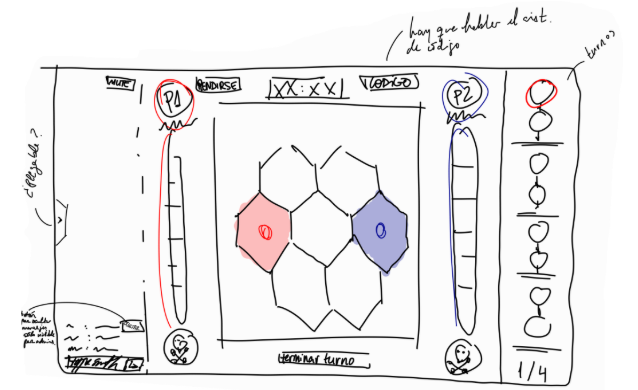
### Mockup 1 - Partida
---
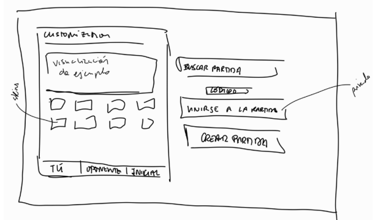
### Mockup 2 - Menú principal
---
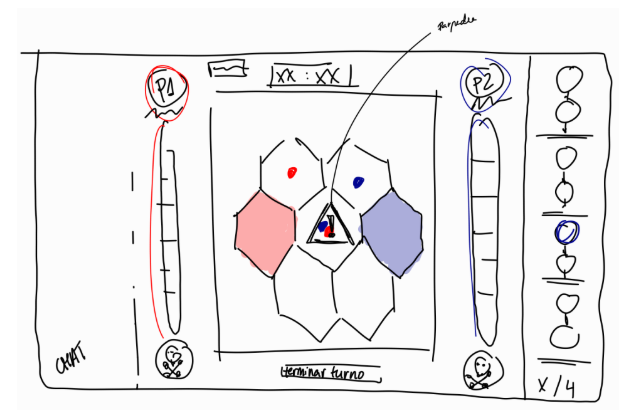
### Mockup 3 - Movimiento no válido
---

### Mockup 4 - Partidas en curso
---
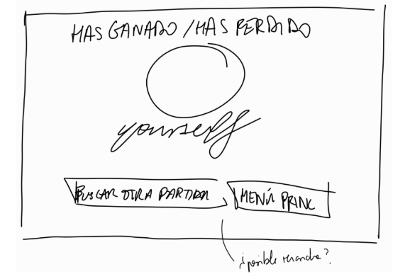
### Mockup 5 - Fin de partida
---
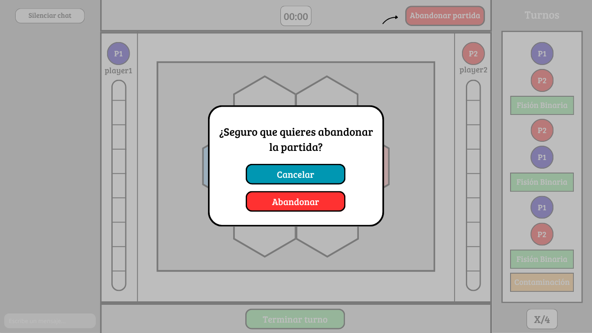
### Mockup 6 - Partidas recientes
---
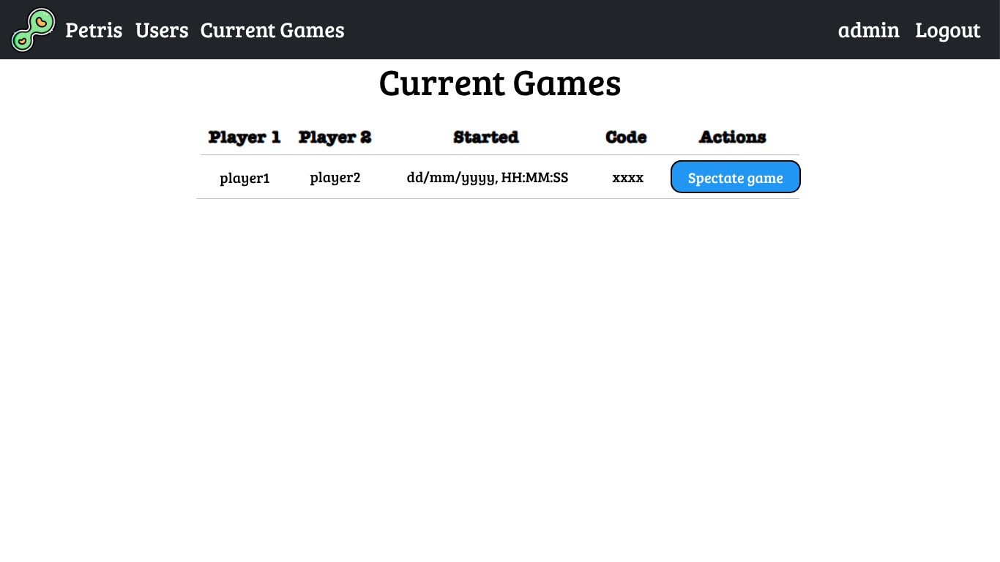
### Mockup 7 - Registro
---
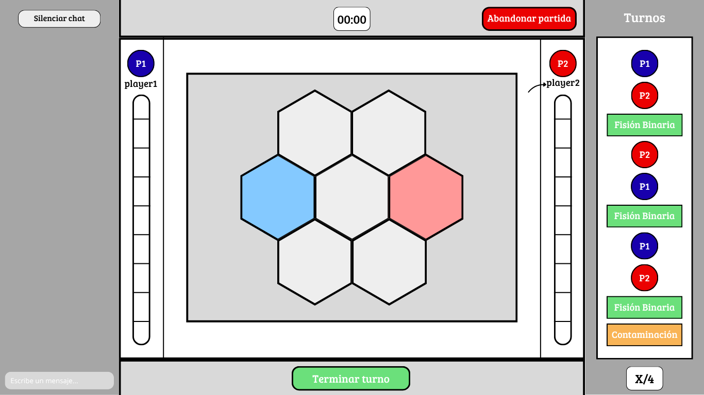
### Mockup 8 - Inicio de sesión
---
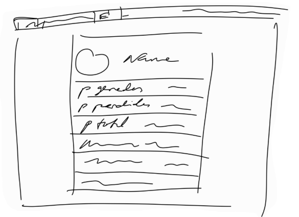
### Mockup 9 - Estadísticas
---
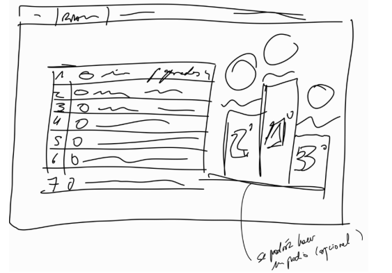
### Mockup 10 - Ranking
---
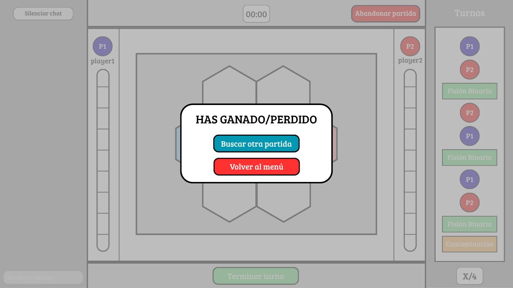
### Mockup 11 - Amigos
---
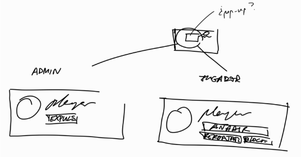
### Mockup 12 - Visualización de perfil de usuario
---
## Aclaraciones
- Mockup 12: la idea es implementar el pop-up del perfil del usuario al hacer click sobre su foto de perfil o pasar el ratón por encima de manera que no ocupe toda la pantalla.

## Diagrama conceptual del sistema

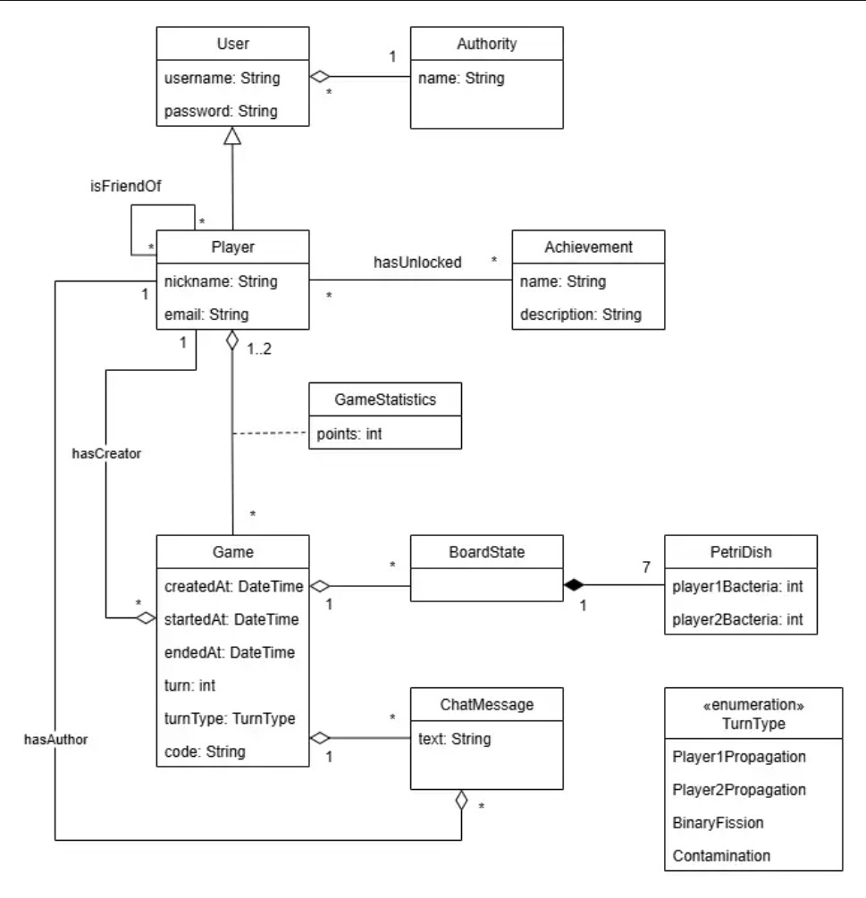
### Diagrama de clases UML
----
## Reglas de Negocio

### R1 - Movimiento de paridad
Un jugador no puede tener las mismas bacterias que otro en un disco. Por ejemplo, si un disco solo esta ocupado por 3 bacterias de mi rival y yo quiero moverme a ese disco, solo puedo mover 1,2 o 4 bacterias a ese disco.
### R2 - Discos adyacentes
Un jugador solo puede mover sus bacterias a discos adyacentes. Es decir, si yo intento mover una bacteria desplazándola por el terreno de juego y para llegar a un disco tengo que pasar por otro intermedio, no puedo realizar este movimiento.
### R3 - Movimientos por disco
Un jugador solo puede mover las bacterias de un solo disco. En un movimiento yo puedo mover de un disco a otro entre 1 y 4 bacterias, pero solamente del disco que elija. Por ejemplo, si muevo una bacteria del disco 1 al 2, no puedo agarrar una del 3 y moverla al 2 en el mismo turno. 
### R4 - Movimiento obligatorio
En cada turno el jugador debe de mover como mínimo una bacteria y como máximo cuatro.
### R5 - Fase de fisión binaria
Si un disco solo tiene bacterias de un jugador, este añade una bacteria desde su reserva a esa placa.
### R6 - Formación de sarcinas
Si un jugador acumula 5 bacterias en un disco, esta se cambia por una ficha especial llamada “sarcina”. Esto puede ocurrir por varios motivos (porque el jugador mueve accidentalmente 5 bacterias al mismo disco o porque en la fase de fisión binaria, de 4 bacterias se pasa a 5). 
### R7 - Inmovilidad de sarcina
Una sarcina no se puede mover. El disco donde se haya formado será el sitio donde permanezca durante el resto de la partida.
### R8 - Movimiento a sarcina
Una bacteria no puede ser movida a un disco donde haya una sarcina del mismo tipo de bacteria. Es decir, si un jugador ha formado una sarcina, este no puede mover una bacteria al disco donde se encuentre la sarcina. En el caso del oponente, este si puede meter sus bacterias en el disco donde se encuentre la sarcina del jugador.
### R9 - Fase de contaminación
Por cada disco con bacterias, el jugador que tiene más bacterias en ese disco anota un punto de contaminación en la barra de contaminación. Es decir si el jugador1 tiene más bacterias que el jugador2 en 5 discos y el jugador2 solo en 1, el jugador 1 anota 5 puntos y el jugador2 anota 1.
### R10 - Fin de partida por contaminación
Un jugador pierde si se anotan todos los puntos en la barra de contaminación. La barra de contaminación tiene 9 puntos.
### R11- Fin de partida por movimiento
Un jugador pierde si no puede realizar una propagación correcta. Es decir, si un jugador no puede cumplir la regla del movimiento obligatorio, este pierde automáticamente.
### R12 - Fin de partida por turnos
Si se acaban las 4 fases del juego, gana el jugador que menos puntos de contaminación tenga. En caso de empate el que menos sarcinas tenga entre todos los discos, y en caso de volver a empatar, el que tenga menos bacterias entre todos los discos.
### R13 - Tiempo por turno
Si el tiempo del turno de un jugador se acaba, éste pierde la partida. Por ejemplo, si el temporizador es de 1 minuto y el jugador se demora más de la cantidad establecida, este pierde automáticamente.
### R14 - Partida por jugador
Si el jugador ya tiene una partida iniciada no puede crear otra a no ser que la abandone.
### R15 - Penalizaciones
Si un jugador tiene un comportamiento irrespetuoso, su cuenta puede ser vetada por un administrador impidiéndole jugar.

