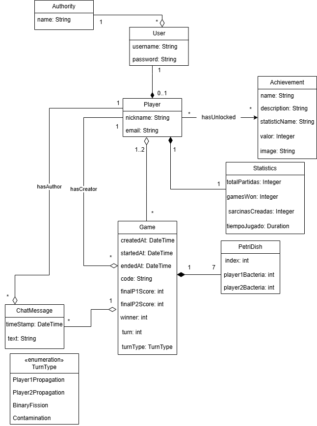
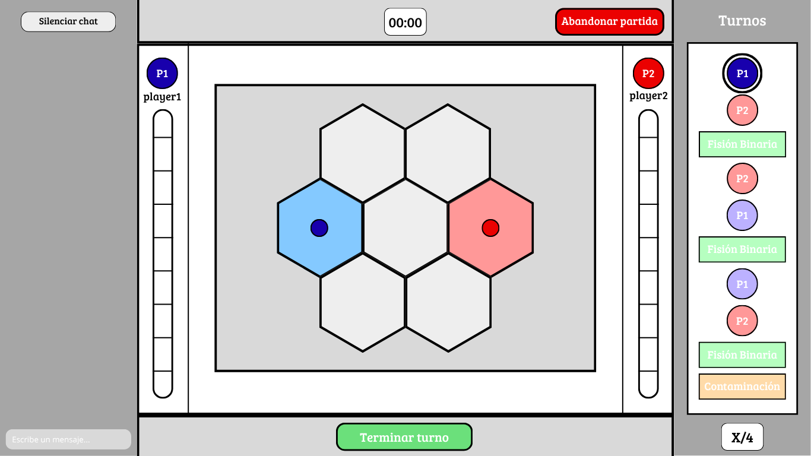

# Documento de diseño del sistema
**Asignatura:** Diseño y Pruebas (Grado en Ingeniería del Software, Universidad de Sevilla)  
**Curso académico:** 2025/2026
**Grupo/Equipo:** L6-03     
**Nombre del proyecto:** Petris
**Repositorio:** https://github.com/gii-is-DP1/dp1-2025-2026-l6-3-25  
**Integrantes (máx. 6):** <!-- Nombre Apellidos (US-Id / correo @us.es) -->
- David Lozano Acosta
- Diego Vicente Cámara
- José Ismael Barroso Delgado
- Jose Antonio Aguadero García
- Lu Dao Guerricabeitia Garzón
- Pablo Pérez Sorni

## Introducción

Petris es un juego de mesa basado en controlar la expansión de unas bacterias que se van moviendo entre unos discos, llamados placas de Petri. El objetivo de la partida consiste en intentar tener el menor número de bacterias posibles situadas estratégicamente para no obtener puntos de contaminación y hacerse con la victoria. 

Por supuesto más allá del objetivo del propio juego, está pensado para el disfrute y entretenimiento de las personas. En parte esta visión es la misma que comparte nuestro grupo de proyecto, quienes pretendemos que este juego, considerado un poco de nicho, llegue a conocerse un poco más.

Es un juego pensado para 2 jugadores en el que cada uno tiene una serie de bacterias y sarcinas. Empiezan cada uno con una bacteria situada en un disco del color de cada jugador. A partir de aquí van sucediendo distintas cosas en función del tipo de turno en el que nos encontremos. Distinguimos entre:
- **Fase de porpagación**: en la que los jugadores están obligados a realizar unos movimientos con ciertas restricciones, llamados propagaciones. Antes de terminar el turno el jugador ha de poder hacer una propagación correcta.
- **Fase de fisión binaria**: en esta fase las bacterias de cada jugador aumentan en función de ciertos criterios. 
- **Fase de contaminación**: fase en la cuál ambos jugadores aumentan su barra de contaminación en función de las bacterias presentes en las placas de Petri.

La duración de una partida es variable, pero ninguna suele superar los 10 minutos de duración. Normalmente se termina porque uno de los dos jugadores no puede realizar una propagación correcta o su barra de contaminación llega al máximo. Sin embargo, si ambos son lo suficientemente capaces como para llegar al final de los 40 turnos (contando como turnos cada una de las fases del juego) el resultado se decide o bien por los puntos de contaminación, o bien por el número de sarcinas, o bien por el número de bacterias.

[Enlace al vídeo de explicación de las reglas del Petris](https://www.youtube.com/watch?v=leB1K3TMzsQ)

## Diagrama(s) UML:

### Diagrama de Dominio/Diseño



### Diagrama de Capas (incluyendo Controladores, Servicios y Repositorios)


## Descomposición del mockups del tablero de juego en componentes



  - App – Componente principal de la aplicación
    - $\color{orange}{\textsf{Chat – Barra lateral izquierda para ver la conversación con el rival.}}$
      - $\color{darkred}{\textsf{[Escriba un mensaje... ]. Sitio para escribir el mensaje que quieras enviar.}}$
    - $\color{cyan}{\textsf{Tablero – Área de juego donde serán mostradas la fichas.}}$
    - $\color{lightblue}{\textsf{Turno – Barra lateral derecha donde ver a quién le toca/tocará los próximos turnos.}}$
      - $\color{green}{\textsf{[ Número de turno ] – Marca en que turno vas, cuando llega a 4 es que es la última}}$
    - $\color{purple}{\textsf{Temporizador – Arriba hay un temporizador que marca el tiempo restante en el turno.}}$
    - $\color{yellow}{\textsf{TerminarTurno – Botón para finalizar turno.}}$
    - $\color{red}{\textsf{Barra de puntuación – Barras laterales con el nombre del jugador arriba donde marca cuanto nivel de contaminación tiene.}}$
    - $\color{pink}{\textsf{Abandonar partida – Botón para salir de la partida antes de que finalice.}}$

## Patrones de diseño y arquitectónicos aplicados
En esta sección de especificar el conjunto de patrones de diseño y arquitectónicos aplicados durante el proyecto. Para especificar la aplicación de cada patrón puede usar la siguiente plantilla:

### Patrón: Modelo Vista Controlador (MVC)
**Tipo**: Arquitectónico 

**Contexto de Aplicación**

Este patrón arquitectónico se ha usado para organizar y estructurar el backend. Para la capa de la lógica de negocios, primero se han creado clases Modelo para cada tabla que queremos en la base de datos, para más tarde crear los servicios, cuyas funciones se han adaptado a las necesidades que hemos establecido en el frontend. Para acceder a esas tablas hemos accedido a traves de los servicios, en la capa de recursos hemos elegido los repositorios. Finalmente para la capa de presentación tenemos los controladores para cada función establecida en los servicios, con su vista respectiva en el frontend

**Clases o paquetes creados**

Hemos creado para las tablas User, Player, Achievement, Statistics, Match y PetriDish su modelo asociado con los atributos correspondientes establecidos en el diagrama de clases. Para todos los modelos les hemos creado sus servicios, repositorios y controladores

**Ventajas alcanzadas al aplicar el patrón**

Es interesante usar este patrón porque nos permite tener un código mejor estructurado por función, separando las responsabilidades de cada componente.

### Patrón: Composición de Componentes (UI basada en React)
*Tipo*: Arquitectónico / Diseño de presentación

**Contexto de Aplicación**

En la pantalla de juego (`frontend/src/Game/gameScreen.js`) todo el JSX y la lógica de renderizado estaban mezclados en un único componente superior. Para mejorar la mantenibilidad hemos aplicado el patrón de composición de componentes propio de React, separando la vista en piezas pequeñas, reutilizables y con responsabilidades claras.

**Clases o componentes creados**

- `PlayerColumn`, `ScoreBar`: encapsulan la representación y la barra de puntuaciones de cada jugador.
- `BoardStage`, `BoardControls`: agrupan el tablero y los controles asociados, recibiendo callbacks desde el contenedor.
- `TurnTimeline`: renderiza la línea temporal de turnos con metadatos y estados visuales.
- `useTurnTracker`: hook específico que gestiona el desplazamiento del timeline.
- `gameScreenHelper`: módulo que centraliza constantes de reglas (secuencias de turnos, adyacencias, límites numéricos) para compartirlas sin duplicaciones.

**Ventajas alcanzadas al aplicar el patrón**

- **Responsabilidad única**: cada componente se centra en una parte concreta de la UI, lo que hace que el `GameScreen` actúe solo como orquestador del estado.
- **Reutilización**: los nuevos componentes pueden emplearse en otros escenarios (por ejemplo, vistas de espectador o pantallas de resumen) sin copiar código.
- **Facilidad de pruebas y refactor**: aislar el hook y las constantes facilita probar comportamientos en Storybook o tests unitarios, además de reducir los conflictos al trabajar en paralelo.

### Patrón: Simple Builder

*Tipo*: Creational

**Contexto de Aplicación**

Necesitamos una manera rápida y eficiente de crear nuevos jugadores y administradores, así que hemos usado el patrón de diseño Builder para facilitarnos el trabajo. Ahora cada vez que se crea un nuevo usuario se le asigna el rol correspondiente, y si es player, la tabla de estadística. Con el ecosistema de Spring Boot y Java moderno es más eficiente usar la variación simplificada de dicho patrón, denominada Simple Builder.

**Clases o paquetes creados/actualizados**
- `Player`: añadido @Builder para que se apliquen las funciones del patrón.
- `Statistics`: añadido @Builder para que se apliquen las funciones del patrón.
- `User`: añadido @Builder para que se apliquen las funciones del patrón.
- `UserService`: modificado el crear usuario para aplicar el patrón de diseño al registrar un nuevo usuario en la aplicación.

**Ventajas alcanzadas al aplicar el patrón**
- **Legibilidad**: al utilizar una interfaz fluida, el código se lee casi como una frase en lenguaje natural.
- **Elimina el constructor tradicional**: en lugar de tener múltiples constructores que se llaman entre sí con largas listas de parámetros, el Builder permite configurar solo lo que necesitas.
- **Facilita la Inmutabilidad**: si usas simples setters, el objeto es mutable y puede quedar en un estado inconsistente a medio construir. Por otro lado, con el patrón de diseño Builder:
     1. El objeto Builder es mutable.
     2. El método .build() devuelve el objeto final.
     3. El objeto final puede no tener setters, haciéndolo inmutable y seguro para entornos concurrentes.

## Decisiones de diseño

### Decisión 1: Creación de la tabla estadísticas.
#### Descripción del problema:

Como grupo nos gustaría poder guardar las estadísticas en una tabla del backend.

#### Alternativas de solución evaluadas:

*Alternativa 1.a*: Que cada fila de la tabla sea una estadística con las propiedades nombre y valor.

*Ventajas:*
•	Sería más dinámica a la hora de añadir estadísticas nuevas en un futuro.
*Inconvenientes:*
•	Haría la tabla menos eficiente debido a que tendríamos un gran número de filas, mayor incluso al de jugadores.

*Alternativa 1.b*: Que cada columna tenga una estadística a guardar.
*Ventajas:*
•	Se quedaría una tabla más reducida dado que sería unas fila igual al número de jugadores.
*Inconvenientes:*
•	Si queremos añadir una estadística nueva hay que editar la base de la tabla.

#### Justificación de la solución adoptada

Al revisar el problema nos dimos cuenta que al ser un trabajo que no se va a prolongar en el tiempo no va a hacer falta añadir más estadísticas haciendo que la mejor opción sea la 1.b.

### Decisión 2: Usuario
#### Descripción del problema:

A la hora de hacer la clase Usuario tener el problema de que los admin no pueden jugar partidas.

#### Alternativas de solución evaluadas:
*Alternativa 1.a*: Que se usara usuario para jugar la partida.

*Ventajas:*
•	No habría que crear una clase intermedia.
*Inconvenientes:*
•	Habría que revisar si el usuario es admin o player.

*Alternativa 1.b*: Crear una clase intermedia llamada player y solo estos pueden jugar.
*Ventajas:*
•	No habría que revisar el rol.
• Se podría poner un nombre que se viera que no fuera el de usuario para iniciar sesión.
*Inconvenientes:*
•	Sería crear una tabla que tenga una relación 0..1 con usuario.

#### Justificación de la solución adoptada

Hemos optado por la opción 1.b porque la hemos valorado que la revisión si era admin o no a la hora de crear partidas podría dar problemas sumado a que nos daría más orden interno.

### Decisión 3: Game
#### Descripción del problema:

Como actualizar los cambios que se hagan en cada turno.

#### Alternativas de solución evaluadas:
*Alternativa 1.a*: Que se cambie la tabla Game cuando se crea, se inicia y se finaliza.

*Ventajas:*
•	La tabla Game al ser importante solo se cambiaría 3 veces.
*Inconvenientes:*
•	Habría que crear otras tablas para guardar el tablero y el turno en el que va.

*Alternativa 1.b*: Modificar Game cada turno.
*Ventajas:*
•	No habría que crear otras tablas para guardar datos.
*Inconvenientes:*
•	Existe la posibilidad de que al guardar datos de problemas.

#### Justificación de la solución adoptada

Hemos optado por la alternativa 1.b devido a que al ver el inconveniente que nos vino a la cabeza a la hora de ver opciones para crearlo nos dimos cuenta que no era tan necesario buscar que game solo se modificara 3 veces.

### Decisión 4: Uso de una pantalla de carga en la pagina del perfil.
#### Descripción del problema:

Como poder mirar las estadisticas, logros y historial de manera que sea atractivo a la vista y no vaya pegando tirones hasta que cargue toda la pagina.

#### Alternativas de solución evaluadas:

*Alternativa 1.a*: Poner una pantalla de carga que espere a todas las llamadas al backend.

*Ventajas:*
•	Sería más limpio y es un patrón de diseño bastamente extendido y utilzado.
*Inconvenientes:*
•	Haría que los jugadores no pudieran mirar los datos directamente.

*Alternativa 1.b*: Que todo vaya cargando de manera asíncrona cargando esperando al backend para cargar de una en una.

*Ventajas:*
•	Haría que los jugadores pudieran mirar los datos directamente.
*Inconvenientes:*
•	Da la sensacion de un producto inacabado y poco eficiente al ver como no todo está cargado cuando se entra a la página.

#### Justificación de la solución adoptada

Al revisar el problema nos decidimos por la primera alternativa ya que nos ayuda a entregar un producto con una apariencia más limpia y tambíen exime la necesidad de que todas las llamadas al backend sean instantaneas.

### Decisión 5: Disposición del lobby
#### Descripción del problema:

Como hacer el lobby en el que esperan los jugadores justo antes de empezar a jugar

#### Alternativas de solución evaluadas:

*Alternativa 1.a*: Poner el lobby directamente en la pantalla de la partida.

*Ventajas:*
•	Directamente empezaria la partida sin tener que cambiar de pantalla.
*Inconvenientes:*
•	La partida empezaria directamente cuando otro jugador se uniese, lo cual no da margen al jugador que se une para escoger una sala equivocada o la partida empezaaria dandole a un boton lo que iria un poco en contra de la filosofia utilizada para escoger esta alternativa ya que no seempezaria rapidamente la partida.

*Alternativa 1.b*: Que haya una pantalla de lobby de partida y luego al iniciar te redirija a la pantalla de la misma.

*Ventajas:*
•	Haría que los jugadores pudieran fallar de sala y salirse sin tener que estar abandonando una partida, además seguiria con la estetica de la pantalla de elección de sala en vez de tener un cambio muy abruto entre los estilos de la pagina de elección y la pantalla de la partida.
*Inconvenientes:*
•	Se reduce la fluidez de la página ya que hay que pasar por una pantalla intermedia para poder comenzar una partida.

#### Justificación de la solución adoptada

Al revisar el problema nos decidimos por la segunda alternativa ya que nos gustó como quedaba y nos resultó más comodo para el usuario y bonito de ver, ademas así reducimos la complejidad del trabajo dividiendolo en una pagina para cada cosa en vez de tener una pantalla de partida que maneja tanto todo a lo que la partida se refiere(logica de juego, usuarios, estilos propios) como, además, la parte de crear un lobby funcional.

### Decisión 6: Aplicar el patrón de diseño Builder en la creación de nuevos usuarios
#### Descripción del problema:
La aplicación nos daba error a la hora de crear nuevos usuarios, tanto players como admins.

#### Alternativas de solución evaluadas:

*Alternativa 1.a*: arreglar la creación de la manera "tradicional"
*Ventajas:*
•	Es como estaba antes.
*Inconvenientes:*
•	Más complejidad a la hora de leer y entender el código.
•   Mas pesado a la hora de programarlo

*Alternativa 1.b*: aplicar el patrón de diseño Builder

*Ventajas:*
•	Mayor legibilidad
•   Más fácil de implementar
*Inconvenientes:*
•	Aprender como se usaba

#### Decisión de la solución adoptada

Al final optamos por usar la segunda alternativa, ya que eso mejoraría la calidad de nuestro código a la vez que su legibilidad y a la reducción de la complejidad.


## Refactorizaciones aplicadas

Si ha hecho refactorizaciones en su código, puede documentarlas usando el siguiente formato:

### Refactorización X: 
En esta refactorización añadimos un mapa de parámtros a la partida para ayudar a personalizar la información precalculada de la que partimos en cada fase del juego.
#### Estado inicial del código
```Java 
class Animal
{
}
``` 
_Puedes añadir información sobre el lenguaje concreto en el que está escrito el código para habilitar el coloreado de sintaxis tal y como se especifica en [este tutorial](https://docs.github.com/es/get-started/writing-on-github/working-with-advanced-formatting/creating-and-highlighting-code-blocks)_

#### Estado del código refactorizado

```
código fuente en java, jsx o javascript
```
#### Problema que nos hizo realizar la refactorización
_Ej: Era difícil añadir información para implementar la lógica de negocio en cada una de las fases del juego (en nuestro caso varía bastante)_
#### Ventajas que presenta la nueva versión del código respecto de la versión original
_Ej: Ahora podemos añadir arbitrariamente los datos que nos hagan falta al contexto de la partida para que sea más sencillo llevar a cabo los turnos y jugadas_


### Refactorización 1: 
#### Descomposición de Componentes de la Pantalla de Perfil (ProfileScreen)
En esta refactorización, hemos extraido la lógica de renderizado de grandes secciones de la pantalla de perfil (como la cabecera, las estadísticas, las partidas recientes y los logros) en subcomponentes funcionales independientes. Además, se encapsularon los modales (HistoryPopup, EditPopup) dentro de sus propios componentes.

### Estado inicial del código

    <div className="profileContainer">{modal}
            <div className="left">
                <div>
                    <div className="profileHeader">
                        <span className="profileNickname">{playerData.nickname}</span>
                        <span onClick={() => setShowEditPopup(true)} className="editIcon">✏️</span>
                    </div>
                    <div className="profileHeaderEmail">{playerData.email}</div>
                </div>
                <div className="bg">
                    
                    <input
                        type="file"
                        ref={imageInputRef}
                        onChange={handleFileChange}
                        className="hiddenFileInput"
                        accept="image/*"
                    />
                    <div className="mainStatContainer">
                        <div className="statItem">
                            <span className="statLabel">Fecha de Creación</span>
                            <span className="statValue">{playerData.createdAt? new Date(playerData.createdAt).toLocaleDateString() : new Date().toLocaleDateString()}</span>
                        </div>
                        <div className="statItem">
                            <span className="statLabel">Tiempo de Juego</span>
                            <span className="statValue">{Math.floor(hoursPlayed) || 0} horas y {Math.round((hoursPlayed - Math.floor(hoursPlayed)) * 60) || 0} minutos</span>
                        </div>
                        <div className="statItem">
                            <span className="statLabel">Partidas Online</span>
                            <span className="statValue">{userGames.length || 0}</span>
                        </div>
                        <div className="statItem">
                            <span className="statLabel">Victorias</span>
                            <span className="statValue">{getStatValue('games_won')
                                }</span>
                        </div>
                        <div className="statItem">
                            <span className="statLabel">Derrotas</span>
                            <span className="statValue">{userGames.filter((game) => !isWinner(game)).length || 0}</span>
                        </div>
                        <div className="statItem">
                            <span className="statLabel">Sarcinas</span>
                            <span className="statValue">{getStatValue('sarcines_created') || 0
                            }</span>
                        </div>
                    </div>
                </div>
            </div>
            <div className="right">
                <div className="bg">
                    <h1 className="title">Partidas Recientes</h1>
                    <div className="recentGamesContainer">
                        {userGames.slice(0, 3).map(game => {
                            return (
                                <div key={game.id} className={isWinner(game) ? "gameWinBg" : "gameLoseBg"}>
                                    <div className="gameHeader">
                                        <div className="gameResult">
                                            {isWinner(game) ? "Victoria" : "Derrota"}
                                            <span className="gameTurns">
                                                ({game.turn} turnos)
                                            </span>
                                        </div>
                                        <span className="gameDate">
                                            Fecha de creación: {new Date(game.createdAt).toLocaleDateString()}
                                        </span>
                                    </div>
                                    <div className="gamePlayersContainer">
                                        <div className="scorePlayer1">
                                            <div className="gamePlayerInfo player2Info">
                                                 {game.player2.nickname}
                                            </div>
                                            <div className="score">
                                                {game.finalP2Score}
                                            </div>
                                        </div>
                                        <span className="gameVs">vs</span>
                                        <div className="scorePlayer2">
                                            <div className="gamePlayerInfo player1Info">
                                                {game.player1.nickname} 
                                            </div>
                                            <div className="score">
                                                {game.finalP1Score}
                                            </div>
                                        </div>
                                    </div>
                                    <div className="gameDetailsContainer">
                                        <div className="gameDetail">
                                            Código de la partida: {game.code}
                                        </div>
                                        <div className="gameDetail">
                                            Duración: {duracion(game)} mins
                                        </div>
                                    </div>
                                </div>
                            );
                        })}
                    </div>
                    <div className="watchHistoryContainer">
                        <button className="watchHistoryButton" onClick={() => setShowHistoryPopup(true)}>
                            Ver Historial
                        </button>
                    </div>
                </div>
                <div className="bg">
                    <h1 className="title">Logros</h1>
                    <h4>Completado {UserAchievements.length}/{Achievements.length}</h4>
                    <div className="mainStatContainer">
                        {Achievements.map(achievement => {
                            const isCompleted = UserAchievements.some(a => a.id === achievement.id);
                            return (
                                <div key={achievement.id} className={`achievement ${isCompleted ? 'completed' : ''}`}>
                                    <div className="achievementHeader">
                                        
                                        <h3 className="achievementName">{achievement.name}</h3>
                                        <p className="achievementProgress">
                                            {achievementProgress(achievement)}
                                        </p>
                                    </div>
                                    <div className="achievementInfo">
                                        <div>
                                            <p className="achievementDescriptionContainer achievementDescription">
                                                {achievement.description}
                                            </p>
                                        </div>
                                    </div>
                                </div>
                            );
                        })}
                    </div>
                </div>
            </div>
            {showHistoryPopup && (
                <div className="popupOverlay">
                    <div className="popupContent">
                        <h2 className="title">Historial de Partidas</h2>
                        <button onClick={() => setShowHistoryPopup(false)} className="closePopupButton">X</button>
                        <div className="gamesList">
                            {userGames.length > 0 ? (
                                userGames.map(game => {
                                    return (
                                        <div key={game.id} className={isWinner(game) ? "gameWinBg" : "gameLoseBg"}>
                                            <div className="gameHeader">
                                                <div className="gameResult">
                                                    {isWinner(game) ? "Victoria" : "Derrota"}
                                                    <span className="gameTurns">
                                                        ({game.turns} turnos)
                                                    </span>
                                                </div>
                                                <span className="gameDate">
                                                    Fecha de creación: {new Date(game.createdAt).toLocaleDateString()}
                                                </span>
                                            </div>
                                            <div className="gamePlayersContainer">
                                                <div className="gamePlayerInfo">
                                                     {game.player2.nickname}
                                                </div>
                                                <span className="gameVs">vs</span>
                                                <div className="gamePlayerInfo">
                                                    {game.player1.nickname} 
                                                </div>
                                            </div>
                                            <div className="gameDetailsContainer">
                                                <div className="gameDetail">
                                                    Código de la partida: {game.code}
                                                </div>
                                                <div className="gameDetail">
                                                    Puntuación: {game.score}
                                                </div>
                                                <div className="gameDetail">
                                                    Duración: {duracion(game)} mins
                                                </div>
                                            </div>
                                        </div>
                                    );
                                })
                            ) : (
                                <p>No hay partidas para mostrar.</p>
                            )}
                        </div>
                    </div>
                </div>
            )}
            {showEditPopup && (
                <div className="popupOverlay">
                    <div className="popupContent">
                        <h2 className="title">Editar Perfil</h2>
                        <button onClick={() => setShowEditPopup(false)} className="closePopupButton">X</button>
                        <Formik
                            initialValues={{
                                nickname: playerData.nickname,
                                email: playerData.email,
                            }}
                            validationSchema={validationSchema}
                            onSubmit={handleEditSubmit}
                        >
                            {({ isSubmitting }) => (
                                <Form>
                                    <div className="formGroup">
                                        <label htmlFor="nickname">Nombre de usuario</label>
                                        <Field name="nickname" type="text" className="formControl" />
                                        <ErrorMessage name="nickname" component="div" className="error" />
                                    </div>
                                    <div className="formGroup">
                                        <label htmlFor="email">Email</label>
                                        <Field name="email" type="email" className="formControl" />
                                        <ErrorMessage name="email" component="div" className="error" />
                                    </div>
                                    <div className="formButtons">
                                        <button type="submit" className="editProfileButton" disabled={isSubmitting}>
                                            Guardar Cambios
                                        </button>
                                        <button type="button" className="watchHistoryButton" onClick={() => setShowEditPopup(false)}>
                                            Cancelar
                                        </button>
                                    </div>
                                </Form>
                            )}
                        </Formik>
                    </div>
                </div>
            )}
        </div>

### Estado del código refactorizado

    <div className="profileContainer">
        {modal}
        <div className="left">
            <ProfileHeader />
            <div className="bg">
                
                <input type="file" ref={imageInputRef} onChange={handleFileChange} className="hiddenFileInput" accept="image/*" />
                <StatsSection />
            </div>
        </div>
        <div className="right">
            <RecentGames />
            <AchievementsSection />
        </div>
        <HistoryPopup />
        <EditPopup />
    </div>
### Problema que nos hizo realizar la refactorización
Era difícil navegar, comprender y modificar el componente de perfil, ya que contenía cientos de líneas de código JSX y lógica de renderizado anidada. Un componente tan grande, dificultabala identificación rápida de dónde se encontraba el código responsable de, por ejemplo, la lista de logros o el modal de edición.

### Ventajas que presenta la nueva versión del código respecto de la versión original

#### Legibilidad y Mantenibilidad: 
El componente principal ProfileScreen se vuelve más limpia, haciendo obvia la estructura de la página. Es mucho más fácil localizar y modificar la lógica de renderizado de una sección específica (ej., StatsSection) sin afectar otras partes.

#### Reutilización:
Si en el futuro necesitas mostrar solo las estadísticas o el historial de partidas en otra parte de la aplicación, puedes reutilizar los componentes sin duplicar código.

#### Aislamiento de Errores (Debugging):
Si ocurre un error de renderizado solo en alguna sección en concreto, sabes exactamente qué subcomponente tienes que revisar, lo que acelera la depuración.

### Refactorización 2: 
#### Clase MatchServiceHelper
En esta refactorización hemos extraído la funcionalidad no correspondiente al servicio a otra clase de ayuda para este
#### Estado inicial del código
```Java 
@Service
public class MatchService {

    @Autowired
    private MatchRepository matchRepository;

    public static final List<TurnType> turnTypes = List.of(
        TurnType.P1_PROPAGATION,
        TurnType.P2_PROPAGATION,
        TurnType.BINARY_FISSION,
        TurnType.P2_PROPAGATION,
        TurnType.P1_PROPAGATION,
        TurnType.BINARY_FISSION,
        TurnType.P1_PROPAGATION,
        TurnType.P2_PROPAGATION,
        TurnType.BINARY_FISSION,
        TurnType.CONTAMINATION,

        TurnType.P2_PROPAGATION,
        TurnType.P1_PROPAGATION,
        TurnType.BINARY_FISSION,
        TurnType.P1_PROPAGATION,
        TurnType.P2_PROPAGATION,
        TurnType.BINARY_FISSION,
        TurnType.P2_PROPAGATION,
        TurnType.P1_PROPAGATION,
        TurnType.BINARY_FISSION,
        TurnType.CONTAMINATION,

        TurnType.P1_PROPAGATION,
        TurnType.P2_PROPAGATION,
        TurnType.BINARY_FISSION,
        TurnType.P2_PROPAGATION,
        TurnType.P1_PROPAGATION,
        TurnType.BINARY_FISSION,
        TurnType.P1_PROPAGATION,
        TurnType.P2_PROPAGATION,
        TurnType.BINARY_FISSION,
        TurnType.CONTAMINATION,

        TurnType.P2_PROPAGATION,
        TurnType.P1_PROPAGATION,
        TurnType.BINARY_FISSION,
        TurnType.P1_PROPAGATION,
        TurnType.P2_PROPAGATION,
        TurnType.BINARY_FISSION,
        TurnType.P2_PROPAGATION,
        TurnType.P1_PROPAGATION,
        TurnType.BINARY_FISSION,
        TurnType.CONTAMINATION
    );

    public static int player1Dish = 2;
    public static int player2Dish = 4;

    public static final Map<Integer,Set<Integer>> petriDishAdjacencies = Map.of(
        0, Set.of(1, 2, 3),
        1, Set.of(0, 3, 4),
        2, Set.of(0, 3, 5),
        3, Set.of(0, 1, 2, 4, 5, 6),
        4, Set.of(1, 3, 6),
        5, Set.of(2, 3, 6),
        6, Set.of(3, 4, 5)
    );

    @Transactional(readOnly = true)
    public List<Match> getAllMatches(){
        return matchRepository.findAll();
    }

    @Transactional(readOnly = true)
    public Match getMatchById(Integer id){
        return matchRepository.findById(id)
            .orElseThrow(() -> new ResourceNotFoundException("Match", "Id", id));
    }

    @Transactional(readOnly = true)
    public Match getMatchByCode(String code){
        return matchRepository.findByCode(code)
            .orElseThrow(() -> new ResourceNotFoundException("Match", "Code", code));
    }

    @Transactional(readOnly = true)
    public List<Match> getCurrentMatches(){
        return matchRepository.findByEndedAtNullAndStartedAtNotNull();
    }

    @Transactional(readOnly = true)
    public List<Match> getNotStartedMatches(){
        return matchRepository.findByStartedAtNull();
    }

    @Transactional
    public Match createMatch(Match match){
        match.setCreatedAt(LocalDateTime.now());
        match.setStartedAt(null);
        match.setEndedAt(null);
        match.setPlayer1Score(0);
        match.setPlayer2Score(0);
        match.setWinner(null);
        Integer turn = 0;
        match.setTurn(turn);
        match.setTurnType(turnTypes.get(turn));
        List<PetriDish> initialBoardState = new ArrayList<>();
        for(int i = 0; i < 7; i++) {
            PetriDish pd = new PetriDish();
            if(i == player1Dish) {
                pd.setPlayer1Bacteria(1);
            } else if(i == player2Dish) {
                pd.setPlayer2Bacteria(1);
            }
            initialBoardState.add(pd);
        }
        match.setBoardState(initialBoardState);
        return matchRepository.save(match);
    }

    @Transactional
    public Match joinMatch(Match match) {
        match.setStartedAt(LocalDateTime.now());
        return matchRepository.save(match);
    }

    @Transactional
    public Match nextTurn(Match matchToUpdate, Optional<List<PetriDish>> newBoardState) throws IllegalArgumentException {
        Match updatedMatch = null;
        switch(matchToUpdate.getTurnType()) {
            case TurnType.P1_PROPAGATION:
                if(newBoardState.isPresent()) {
                    updatedMatch = propagation(matchToUpdate, newBoardState.get(), 1);
                } else {
                    throw new IllegalArgumentException("New board state not provided");
                }
                break;
            case TurnType.P2_PROPAGATION:
                if(newBoardState.isPresent()) {
                    updatedMatch = propagation(matchToUpdate, newBoardState.get(), 2);
                } else {
                    throw new IllegalArgumentException("New board state not provided");
                }
                break;
            case TurnType.BINARY_FISSION:
                updatedMatch = binaryFission(matchToUpdate);
                break;
            case TurnType.CONTAMINATION:
                updatedMatch = contamination(matchToUpdate);
        }

        Integer turn = matchToUpdate.getTurn() + 1;
        updatedMatch.setTurn(turn);
        updatedMatch.setTurnType(turnTypes.get(turn));

        Integer winner = getWinner(updatedMatch);
        if(getWinner(updatedMatch) != null) {
            updatedMatch.setEndedAt(LocalDateTime.now());
            updatedMatch.setWinner(winner);
        }
        return matchRepository.save(updatedMatch);
    }

    private Match propagation(Match matchToUpdate, List<PetriDish> newBoardState, int player) throws IllegalArgumentException{
        List<PetriDish> currentBoardState = matchToUpdate.getBoardState();
        List<String> errors = getPropagationErrors(currentBoardState, newBoardState, player);
        if(!errors.isEmpty()) {
            throw new IllegalArgumentException(errors.toString());
        }
        matchToUpdate.setBoardState(newBoardState);
        return matchToUpdate;
    }

    private Match binaryFission(Match matchToUpdate) {
        List<PetriDish> newBoardState = new ArrayList<>(matchToUpdate.getBoardState());
        for(Integer i = 0; i < 7; i++) {
            PetriDish newPd = newBoardState.get(i);
            if(newPd.getPlayer1Bacteria() > 0 && newPd.getPlayer1Bacteria() < 5 && newPd.getPlayer2Bacteria() == 0) {
                newPd.setPlayer1Bacteria(newPd.getPlayer1Bacteria() + 1);
            } else  if(newPd.getPlayer2Bacteria() > 0 && newPd.getPlayer2Bacteria() < 5 && newPd.getPlayer1Bacteria() == 0) {
                newPd.setPlayer2Bacteria(newPd.getPlayer2Bacteria() + 1);
            }
        }
        return matchToUpdate;
    }

    private Match contamination(Match matchToUpdate) {
        for(Integer i = 0; i < 7; i++) {
            PetriDish pd = matchToUpdate.getBoardState().get(i);
            if(pd.getPlayer1Bacteria() > pd.getPlayer2Bacteria()) {
                matchToUpdate.setPlayer1Score(matchToUpdate.getPlayer1Score() + 1);
            } else if(pd.getPlayer1Bacteria() < pd.getPlayer2Bacteria()) {
                matchToUpdate.setPlayer2Score(matchToUpdate.getPlayer2Score() + 1);
            }
        }
        return matchToUpdate;
    }

    @Transactional(readOnly = true)
    public List<String> getPropagationErrors(List<PetriDish> currentBoardState, List<PetriDish> newBoardState, int player) {
        List<String> errors = new ArrayList<>();

        Set<Integer> movedBacteriaTo = new HashSet<>();
        Integer movedBacteriaFrom = null;
        Integer movedInBacteriaNum = 0;
        Integer movedOutBacteriaNum = 0;
        for(Integer i = 0; i < 7; i++) {
            PetriDish currentPd = currentBoardState.get(i);
            PetriDish newPd = newBoardState.get(i);

            if(newPd.getPlayer1Bacteria().equals(currentPd.getPlayer2Bacteria())) {
                errors.add("Players can't have the same amount of bacteria on the same dish as another: " + "{" + i + "}");
            }

            int diffP1 = newPd.getPlayer1Bacteria() - currentPd.getPlayer1Bacteria();
            if(diffP1 != 0 && player != 1) {
                errors.add("Players can only move their own bacteria: " + "{" + i + "}");
            }
            if(diffP1 < 0){
                if(movedBacteriaFrom != null) {
                    errors.add("Players can't move bacteria from more than one petri dish: " + "{" + i + "}");
                }
                if(currentPd.getPlayer1Bacteria() == 5) {
                    errors.add("Sarcinas can't be moved: " + "{" + i + "}");
                }
                movedBacteriaFrom = i;
                movedOutBacteriaNum = -diffP1;
            } else if(diffP1 > 0) {
                movedBacteriaTo.add(i);
                movedInBacteriaNum += diffP1;
            }

            int diffP2 = newPd.getPlayer2Bacteria() - currentPd.getPlayer2Bacteria();
            if(diffP2 != 0 && player != 2) {
                errors.add("Players can only move their bacteria: " + "{" + i + "}");
            }
            if(diffP2 < 0){
                if(movedBacteriaFrom != null) {
                    errors.add("Players can't move bacteria from more than one petri dish: " + "{" + i + "}");
                }
                if(currentPd.getPlayer2Bacteria() == 5) {
                    errors.add("Sarcinas can't be moved: " + "{" + i + "}");
                }
                movedBacteriaFrom = i;
                movedOutBacteriaNum = -diffP2;
            } else if(diffP2 > 0) {
                movedBacteriaTo.add(i);
                movedInBacteriaNum += diffP2;
            }
        }

        if(movedBacteriaFrom == null) {
            errors.add("Players must move at least one bacteria: " + "{atLeastOne}");
        }
        if(!movedInBacteriaNum.equals(movedOutBacteriaNum)) {
            errors.add("Inconsistency in the number of bacteria that moved: " + "{inconsistency}");
        }
        if(!petriDishAdjacencies.get(movedBacteriaFrom).containsAll(movedBacteriaTo)) {
            errors.add("Players can only move bacteria to adyacent dishes: " + "{adyacency}");
        }

        return errors;
    }

    private Integer getWinner(Match match) {
        Integer winner = null;
        if(match.getTurn().equals(turnTypes.size() - 1)) {
            if(match.getPlayer1Score() < match.getPlayer2Score()) {
                winner = 1;
            } else if(match.getPlayer1Score() > match.getPlayer2Score()) {
                winner = 2;
            } else {
                winner = tieBreak(match);
            }
            return winner;
        }
        if(match.getTurnType().equals(TurnType.P1_PROPAGATION)) {
            if(!hasPossibleMoves(match.getBoardState(), 1)) {
                winner = 2;
                return winner;
            }
        }
        if(match.getTurnType().equals(TurnType.P2_PROPAGATION)) {
            if(!hasPossibleMoves(match.getBoardState(), 2)) {
                winner = 1;
                return winner;
            }
        }
        if(match.getPlayer1Score() == 9) {
            if(match.getPlayer2Score() == 9) {
                winner = tieBreak(match);
            } else {
                winner = 2;
            }
            return winner;
        } else if(match.getPlayer2Score() == 9) {
            winner = 1;
            return winner;
        }
        return winner;
    }

    private Boolean hasPossibleMoves(List<PetriDish> boardState, int player) {
        Boolean res = false;
        for(Integer i = 0; i < 7; i++) {
            PetriDish pd = boardState.get(i);
            int bacteria;
            if(player == 1) {
                bacteria = pd.getPlayer1Bacteria();
            } else if(player == 2) {
                bacteria = pd.getPlayer2Bacteria();
            } else {
                throw new IllegalArgumentException("player must be 1 or 2");
            }
            if(bacteria != 0 && bacteria != 5) {
                for(Integer bacteriaToMove = 1; bacteriaToMove <= bacteria; bacteriaToMove++) {
                    for(Integer target : petriDishAdjacencies.get(i)) {
                        if(player == 1) {
                            res = res || (boardState.get(target).getPlayer1Bacteria() != 5 &&
                                          boardState.get(target).getPlayer2Bacteria() != bacteriaToMove &&
                                          bacteria - bacteriaToMove != boardState.get(i).getPlayer2Bacteria());
                        } else {
                            res = res || (boardState.get(target).getPlayer2Bacteria() != 5 &&
                                          boardState.get(target).getPlayer1Bacteria() != bacteriaToMove &&
                                          bacteria - bacteriaToMove != boardState.get(i).getPlayer1Bacteria());
                        }
                    }
                }
            }
        }
        return res;
    }

    private Integer tieBreak(Match match) {
        Integer winner = null;
        int player1Tokens = 0;
        int player1Sarcinas = 0;
        int player2Tokens = 0;
        int player2Sarcinas = 0;
        for(Integer i = 0; i < 7; i++) {
            PetriDish pd = match.getBoardState().get(i);
            if(pd.getPlayer1Bacteria() != 5) {
                player1Tokens += pd.getPlayer1Bacteria();
            } else {
                player1Tokens += 1;
                player1Sarcinas += 1;
            }
            if(pd.getPlayer2Bacteria() != 5) {
                player2Tokens += pd.getPlayer2Bacteria();
            } else {
                player2Tokens += 1;
                player2Sarcinas += 1;
            }
        }
        if(player1Tokens < player2Tokens) {
            winner = 1;
        } else if(player1Tokens > player2Tokens) {
            winner = 2;
        } else if(player1Sarcinas < player2Sarcinas) {
            winner = 1;
        } else {
            winner = 2;
        }
        return winner;
    }

    @Transactional
    public Match forceEndMatch(Match match) {
        match.setEndedAt(LocalDateTime.now());
        return matchRepository.save(match);
    }

    @Transactional
    public void delete(Integer id){
        matchRepository.deleteById(id);
    }
}
``` 

#### Estado del código refactorizado

```Java
@Service
public class MatchService {

    @Autowired
    private MatchRepository matchRepository;

    private MatchServiceHelper matchServiceHelper;

    @Transactional(readOnly = true)
    public List<Match> getAllMatches(){
        return matchRepository.findAll();
    }

    @Transactional(readOnly = true)
    public Match getMatchById(Integer id){
        return matchRepository.findById(id)
            .orElseThrow(() -> new ResourceNotFoundException("Match", "Id", id));
    }

    @Transactional(readOnly = true)
    public Match getMatchByCode(String code){
        return matchRepository.findByCode(code)
            .orElseThrow(() -> new ResourceNotFoundException("Match", "Code", code));
    }

    @Transactional(readOnly = true)
    public List<Match> getCurrentMatches(){
        return matchRepository.findByEndedAtNullAndStartedAtNotNull();
    }

    @Transactional(readOnly = true)
    public List<Match> getNotStartedMatches(){
        return matchRepository.findByStartedAtNull();
    }

    @Transactional
    public Match createMatch(Match match){
        match.setCreatedAt(LocalDateTime.now());
        match.setStartedAt(null);
        match.setEndedAt(null);
        match.setPlayer1Score(0);
        match.setPlayer2Score(0);
        match.setWinner(null);
        int turn = 0;
        match.setTurn(turn);
        match.setTurnType(matchServiceHelper.getTurnTypeList().get(turn));
        List<PetriDish> initialBoardState = new ArrayList<>();
        for(int i = 0; i < 7; i++) {
            PetriDish pd = new PetriDish();
            if(i == 2) { // posicion inicial del jugador 1
                pd.setPlayer1Bacteria(1);
            } else if(i == 4) { // posicion inicial del jugador 2
                pd.setPlayer2Bacteria(1);
            }
            initialBoardState.add(pd);
        }
        match.setBoardState(initialBoardState);
        return matchRepository.save(match);
    }

    @Transactional
    public Match joinMatch(Match match) {
        match.setStartedAt(LocalDateTime.now());
        return matchRepository.save(match);
    }

    @Transactional
    public Match nextTurn(Match matchToUpdate, Optional<List<PetriDish>> newBoardState) throws IllegalArgumentException {
        Match updatedMatch = null;
        switch(matchToUpdate.getTurnType()) {
            case TurnType.P1_PROPAGATION:
                if(newBoardState.isPresent()) {
                    updatedMatch = propagation(matchToUpdate, newBoardState.get(), 1);
                } else {
                    throw new IllegalArgumentException("New board state not provided");
                }
                break;
            case TurnType.P2_PROPAGATION:
                if(newBoardState.isPresent()) {
                    updatedMatch = propagation(matchToUpdate, newBoardState.get(), 2);
                } else {
                    throw new IllegalArgumentException("New board state not provided");
                }
                break;
            case TurnType.BINARY_FISSION:
                updatedMatch = matchServiceHelper.binaryFission(matchToUpdate);
                break;
            case TurnType.CONTAMINATION:
                updatedMatch = matchServiceHelper.contamination(matchToUpdate);
        }

        int turn = matchToUpdate.getTurn() + 1;
        updatedMatch.setTurn(turn);
        updatedMatch.setTurnType(matchServiceHelper.getTurnTypeList().get(turn));

        Integer winner = matchServiceHelper.getWinner(updatedMatch);
        if(matchServiceHelper.getWinner(updatedMatch) != null) {
            updatedMatch.setEndedAt(LocalDateTime.now());
            updatedMatch.setWinner(winner);
        }
        return matchRepository.save(updatedMatch);
    }

    private Match propagation(Match matchToUpdate, List<PetriDish> newBoardState, int player) throws IllegalArgumentException{
        List<PetriDish> currentBoardState = matchToUpdate.getBoardState();
        List<String> errors = getPropagationErrors(currentBoardState, newBoardState, player);
        if(!errors.isEmpty()) {
            throw new IllegalArgumentException(errors.toString());
        }
        matchToUpdate.setBoardState(newBoardState);
        return matchToUpdate;
    }

    @Transactional(readOnly = true)
    public List<String> getPropagationErrors(List<PetriDish> currentBoardState, List<PetriDish> newBoardState, int player) {
        List<String> errors = new ArrayList<>();

        Set<Integer> movedBacteriaTo = new HashSet<>();
        Integer movedBacteriaFrom = null;
        Integer movedInBacteriaNum = 0;
        int movedOutBacteriaNum = 0;
        for(int i = 0; i < 7; i++) {
            PetriDish currentPd = currentBoardState.get(i);
            PetriDish newPd = newBoardState.get(i);

            if(newPd.getPlayer1Bacteria().equals(currentPd.getPlayer2Bacteria())) {
                errors.add("Players can't have the same amount of bacteria on the same dish as another: " + "{" + i + "}");
            }

            int diffP1 = newPd.getPlayer1Bacteria() - currentPd.getPlayer1Bacteria();
            if(diffP1 != 0 && player != 1) {
                errors.add("Players can only move their own bacteria: " + "{" + i + "}");
            }
            if(diffP1 < 0){
                if(movedBacteriaFrom != null) {
                    errors.add("Players can't move bacteria from more than one petri dish: " + "{" + i + "}");
                }
                if(currentPd.getPlayer1Bacteria() == 5) {
                    errors.add("Sarcinas can't be moved: " + "{" + i + "}");
                }
                movedBacteriaFrom = i;
                movedOutBacteriaNum = -diffP1;
            } else if(diffP1 > 0) {
                movedBacteriaTo.add(i);
                movedInBacteriaNum += diffP1;
            }

            int diffP2 = newPd.getPlayer2Bacteria() - currentPd.getPlayer2Bacteria();
            if(diffP2 != 0 && player != 2) {
                errors.add("Players can only move their bacteria: " + "{" + i + "}");
            }
            if(diffP2 < 0){
                if(movedBacteriaFrom != null) {
                    errors.add("Players can't move bacteria from more than one petri dish: " + "{" + i + "}");
                }
                if(currentPd.getPlayer2Bacteria() == 5) {
                    errors.add("Sarcinas can't be moved: " + "{" + i + "}");
                }
                movedBacteriaFrom = i;
                movedOutBacteriaNum = -diffP2;
            } else if(diffP2 > 0) {
                movedBacteriaTo.add(i);
                movedInBacteriaNum += diffP2;
            }
        }

        if(movedBacteriaFrom == null) {
            errors.add("Players must move at least one bacteria: " + "{atLeastOne}");
        }
        if(!movedInBacteriaNum.equals(movedOutBacteriaNum)) {
            errors.add("Inconsistency in the number of bacteria that moved: " + "{inconsistency}");
        }
        if(!matchServiceHelper.getPetriDishAdjacencies().get(movedBacteriaFrom).containsAll(movedBacteriaTo)) {
            errors.add("Players can only move bacteria to adyacent dishes: " + "{adyacency}");
        }

        return errors;
    }

    @Transactional
    public Match forceEndMatch(Match match) {
        match.setEndedAt(LocalDateTime.now());
        return matchRepository.save(match);
    }

    @Transactional
    public void delete(Integer id){
        matchRepository.deleteById(id);
    }
}
```
#### Problema que nos hizo realizar la refactorización
Nos dimos cuenta que en la clase `MatchService` estaba toda la lógica de algunas funciones y variables de este. Por lo que la clase era demasiado larga y optamos por refactorizarla para que fuese más legible.
#### Ventajas que presenta la nueva versión del código respecto de la versión original
##### Legibilidad
Al extraer la lógica de las reglas del juego, las validaciones de movimientos y las constantes a `MatchServiceHelper`, la clase `MatchService` se vuelve mucho más legible. Esta separación hace que el código sea más limpio y fácil de seguir.
##### Tamaño
La clase `MatchService` se había vuelto demasiado grande, acumulando responsabilidades que iban más allá de la gestión de la entidad `Match`. Contenía los datos iniciales y la lógica de negocio completa del juego, que dificultaba su mantenimiento y comprensión. Al mover la lógica y los datos específicos del juego a `MatchServiceHelper`, `MatchService` se simplificó, centrándose únicamente en las operaciones de alto nivel y la interacción con el repositorio, lo que reduce su tamaño y complejidad.

### Refactorización 3: 
#### Extracción de las responsabilidades de WebSocket de `MatchService`
En esta refactorización movimos toda la lógica relacionada con WebSocket a un servicio dedicado (`WebSocketMatchService`) y adaptamos los controladores para usarlo.

#### Estado inicial del código
Este es un ejemplo de varias funciones que hacian uso de `publishLobbyList()` y de otras funciones similares
```java
@Service
public class MatchService {

    private final SimpMessagingTemplate messagingTemplate;

    public MatchService(MatchRepository matchRepository,
                        ObjectProvider<SimpMessagingTemplate> messagingTemplateProvider) {
        this.matchRepository = matchRepository;
        this.messagingTemplate = messagingTemplateProvider.getIfAvailable();
    }

    public Match createMatch(@NonNull Match match) {
        Match created = matchRepository.save(match);
        publishLobbySnapshot(created);
        publishLobbyList();
        return created;
    }

    public void publishLobbyList() {
        if (messagingTemplate == null) {
            return;
        }
        List<LobbyDTO> lobbies = matchRepository.findByStartedAtNull().stream()
            .map(this::toLobbyDTO)
            .toList();
        messagingTemplate.convertAndSend("/topic/lobbies", lobbies);
    }

    public void publishLobbySnapshot(Match match) {
        if (messagingTemplate == null) {
            return;
        }
        messagingTemplate.convertAndSend("/topic/lobby/" + match.getId(), toLobbyDTO(match));
    }
}
```
#### Estado del código refactorizado
Este es uno de los varios ejemplos que se podrian mostrar en lo que se ve como ahora `WebSocketMatchService` es el que alberga las funciones relacionadas con WebSocket y en vez de llamar a `MatchService` ahora llama a `WebSocketMatchService`
```java
@Service
public class WebSocketMatchService {

    private final SimpMessagingTemplate messagingTemplate;

    public void broadcastLobbyState(@NonNull Match match) {
        publishLobbySnapshot(match);
        publishLobbyList();
    }

    public void publishLobbySnapshot(@NonNull Match match) {
        LobbyDTO lobbySnapshot = Objects.requireNonNull(matchService.toLobbyDTO(match));
        messagingTemplate.convertAndSend("/topic/lobby/" + match.getId(), lobbySnapshot);
    }
}

@RestController
public class MatchController {

    @PostMapping
    public ResponseEntity<Match> createMatch(@RequestParam(defaultValue = "false") Boolean isPrivate)
            throws AccessDeniedException {
        Match match = matchService.createMatch(newMatch);
        webSocketMatchService.broadcastLobbyState(Objects.requireNonNull(match));
        return ResponseEntity.created(location).body(match);
    }
}
```

#### Problema que nos hizo realizar la refactorización
MatchService se habia convertido en un conglomerado de código con más de una función ocupandose tanto de los servicios normales como de los relacionados con WebSocket
#### Ventajas que presenta la nueva versión del código respecto de la versión original
##### Responsabilidad única:
`MatchService` vuelve a centrarse en la gestión del dominio y la persistencia, mientras que `WebSocketMatchService` se ocupa exclusivamente de la mensajería proporcionada por WebSocket.
##### Testabilidad:
Los tests de negocio pueden usar `MatchService` sin preparar mocks de WebSocket, y las notificaciones se prueban aisladamente en el nuevo servicio.
##### Reutilización y coherencia:
Cualquier controlador que deba notificar eventos reutiliza un punto único, `WebSocketMatchService`, lo que facilita mantener el protocolo de mensajes y ajustar destinos o cargas útiles en un solo lugar.

### Refactorización 4:
#### Descomposición de `GameScreen` en componentes especializados
En esta refactorización dividimos el componente `GameScreen` en piezas más pequeñas para separar responsabilidades y facilitar su mantenimiento.

#### Estado inicial del código
Todo el JSX y la lógica de la pantalla estaban embebidos en un único componente de más de 1.000 líneas:
```jsx
export default function GameScreen() {
    // decenas de estados y handlers...
    return (
        <div className="gameScreenContainer">
            <aside className="chatPanel">...</aside>
            <main>/* controles, inputs y tablero */</main>
            <aside className="turnsPanel">/* timeline completo */</aside>
        </div>
    );
}
```

#### Estado del código refactorizado
Ahora extraemos piezas semánticas dentro del mismo archivo (`frontend/src/Game/gameScreen.js`), reutilizando props claros y handlers memoizados:
```jsx
return (
    <div className="gameScreenContainer">
        <aside className="chatPanel">...</aside>
        <main className="gameMainPanel">
            <div className="gameStage">
                <PlayerColumn ... />
                <BoardStage boardProps={...} controlsProps={...} />
                <PlayerColumn ... />
            </div>
        </main>
        <aside className="turnsPanel">
            <TurnTimeline {...timelineProps} />
            <button className="endTurn" ...>Terminar turno</button>
        </aside>
    </div>
);
```
Cada subcomponente (`PlayerColumn`, `BoardStage`, `BoardControls` y `TurnTimeline`) encapsula únicamente la vista y se alimenta con props calculados en `GameScreen`.

#### Problema que nos hizo realizar la refactorización
`GameScreen` mezclaba en un solo bloque la lógica de negocio, la gestión del estado del tablero, la renderización del tablero, los controles y la línea de turnos. Esto hacía casi imposible localizar un comportamiento concreto, incrementaba el riesgo al modificar la UI y dificultaba las pruebas.

#### Ventajas que presenta la nueva versión del código respecto de la versión original
##### Mantenibilidad
El componente principal ahora actúa como “coordinador” y delega la UI a subcomponentes autocontenidos. Esto reduce ruido y permite modificar secciones concretas sin romper el resto.
##### Reutilización de lógica
`BoardControls` y `BoardStage` reciben callbacks memoizados (`handleQuickAmountSelect`, `handleCancelSelection`, etc.), lo que facilita testearlos en aislamiento e incluso moverlos a otros contextos si fuera necesario.
##### Claridad visual
El JSX de alto nivel describe la estructura conceptual (dos columnas de jugadores, escenario central, panel lateral), lo que acelera la comprensión para nuevos desarrolladores.

### Refactorización 4:
En esta refactorización se han:
* Movido comprobaciones de lógica de negocio de MatchController a MatchService para respetar las capas de Spring
* Extraído métodos auxiliares en MatchService a MatchMethodUtil
* Creado métodos de comprobación de valores de partidas en Match
* Extraído constantes y otros datos a MatchDataUtil
* Extraído métodos de DTO en MatchService a sus propias clases
* Reemplazado algunos "Magic Numbers" restantes por constantes de nombre adecuado
* Eliminado algunas comprobaciones innecesarias de ciertos métodos que dificultaban la comprensión del código
* Estructurado todos los métodos de MatchController con un try-catch que lanza ResponseStatusException
#### Estado inicial del código
```Java 
@Service
public class MatchService {
    private static final int NUM_PETRI_DISHES = 7;
    private static final int MAX_BACTERIA_PER_PETRI_DISH = 5;
    private static final int MAX_MOVABLE_BACTERIA = 4;
    private static final String CODE_ALPHABET = "ABCDEFGHIJKLMNOPQRSTUVWXYZ";
    private static final int CODE_LENGTH = 4;

    private final MatchRepository matchRepository;
    private final SecureRandom secureRandom = new SecureRandom();
    private MatchServiceHelper matchServiceHelper;

    public MatchService(final MatchRepository matchRepository) {
        this.matchRepository = matchRepository;
    }

    @Transactional(readOnly = true)
    public List<Match> getAllMatches(){
        return matchRepository.findAll();
    }

    @Transactional(readOnly = true)
    public Match getMatchById(@NonNull Integer id){
        return matchRepository.findById(id)
            .orElseThrow(() -> new ResourceNotFoundException("Match", "Id", id));
    }

    @Transactional(readOnly = true)
    public Match getMatchByCode(@NonNull String code){
        return matchRepository.findByCode(code)
            .orElseThrow(() -> new ResourceNotFoundException("Match", "Code", code));
    }

    @Transactional(readOnly = true)
    public List<Match> getCurrentMatches(){
        return matchRepository.findByEndedAtNullAndStartedAtNotNull();
    }

    @Transactional(readOnly = true)
    public List<Match> getNotStartedMatches(){
        return matchRepository.findByStartedAtNull();
    }

    @Transactional(rollbackFor = {AccessDeniedException.class})
    public Match createMatch(Player creator, Boolean isPrivate) throws AccessDeniedException{
        Match match = new Match();
        if (creator.getIsCurrentlyInMatch()) {
            throw new AccessDeniedException("Already in a match");
        }
        match.setCreator(creator);
        match.setPlayer1(creator);

        String code = null;
        if (isPrivate) {
            code = generateLobbyCode();
        }
        match.setCode(code);

        match.setCreatedAt(LocalDateTime.now());
        match.setStartedAt(null);
        match.setEndedAt(null);
        match.setPlayer1Score(0);
        match.setPlayer2Score(0);
        match.setWinner(null);

        Integer turn = 0;
        match.setTurn(turn);
        match.setTurnType(matchServiceHelper.getTurnTypeList().get(turn));
        List<PetriDish> initialBoardState = new ArrayList<>();
        for(int i = 0; i < 7; i++) {
            PetriDish pd = new PetriDish();
            if(i == 2) { // posicion inicial del jugador 1
                pd.setPlayer1Bacteria(1);
            } else if(i == 4) { // posicion inicial del jugador 2
                pd.setPlayer2Bacteria(1);
            }
            initialBoardState.add(pd);
        }
        match.setBoardState(initialBoardState);

        return matchRepository.save(match);
    }

    @Transactional
    public Match joinMatch(@NonNull Match match) {
        return matchRepository.save(match);
    }

    @Transactional
    public Match startMatch(@NonNull Match match) {
        match.setStartedAt(LocalDateTime.now());
        return matchRepository.save(match);
    }

    @Transactional
    public Optional<Match> leaveMatch(@NonNull Match match, @NonNull Player player) {
        boolean changed = false;
        if (player.equals(match.getPlayer1())) {
            match.setPlayer1(null);
            changed = true;
        } else if (player.equals(match.getPlayer2())) {
            match.setPlayer2(null);
            changed = true;
        }

        if (!changed) {
            return Optional.of(match);
        }

        if (player.equals(match.getCreator())) {
            match.setCreator(null);
        }

        if (match.getPlayer1() == null && match.getPlayer2() != null) {
            match.setPlayer1(match.getPlayer2());
            match.setPlayer2(null);
            if (match.getCreator() == null) {
                match.setCreator(match.getPlayer1());
            }
        } else if (match.getPlayer1() == null && match.getPlayer2() == null) {
            matchRepository.delete(match);
            return Optional.empty();
        } else if (match.getCreator() == null) {
            match.setCreator(match.getPlayer1());
        }

        Match saved = matchRepository.save(match);
        return Optional.of(saved);
    }

    @Transactional
    public Match nextTurn(@NonNull Match matchToUpdate, Optional<List<PetriDish>> newBoardState) throws IllegalArgumentException {
        List<TurnType> turnSequence = matchServiceHelper.getTurnTypeList();
        Integer currentTurn = matchToUpdate.getTurn();
        if (currentTurn == null) {
            currentTurn = 0;
            matchToUpdate.setTurn(currentTurn);
        }
        if (currentTurn >= turnSequence.size()) {
            throw new IllegalStateException("No remaining turns to process");
        }

        Match updatedMatch = null;
        TurnType currentTurnType = matchToUpdate.getTurnType();
        switch (currentTurnType) {
            case TurnType.P1_PROPAGATION:
                if (newBoardState.isPresent()) {
                    updatedMatch = propagation(matchToUpdate, newBoardState.get(), 1);
                } else {
                    throw new IllegalArgumentException("New board state not provided");
                }
                break;
            case TurnType.P2_PROPAGATION:
                if (newBoardState.isPresent()) {
                    updatedMatch = propagation(matchToUpdate, newBoardState.get(), 2);
                } else {
                    throw new IllegalArgumentException("New board state not provided");
                }
                break;
            case TurnType.BINARY_FISSION:
                updatedMatch = matchServiceHelper.binaryFission(matchToUpdate);
                break;
            case TurnType.CONTAMINATION:
                updatedMatch = matchServiceHelper.contamination(matchToUpdate);
                break;
            default:
                throw new IllegalStateException("Unsupported turn type: " + currentTurnType);
        }

        int nextTurnIndex = currentTurn + 1;
        updatedMatch.setTurn(nextTurnIndex);
        if (nextTurnIndex < turnSequence.size()) {
            updatedMatch.setTurnType(turnSequence.get(nextTurnIndex));
        } else {
            updatedMatch.setTurnType(null);
        }

        Integer winner = matchServiceHelper.getWinner(updatedMatch);
        if (winner != null) {
            updatedMatch.setEndedAt(LocalDateTime.now());
            updatedMatch.setWinner(winner);
        }
        return matchRepository.save(updatedMatch);
    }

    private Match propagation(Match matchToUpdate, List<PetriDish> newBoardState, int player) throws IllegalArgumentException{
        List<PetriDish> currentBoardState = matchToUpdate.getBoardState();
        List<String> errors = getPropagationErrors(currentBoardState, newBoardState, player);
        if(!errors.isEmpty()) {
            throw new IllegalArgumentException(errors.toString());
        }
        matchToUpdate.setBoardState(newBoardState);
        return matchToUpdate;
    }

    @Transactional(readOnly = true)
    public List<String> getPropagationErrors(List<PetriDish> currentBoardState, List<PetriDish> newBoardState, int player) {
        List<String> errors = new ArrayList<>();
        if (currentBoardState == null || newBoardState == null) {
            errors.add("Board state is missing");
            return errors;
        }
        if (currentBoardState.size() != NUM_PETRI_DISHES || newBoardState.size() != NUM_PETRI_DISHES) {
            errors.add("Board state must contain exactly " + NUM_PETRI_DISHES + " dishes");
            return errors;
        }

        Set<Integer> movedBacteriaTo = new HashSet<>();
        Integer movedBacteriaFrom = null;
        int movedInBacteriaNum = 0;
        int movedOutBacteriaNum = 0;

        for (int i = 0; i < NUM_PETRI_DISHES; i++) {
            PetriDish currentPd = currentBoardState.get(i);
            PetriDish newPd = newBoardState.get(i);
            if (currentPd == null || newPd == null) {
                errors.add("Invalid dish data at index: {" + i + "}");
                continue;
            }

            int currentP1 = normalizeCount(currentPd.getPlayer1Bacteria());
            int currentP2 = normalizeCount(currentPd.getPlayer2Bacteria());
            int newP1 = normalizeCount(newPd.getPlayer1Bacteria());
            int newP2 = normalizeCount(newPd.getPlayer2Bacteria());

            if (!isValidCount(newP1) || !isValidCount(newP2)) {
                errors.add("Bacteria count must stay between 0 and " + MAX_BACTERIA_PER_PETRI_DISH + ": {" + i + "}");
            }

            if (currentP2 > 0 && newP1 == currentP2) {
                errors.add("Players can't have the same amount of bacteria on the same dish as another: {" + i + "}");
            }
            if (currentP1 > 0 && newP2 == currentP1) {
                errors.add("Players can't have the same amount of bacteria on the same dish as another: {" + i + "}");
            }

            if (player == 1 && newP2 != currentP2) {
                errors.add("Player 1 can't modify Player 2 bacteria: {" + i + "}");
            }
            if (player == 2 && newP1 != currentP1) {
                errors.add("Player 2 can't modify Player 1 bacteria: {" + i + "}");
            }

            int diffForPlayer = player == 1 ? newP1 - currentP1 : newP2 - currentP2;
            int opponentCount = player == 1 ? currentP2 : currentP1;

            if (diffForPlayer < 0) {
                int availableAtSource = player == 1 ? currentP1 : currentP2;
                if ((player == 1 && currentP1 == MAX_BACTERIA_PER_PETRI_DISH) || (player == 2 && currentP2 == MAX_BACTERIA_PER_PETRI_DISH)) {
                    errors.add("Sarcinas can't be moved: {" + i + "}");
                }
                if (movedBacteriaFrom != null && !movedBacteriaFrom.equals(i)) {
                    errors.add("Players can't move bacteria from more than one petri dish: {" + i + "}");
                }
                movedBacteriaFrom = i;
                int amountMoved = Math.abs(diffForPlayer);
                movedOutBacteriaNum += amountMoved;
                if (amountMoved > availableAtSource) {
                    errors.add("Players can't move more bacteria than available on the origin dish: {" + i + "}");
                }
                if (amountMoved > MAX_MOVABLE_BACTERIA) {
                    errors.add("Players can't move more than " + MAX_MOVABLE_BACTERIA + " bacteria per turn: {" + i + "}");
                }
                if (opponentCount > 0 && availableAtSource - amountMoved == opponentCount) {
                    errors.add("Players can't leave the same amount of bacteria as the opponent on the origin dish: {" + i + "}");
                }
            } else if (diffForPlayer > 0) {
                movedBacteriaTo.add(i);
                movedInBacteriaNum += diffForPlayer;
                if (player == 1 && newP1 > MAX_BACTERIA_PER_PETRI_DISH || player == 2 && newP2 > MAX_BACTERIA_PER_PETRI_DISH) {
                    errors.add("Players can't exceed the maximum number of bacteria per dish: {" + i + "}");
                }
                if (opponentCount > 0 && opponentCount == diffForPlayer) {
                    errors.add("Players can't move the same amount of bacteria as the opponent has on the target dish: {" + i + "}");
                }
            }
        }

        if (movedBacteriaFrom == null) {
            errors.add("Players must move at least one bacteria: {atLeastOne}");
        }
        if (movedOutBacteriaNum != movedInBacteriaNum) {
            errors.add("Inconsistency in the number of bacteria that moved: {inconsistency}");
        }
        if (movedOutBacteriaNum > MAX_MOVABLE_BACTERIA) {
            errors.add("Players can't move more than " + MAX_MOVABLE_BACTERIA + " bacteria per turn: {tooMany}");
        }
        if (movedBacteriaFrom != null) {
            Set<Integer> allowedTargets = matchServiceHelper.getPetriDishAdjacencies().get(movedBacteriaFrom);
            if (allowedTargets == null || !allowedTargets.containsAll(movedBacteriaTo)) {
                errors.add("Players can only move bacteria to adyacent dishes: {adyacency}");
            }
        }

        return errors;
    }

    @Transactional
    public Match forceEndMatch(@NonNull Match match) {
        match.setEndedAt(LocalDateTime.now());
        return matchRepository.save(match);
    }

    @Transactional
    public void delete(@NonNull Integer id){
        matchRepository.deleteById(id);
    }

    public LobbyDTO toLobbyDTO(@NonNull Match match) {
        LobbyDTO dto = new LobbyDTO();
        dto.setId(match.getId());
        dto.setCode(match.getCode());
        dto.setPrivate(match.getCode() != null);
        dto.setCreatorId(match.getCreator() != null ? match.getCreator().getId() : null);
        dto.setCreatedAt(match.getCreatedAt());
        dto.setStartedAt(match.getStartedAt());
        dto.setPlayers(buildPlayerList(match));
        return dto;
    }

    public MatchDTO toMatchDTO(@NonNull Match match) {
        MatchDTO dto = new MatchDTO();
        dto.setId(match.getId());
        dto.setCode(match.getCode());
        dto.setCreatedAt(match.getCreatedAt());
        dto.setStartedAt(match.getStartedAt());
        dto.setEndedAt(match.getEndedAt());
        dto.setTurn(match.getTurn());
        dto.setTurnType(match.getTurnType());
        dto.setPlayer1Score(match.getPlayer1Score());
        dto.setPlayer2Score(match.getPlayer2Score());
        dto.setWinner(match.getWinner());
        dto.setPlayer1(toPlayerSummary(match.getPlayer1()));
        dto.setPlayer2(toPlayerSummary(match.getPlayer2()));
        List<PetriDishDTO> board = new ArrayList<>();
        List<PetriDish> dishes = match.getBoardState();
        if (dishes != null) {
            for (int i = 0; i < dishes.size(); i++) {
                PetriDish dish = dishes.get(i);
                PetriDishDTO dishDTO = new PetriDishDTO();
                dishDTO.setIndex(i);
                dishDTO.setPlayer1Bacteria(dish.getPlayer1Bacteria());
                dishDTO.setPlayer2Bacteria(dish.getPlayer2Bacteria());
                board.add(dishDTO);
            }
        }
        dto.setBoard(board);
        return dto;
    }

    public String generateLobbyCode() {
        StringBuilder builder = new StringBuilder(CODE_LENGTH);
        for (int i = 0; i < CODE_LENGTH; i++) {
            int index = secureRandom.nextInt(CODE_ALPHABET.length());
            builder.append(CODE_ALPHABET.charAt(index));
        }
        return builder.toString();
    }

    private List<PlayerSummaryDTO> buildPlayerList(Match match) {
        List<PlayerSummaryDTO> players = new ArrayList<>();
        if (match.getPlayer1() != null) {
            players.add(toPlayerSummary(match.getPlayer1()));
        }
        if (match.getPlayer2() != null) {
            players.add(toPlayerSummary(match.getPlayer2()));
        }
        return players;
    }

    private PlayerSummaryDTO toPlayerSummary(Player player) {
        if (player == null) {
            return null;
        }
        PlayerSummaryDTO dto = new PlayerSummaryDTO();
        dto.setId(player.getId());
        dto.setNickname(player.getNickname());
        dto.setUsername(player.getUser() != null ? player.getUser().getUsername() : null);
        return dto;
    }

    private static int normalizeCount(Integer value) {
        return value == null ? 0 : value;
    }

    private static boolean isValidCount(int value) {
        return value >= 0 && value <= MAX_BACTERIA_PER_PETRI_DISH;
    }
}
``` 
``` Java 
@RestController
@RequestMapping("/api/v1/matches")
@Tag(name = "Matches", description = "API for the management of Matches")
@SecurityRequirement(name = "bearerAuth")
public class MatchController {

    MatchService matchService;
    WebSocketMatchService webSocketMatchService;
    UserService userService;
    PlayerService playerService;

    @Autowired
    public MatchController(MatchService ms,
                           WebSocketMatchService webSocketMatchService,
                           UserService us,
                           PlayerService ps) {
        this.matchService = ms;
        this.webSocketMatchService = webSocketMatchService;
        this.userService = us;
        this.playerService = ps;
    }

    @GetMapping
    @ResponseStatus(HttpStatus.OK)
    public ResponseEntity<List<Match>> getAllMatches() {
        return new ResponseEntity<>(matchService.getAllMatches(), HttpStatus.OK);
    }

    @GetMapping("/current")
    @ResponseStatus(HttpStatus.OK)
    public ResponseEntity<List<Match>> getCurrentMatches() {
        return new ResponseEntity<>(matchService.getCurrentMatches(), HttpStatus.OK);
    }

    @GetMapping("/notStarted")
    @ResponseStatus(HttpStatus.OK)
    public ResponseEntity<List<Match>> getNotStartedMatches() {
        return new ResponseEntity<>(matchService.getNotStartedMatches(), HttpStatus.OK);
    }

    @GetMapping("/{id}")
    @ResponseStatus(HttpStatus.OK)
    public ResponseEntity<Match> getMatchById(@PathVariable("id") @NonNull Integer id) throws ResourceNotFoundException {
        Match match = Objects.requireNonNull(matchService.getMatchById(id));
        return new ResponseEntity<>(match, HttpStatus.OK);
    }

    @GetMapping("/code/{code}")
    @ResponseStatus(HttpStatus.OK)
    public ResponseEntity<Match> getMatchByCode(@PathVariable("code") @NonNull String code) throws ResourceNotFoundException {
        Match match = Objects.requireNonNull(matchService.getMatchByCode(code));
        return new ResponseEntity<>(match, HttpStatus.OK);
    }

    // TODO Eliminar ¿En qué situación necesitamos esta petición?
    @GetMapping("/{id}/{dishIndex}")
    public PetriDish getPetriDish(@PathVariable("id") @NonNull Integer id, @PathVariable("dishIndex") @NonNull Integer index) {
        Match match = Objects.requireNonNull(matchService.getMatchById(id));
        return match.getBoardState().get(index);
    }

    @PostMapping
    @ResponseStatus(HttpStatus.CREATED)
    public ResponseEntity<Match> createMatch(@RequestParam(value = "isPrivate", defaultValue = "false") Boolean isPrivate)
            throws AccessDeniedException {
        User currentUser = userService.findCurrentUser();
        Player currentPlayer = playerService.getPlayerByUser(currentUser);
        if (Boolean.TRUE.equals(currentPlayer.getIsCurrentlyInMatch())) {
            throw new AccessDeniedException("Already in a match");
        }
        Match match = new Match();
        String code = null;
        if (isPrivate) {
            code = matchService.generateLobbyCode();
        }
        match.setCode(code);
        match.setCreator(currentPlayer);
        match.setPlayer1(currentPlayer);
        match = matchService.createMatch(match);
        webSocketMatchService.broadcastLobbyState(Objects.requireNonNull(match));
        currentPlayer.setIsCurrentlyInMatch(true);
        playerService.save(currentPlayer);
        URI location = ServletUriComponentsBuilder
            .fromCurrentRequest()
            .path("/{id}")
            .buildAndExpand(match.getId())
            .toUri();
        return ResponseEntity.created(location).body(match);
    }

    @PutMapping("/{id}")
    @ResponseStatus(HttpStatus.OK)
    public ResponseEntity<Match> joinMatch(@PathVariable("id") @NonNull Integer id,
                                           @RequestParam(value = "code", required = false) Optional<String> code)
            throws AccessDeniedException {
        Match matchToUpdate = Objects.requireNonNull(matchService.getMatchById(id));
        if(matchToUpdate.getEndedAt() != null) {
            throw new AccessDeniedException("The match has already ended");
        }

        if(matchToUpdate.getStartedAt() != null) {
            throw new AccessDeniedException("The match has already started");
        }

        String providedCode = code.orElse(null);
        if(matchToUpdate.getCode() != null && !matchToUpdate.getCode().equalsIgnoreCase(providedCode)) {
            throw new AccessDeniedException("Incorrect code for private match");
        }
        User currentUser = userService.findCurrentUser();
        Player currentPlayer = playerService.getPlayerByUser(currentUser);
        if (currentPlayer.equals(matchToUpdate.getPlayer1()) || currentPlayer.equals(matchToUpdate.getPlayer2())) {
            return new ResponseEntity<>(matchToUpdate, HttpStatus.OK);
        }
        if (Boolean.TRUE.equals(currentPlayer.getIsCurrentlyInMatch())) {
            throw new AccessDeniedException("Already in a match");
        }
        if (matchToUpdate.getPlayer2() != null) {
            throw new AccessDeniedException("The match is already full");
        }
        matchToUpdate.setPlayer2(currentPlayer);
        currentPlayer.setIsCurrentlyInMatch(true);
        playerService.save(currentPlayer);

        Match joined = matchService.joinMatch(matchToUpdate);
        webSocketMatchService.broadcastLobbyAndMatchState(Objects.requireNonNull(joined));
        return new ResponseEntity<>(joined, HttpStatus.OK);
    }

    @PutMapping("/{id}/leave")
    @ResponseStatus(HttpStatus.NO_CONTENT)
    public ResponseEntity<Void> leaveMatch(@PathVariable("id") @NonNull Integer id) throws AccessDeniedException {
        Match match = Objects.requireNonNull(matchService.getMatchById(id));
        if (match.getEndedAt() != null) {
            throw new AccessDeniedException("The match has already ended");
        }
        if (match.getStartedAt() != null) {
            throw new AccessDeniedException("The match has already started");
        }
        User currentUser = userService.findCurrentUser();
        Player currentPlayer = playerService.getPlayerByUser(currentUser);
        Player p1 = matchService.getMatchById(id).getPlayer1();
        Player p2 = matchService.getMatchById(id).getPlayer2();
        p1.setIsCurrentlyInMatch(false);
        if (p2 != null) {
            p2.setIsCurrentlyInMatch(false);
        }
        if (!currentPlayer.equals(match.getPlayer1()) && !currentPlayer.equals(match.getPlayer2())) {
            throw new AccessDeniedException("You're not part of this lobby");
        }
        Optional<Match> optionalMatch = matchService.leaveMatch(match, currentPlayer);
        currentPlayer.setIsCurrentlyInMatch(false);
        playerService.save(currentPlayer);
        if (optionalMatch.isPresent()) {
            webSocketMatchService.broadcastLobbyState(Objects.requireNonNull(optionalMatch.get()));
        } else {
            webSocketMatchService.broadcastLobbyClosed(match.getId());
        }
        return ResponseEntity.noContent().build();
    }

    @PutMapping("/{id}/start")
    @ResponseStatus(HttpStatus.OK)
    public ResponseEntity<Match> startMatch(@PathVariable("id") @NonNull Integer id) throws AccessDeniedException {
        Match match = Objects.requireNonNull(matchService.getMatchById(id));
        if (match.getEndedAt() != null) {
            throw new AccessDeniedException("The match has already ended");
        }
        if (match.getStartedAt() != null) {
            return new ResponseEntity<>(match, HttpStatus.OK);
        }
        if (match.getPlayer1() == null || match.getPlayer2() == null) {
            throw new AccessDeniedException("Two players are required to start the match");
        }
        User currentUser = userService.findCurrentUser();
        Player currentPlayer = playerService.getPlayerByUser(currentUser);
        if (!currentPlayer.equals(match.getCreator())) {
            throw new AccessDeniedException("Only the lobby creator can start the match");
        }
        Match started = matchService.startMatch(match);
        webSocketMatchService.broadcastLobbyAndMatchState(Objects.requireNonNull(started));
        return new ResponseEntity<>(started, HttpStatus.OK);
    }

    @PutMapping("/{id}/nextTurn")
    @ResponseStatus(HttpStatus.OK)
    public ResponseEntity<Match> nextTurn(@Valid @RequestBody(required = false) List<PetriDish> newBoardState, @PathVariable("id") @NonNull Integer id)
            throws AccessDeniedException {
        Match matchToUpdate = Objects.requireNonNull(matchService.getMatchById(id));
        if(matchToUpdate.getEndedAt() != null) {
            throw new AccessDeniedException("The match has already ended");
        }

        User currentUser = userService.findCurrentUser();
        Player currentPlayer = playerService.getPlayerByUser(currentUser);
        if (!currentPlayer.equals(matchToUpdate.getPlayer1()) && matchToUpdate.getTurnType().equals(TurnType.P1_PROPAGATION) ||
            !currentPlayer.equals(matchToUpdate.getPlayer2()) && matchToUpdate.getTurnType().equals(TurnType.P2_PROPAGATION)) {
                throw new AccessDeniedException("It's not your turn");
        }
        
        Match updatedMatch = matchService.nextTurn(matchToUpdate, Optional.ofNullable(newBoardState));
        if(updatedMatch.getEndedAt() != null) {
            Player player1 = updatedMatch.getPlayer1();
            Player player2 = updatedMatch.getPlayer2();
            player1.setIsCurrentlyInMatch(false);
            player2.setIsCurrentlyInMatch(false);
            playerService.save(player1);
            playerService.save(player2);
            webSocketMatchService.broadcastMatchEnded(updatedMatch);
        } else {
            webSocketMatchService.publishMatchSnapshot(updatedMatch);
        }

        return new ResponseEntity<>(updatedMatch, HttpStatus.OK);
    }

    @GetMapping("/{id}/checkErrors")
    public List<String> getPropagationErrors(@PathVariable("id") @NonNull Integer id, @Valid @RequestParam List<PetriDish> newBoardState)
            throws AccessDeniedException{
        User currentUser = userService.findCurrentUser();
        Player currentPlayer = playerService.getPlayerByUser(currentUser);
        Match match = Objects.requireNonNull(matchService.getMatchById(id));
        int player;
        if(currentPlayer.equals(match.getPlayer1())) {
            player = 1;
        } else if(currentPlayer.equals(match.getPlayer2())) {
            player = 2;
        } else {
            throw new AccessDeniedException();
        }
        return matchService.getPropagationErrors(match.getBoardState(), newBoardState, player);
    }

    @PutMapping("/{id}/endMatch")
    @ResponseStatus(HttpStatus.OK)
    public ResponseEntity<Match> forceEndMatch(@PathVariable("id") @NonNull Integer id)
            throws AccessDeniedException {
        User currentUser = userService.findCurrentUser();
        Player currentPlayer = playerService.getPlayerByUser(currentUser);
        Player p1 = matchService.getMatchById(id).getPlayer1();
        Player p2 = matchService.getMatchById(id).getPlayer2();
        p1.setIsCurrentlyInMatch(false);
        p2.setIsCurrentlyInMatch(false);
        Match matchToUpdate = Objects.requireNonNull(matchService.getMatchById(id));
        if(currentPlayer.equals(matchToUpdate.getPlayer1())) {
            matchToUpdate.setWinner(2);
        } else if(currentPlayer.equals(matchToUpdate.getPlayer2())) {
            matchToUpdate.setWinner(1);
        } else {
            throw new AccessDeniedException("You're not in the game");
        }
        Match ended = matchService.forceEndMatch(matchToUpdate);
        webSocketMatchService.broadcastMatchEnded(Objects.requireNonNull(ended));
        return new ResponseEntity<>(ended, HttpStatus.OK);
    }

    @DeleteMapping("/{id}")
    @ResponseStatus(HttpStatus.NO_CONTENT)
    public ResponseEntity<Void> deleteMatch(@PathVariable("id") @NonNull Integer id) {
        matchService.delete(id);
        webSocketMatchService.broadcastLobbyClosed(id);
        return ResponseEntity.noContent().build();
    }
}
``` 

#### Estado del código refactorizado

```Java
@Service
public class MatchService {

    private final MatchRepository matchRepository;
    private final MatchStatsBatchOrchestrator matchStatsBatchOrchestrator;

    public MatchService(final MatchRepository matchRepository, MatchStatsBatchOrchestrator matchStatsBatchOrchestrator) {
        this.matchRepository = matchRepository;
        this.matchStatsBatchOrchestrator = matchStatsBatchOrchestrator;
    }

    @Transactional(readOnly = true)
    public List<Match> getAllMatches(){
        return matchRepository.findAll();
    }

    @Transactional(readOnly = true)
    public Match getMatchById(Integer id) throws ResourceNotFoundException {
        return matchRepository.findById(id)
            .orElseThrow(() -> new ResourceNotFoundException("Match", "Id", id));
    }

    @Transactional(readOnly = true)
    public Match getMatchByCode(String code) throws ResourceNotFoundException {
        return matchRepository.findByCode(code)
            .orElseThrow(() -> new ResourceNotFoundException("Match", "Code", code));
    }

    @Transactional(readOnly = true)
    public List<Match> getCurrentMatches(){
        return matchRepository.findByEndedAtNullAndStartedAtNotNull();
    }

    @Transactional(readOnly = true)
    public List<Match> getNotStartedMatches(){
        return matchRepository.findByStartedAtNull();
    }

    @Transactional(rollbackFor = {AccessDeniedException.class})
    public Match createMatch(Player creator, boolean isPrivate) throws AccessDeniedException{
        if (creator.getIsCurrentlyInMatch()) {
            throw new AccessDeniedException("Already in a match");
        }

        Match initialMatch = MatchDataUtil.buildInitialMatch(creator, isPrivate);

        return matchRepository.save(initialMatch);
    }

    @Transactional(rollbackFor = {AccessDeniedException.class})
    public Match joinMatch(Match match, Player playerToJoin, String code) throws AccessDeniedException{
        if (playerToJoin.getIsCurrentlyInMatch()) {
            throw new AccessDeniedException("Already in a match");
        }
        if(match.hasEnded()) {
            throw new AccessDeniedException("The match has already ended");
        } else if(match.hasStarted()) {
            throw new AccessDeniedException("The match has already started");
        }
        if(!match.isValidCode(code)) {
            throw new AccessDeniedException("Incorrect code for private match");
        }
        if (match.isFull()) {
            throw new AccessDeniedException("The match is already full");
        }

        match.setPlayer2(playerToJoin);

        return matchRepository.save(match);
    }

    @Transactional(rollbackFor = {AccessDeniedException.class})
    public Match leaveMatch(Match match, Player playerToLeave) {
        if(match.hasEnded()) {
            throw new AccessDeniedException("The match has already ended");
        } else if(match.hasStarted()) {
            throw new AccessDeniedException("The match has already started. Concede instead");
        }
        if (!match.hasPlayer(playerToLeave)) {
            throw new AccessDeniedException("Not in this match");
        } else if(match.hasCreator(playerToLeave)) {
            Player currentPlayer2 = match.getPlayer2();
            match.setCreator(currentPlayer2);
            match.setPlayer1(currentPlayer2);
        }

        match.setPlayer2(null);

        return matchRepository.save(match);
    }

    @Transactional(rollbackFor = {AccessDeniedException.class})
    public Match startMatch(Match match) {
        if (!match.isFull()) {
            throw new AccessDeniedException("Two players are required to start the match");
        }
        if(match.hasEnded()) {
            throw new AccessDeniedException("The match has already ended");
        } else if(match.hasStarted()) {
            // This method can't be called appropriately (via MatchController) if the match has started
            throw new AccessDeniedException("Unsupported operation for started match");
        }

        match.setStartedAt(LocalDateTime.now());
        match.setTurn(0);

        return matchRepository.save(match);
    }

    @Transactional(rollbackFor = {IllegalArgumentException.class, AccessDeniedException.class})
    public Match nextTurn(Match matchToUpdate, List<PetriDish> newBoardState) throws IllegalArgumentException, AccessDeniedException {
        Integer currentTurn = matchToUpdate.getTurn();
        if (currentTurn >= MatchDataUtil.getTurnsNum()) {
            throw new IllegalArgumentException("No remaining turns to process");
        }

        if(!matchToUpdate.hasStarted()) {
            throw new AccessDeniedException("The match has not yet started");
        }
        if(matchToUpdate.hasEnded()) {
            throw new AccessDeniedException("The match has already ended");
        }

        Match updatedMatch;
        TurnType currentTurnType = matchToUpdate.getTurnType();
        switch (currentTurnType) {
            case TurnType.P1_PROPAGATION:
                try {
                    updatedMatch = MatchMethodUtil.propagation(matchToUpdate, newBoardState, 1);
                } catch(IllegalArgumentException e) {
                    throw e;
                }
                break;
            case TurnType.P2_PROPAGATION:
                try {
                    updatedMatch = MatchMethodUtil.propagation(matchToUpdate, newBoardState, 2);
                } catch(IllegalArgumentException e) {
                    throw e;
                }
                break;
            case TurnType.BINARY_FISSION:
                updatedMatch = MatchMethodUtil.binaryFission(matchToUpdate);
                break;
            case TurnType.CONTAMINATION:
                updatedMatch = MatchMethodUtil.contamination(matchToUpdate);
                break;
            default:
                throw new IllegalArgumentException("Unsupported turn type: " + currentTurnType);
        }

        int nextTurnIndex = currentTurn + 1;
        updatedMatch.setTurn(nextTurnIndex);
        if (nextTurnIndex < MatchDataUtil.getTurnsNum()) {
            updatedMatch.setTurnType(MatchDataUtil.getTurnType(nextTurnIndex));
        } else {
            updatedMatch.setTurnType(null);
        }

        Integer winner = MatchMethodUtil.getWinner(updatedMatch);
        if (winner != null) {
            updatedMatch.setEndedAt(LocalDateTime.now());
            updatedMatch.setWinner(winner);
        }

        Match savedMatch = matchRepository.save(updatedMatch);
        if (winner != null && matchStatsBatchOrchestrator != null) {
            matchStatsBatchOrchestrator.triggerForMatch(savedMatch);
        }
        return savedMatch;
    }

    @Transactional(readOnly = true)
    public List<String> checkErrors(Match matchToCheck, List<PetriDish> newBoardState, Player player) throws AccessDeniedException {
        int playerNum;
        if(matchToCheck.hasPlayer1(player)) {
            playerNum = 1;
        } else if(matchToCheck.hasPlayer2(player)) {
            playerNum = 2;
        } else {
            throw new AccessDeniedException("Not in this match");
        }

        if(matchToCheck.hasEnded()) {
            throw new AccessDeniedException("The match has already ended");
        }
        if(!matchToCheck.isTurnOf(player)) {
            throw new AccessDeniedException("Can only check for errors in your propagation turns");
        }

        return MatchMethodUtil.getPropagationErrors(matchToCheck.getBoardState(), newBoardState, playerNum);
    }

    @Transactional(rollbackFor = {AccessDeniedException.class})
    public Match concedeMatch(Match matchToUpdate, Player playerToConcede) throws AccessDeniedException {
        int winner;
        if(matchToUpdate.hasPlayer1(playerToConcede)) {
            winner = 2;
        } else if(matchToUpdate.hasPlayer2(playerToConcede)) {
            winner = 1;
        } else {
            throw new AccessDeniedException("Not in this match");
        }

        if(matchToUpdate.hasEnded()) {
            throw new AccessDeniedException("The match has already ended");
        }
        if(!matchToUpdate.isInPropagationTurn()) {
            throw new AccessDeniedException("Can only concede in propagation turns");
        }

        matchToUpdate.setWinner(winner);
        matchToUpdate.setEndedAt(LocalDateTime.now());

        Match savedMatch = matchRepository.save(matchToUpdate);
        matchStatsBatchOrchestrator.triggerForMatch(savedMatch);

        return matchRepository.save(matchToUpdate);
    }

    @Transactional
    public void delete(Integer id) {
        matchRepository.deleteById(id);
    }

}
``` 
``` Java
@RestController
@RequestMapping("/api/v1/matches")
@Tag(name = "Matches", description = "API for the management of Matches")
@SecurityRequirement(name = "bearerAuth")
public class MatchController {

    MatchService matchService;
    WebSocketMatchService webSocketMatchService;
    UserService userService;
    PlayerService playerService;

    public MatchController(
        MatchService ms,
        WebSocketMatchService webSocketMatchService,
        UserService us,
        PlayerService ps) {

        this.matchService = ms;
        this.webSocketMatchService = webSocketMatchService;
        this.userService = us;
        this.playerService = ps;
    }

    @GetMapping
    @ResponseStatus(HttpStatus.OK)
    public ResponseEntity<List<Match>> getAllMatches() {
        return new ResponseEntity<>(matchService.getAllMatches(), HttpStatus.OK);
    }

    @GetMapping("/current")
    @ResponseStatus(HttpStatus.OK)
    public ResponseEntity<List<Match>> getCurrentMatches() {
        return new ResponseEntity<>(matchService.getCurrentMatches(), HttpStatus.OK);
    }

    @GetMapping("/notStarted")
    @ResponseStatus(HttpStatus.OK)
    public ResponseEntity<List<Match>> getNotStartedMatches() {
        return new ResponseEntity<>(matchService.getNotStartedMatches(), HttpStatus.OK);
    }

    @GetMapping("/{id}")
    @ResponseStatus(HttpStatus.OK)
    public ResponseEntity<Match> getMatchById(@PathVariable(required = true) Integer id) throws ResponseStatusException {
        try {
            Match result = matchService.getMatchById(id);
            return new ResponseEntity<>(result, HttpStatus.OK);
        } catch(ResourceNotFoundException e) {
            throw new ResponseStatusException(HttpStatus.NOT_FOUND, e.getMessage());
        }
    }

    @GetMapping("/code/{code}")
    @ResponseStatus(HttpStatus.OK)
    public ResponseEntity<Match> getMatchByCode(@PathVariable(required = true) String code) throws ResponseStatusException {
        try {
            Match result = matchService.getMatchByCode(code);
            return new ResponseEntity<>(result, HttpStatus.OK);
        } catch(ResourceNotFoundException e) {
            throw new ResponseStatusException(HttpStatus.NOT_FOUND, e.getMessage());
        }
    }

    private Player getCurrentPlayer() {
        User currentUser = userService.findCurrentUser();
        Player currentPlayer = playerService.getPlayerByUser(currentUser);
        return currentPlayer;
    }

    @PostMapping
    @ResponseStatus(HttpStatus.CREATED)
    public ResponseEntity<Match> createMatch(@RequestParam(defaultValue = "false") Boolean isPrivate) throws ResponseStatusException {
        try {
            Player currentPlayer = getCurrentPlayer();
            Match createdMatch = matchService.createMatch(currentPlayer, isPrivate);
            playerService.setIsCurrentlyInMatch(currentPlayer, true);

            webSocketMatchService.broadcastLobbyState(createdMatch);

            return new ResponseEntity<>(createdMatch, HttpStatus.CREATED);
        } catch(Exception e) {
            throw new ResponseStatusException(HttpStatus.FORBIDDEN, e.getMessage());
        }
    }

    @PutMapping("/{id}")
    @ResponseStatus(HttpStatus.OK)
    public ResponseEntity<Match> joinMatch(@PathVariable(required = true) Integer id,
            @RequestParam(defaultValue = "") String code)
            throws ResponseStatusException {

        try {
            Match result;
            Match matchToUpdate = matchService.getMatchById(id);
            Player currentPlayer = getCurrentPlayer();
            if (matchToUpdate.hasPlayer(currentPlayer)) {
                // Can't join if already in the match. Result is the match without updating it
                result = matchToUpdate;
            } else {
                result = matchService.joinMatch(matchToUpdate, currentPlayer, code);
                playerService.setIsCurrentlyInMatch(currentPlayer, true);

                webSocketMatchService.broadcastLobbyAndMatchState(result);
            }

            return new ResponseEntity<>(result, HttpStatus.OK);
        } catch(Exception e){
            throw new ResponseStatusException(HttpStatus.FORBIDDEN, e.getMessage());
        }
    }

    @PutMapping("/{id}/leave")
    @ResponseStatus(HttpStatus.NO_CONTENT)
    public ResponseEntity<Void> leaveMatch(@PathVariable(required = true) Integer id) throws ResponseStatusException {
        try {
            Match matchToUpdate = matchService.getMatchById(id);
            Player currentPlayer = getCurrentPlayer();

            Match updatedMatch = null;
            if (matchToUpdate.isFull()) {
                updatedMatch = matchService.leaveMatch(matchToUpdate, currentPlayer);
                
                playerService.setIsCurrentlyInMatch(currentPlayer, false);
            } else {
                matchService.delete(id);

                playerService.setIsCurrentlyInMatch(matchToUpdate.getPlayer1(), false);
                playerService.setIsCurrentlyInMatch(matchToUpdate.getPlayer2(), false);
            }

            if (updatedMatch != null) {
                webSocketMatchService.broadcastLobbyState(Objects.requireNonNull(updatedMatch));
            } else {
                webSocketMatchService.broadcastLobbyClosed(matchToUpdate.getId());
            }

            return ResponseEntity.noContent().build();
        } catch(Exception e) {
            throw new ResponseStatusException(HttpStatus.FORBIDDEN, e.getMessage());
        }
    }

    @PutMapping("/{id}/start")
    @ResponseStatus(HttpStatus.OK)
    public ResponseEntity<Match> startMatch(@PathVariable(required = true) Integer id) throws ResponseStatusException {
        try {
            Match result;
            Match matchToUpdate = matchService.getMatchById(id);
            Player currentPlayer = getCurrentPlayer();

            if (!matchToUpdate.hasCreator(currentPlayer)) {
                throw new ResponseStatusException(HttpStatus.FORBIDDEN, "Only the match creator can start the match");
            } else if (matchToUpdate.hasStarted()) {
                // Can't start if already started. Result is the match without updating it
                result = matchToUpdate;
            } else {
                result = matchService.startMatch(matchToUpdate);

                webSocketMatchService.broadcastLobbyAndMatchState(Objects.requireNonNull(result));
            }

            return new ResponseEntity<>(result, HttpStatus.OK);
        } catch(Exception e) {
            throw new ResponseStatusException(HttpStatus.FORBIDDEN, e.getMessage());
        }
    }

    @PutMapping("/{id}/nextTurn")
    @ResponseStatus(HttpStatus.OK)
    public ResponseEntity<Match> nextTurn(@PathVariable(required = true) Integer id,
            @Valid @RequestBody(required = false) Optional<List<PetriDish>> newBoardState)
            throws ResponseStatusException {

        try {
            Player currentPlayer = getCurrentPlayer();
            Match matchToUpdate = matchService.getMatchById(id);

            if (!matchToUpdate.isTurnOf(currentPlayer)) {
                throw new ResponseStatusException(HttpStatus.FORBIDDEN, "It's not your turn");
            }
            
            Match updatedMatch = matchService.nextTurn(matchToUpdate, newBoardState.orElse(null));

            if(updatedMatch.hasEnded()) {
                playerService.setIsCurrentlyInMatch(updatedMatch.getPlayer1(), false);
                playerService.setIsCurrentlyInMatch(updatedMatch.getPlayer2(), false);

                webSocketMatchService.broadcastMatchEnded(updatedMatch);
            } else {
                webSocketMatchService.publishMatchSnapshot(updatedMatch);
            }

            return new ResponseEntity<>(updatedMatch, HttpStatus.OK);
        } catch(Exception e) {
            throw new ResponseStatusException(HttpStatus.FORBIDDEN, e.getMessage());
        }
    }

    @GetMapping("/{id}/checkErrors")
    @ResponseStatus(HttpStatus.OK)
    public ResponseEntity<List<String>> checkErrors(@PathVariable(required = true) Integer id,
            @Valid @RequestBody List<PetriDish> newBoardState)
            throws ResponseStatusException {

        try {
            Player currentPlayer = getCurrentPlayer();
            Match matchToCheck = matchService.getMatchById(id);
            
            List<String> errors = matchService.checkErrors(matchToCheck, newBoardState, currentPlayer);

            return new ResponseEntity<>(errors, HttpStatus.OK);
        } catch(Exception e) {
            throw new ResponseStatusException(HttpStatus.FORBIDDEN, e.getMessage());
        }
    }

    @PutMapping("/{id}/endMatch")
    @ResponseStatus(HttpStatus.OK)
    public ResponseEntity<Match> concedeMatch(@PathVariable(required = true) Integer id) throws ResponseStatusException {
        try {
            Player currentPlayer = getCurrentPlayer();
            Match matchToUpdate = matchService.getMatchById(id);

            Match updatedMatch = matchService.concedeMatch(matchToUpdate, currentPlayer);

            playerService.setIsCurrentlyInMatch(matchToUpdate.getPlayer1(), false);
            playerService.setIsCurrentlyInMatch(matchToUpdate.getPlayer2(), false);

            webSocketMatchService.broadcastMatchEnded(Objects.requireNonNull(updatedMatch));

            return new ResponseEntity<>(updatedMatch, HttpStatus.OK);
        } catch(Exception e) {
            throw new ResponseStatusException(HttpStatus.FORBIDDEN, e.getMessage());
        }
    }

    @DeleteMapping("/{id}")
    @ResponseStatus(HttpStatus.NO_CONTENT)
    public ResponseEntity<Void> deleteMatch(@PathVariable(required = true) Integer id) throws ResponseStatusException {
        try {
            Match matchToDelete = matchService.getMatchById(id);
            
            matchService.delete(id);

            playerService.setIsCurrentlyInMatch(matchToDelete.getPlayer1(), false);
            playerService.setIsCurrentlyInMatch(matchToDelete.getPlayer2(), false);

            webSocketMatchService.broadcastLobbyClosed(id);
            
            return ResponseEntity.noContent().build();
        } catch(Exception e) {
            throw new ResponseStatusException(HttpStatus.FORBIDDEN, e.getMessage());
        }
    }
}
```

#### Problema que nos hizo realizar la refactorización
Comprensión del código por su mala organización, coherencia con las capas de Spring
#### Ventajas que presenta la nueva versión del código respecto de la versión original
Código con funcionalidad dividida en las clases adecuadas, más legible y mantenible