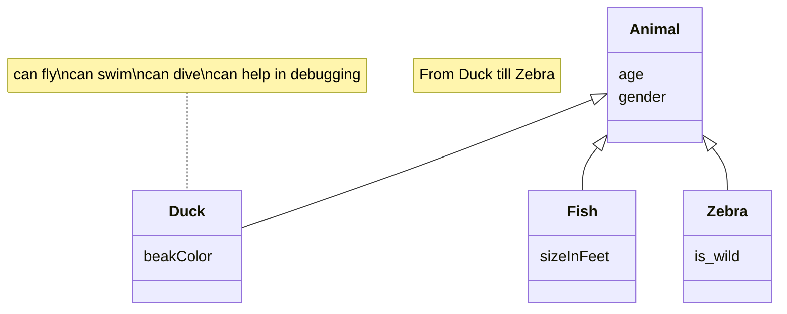

# Documento de diseño del sistema
**Asignatura:** Diseño y Pruebas (Grado en Ingeniería del Software, Universidad de Sevilla)  
**Curso académico:** 2025/2026
**Grupo/Equipo:** L6-03     
**Nombre del proyecto:** Petris
**Repositorio:** https://github.com/gii-is-DP1/dp1-2025-2026-l6-3-25  
**Integrantes (máx. 6):** <!-- Nombre Apellidos (US-Id / correo @us.es) -->
- David Lozano Acosta
- Diego Vicente Cámara
- José Ismael Barroso Delgado
- Jose Antonio Aguadero García
- Lu Dao Guerricabeitia Garzón
- Pablo Pérez Sorni

## Introducción

Petris es un juego de mesa basado en controlar la expansión de unas bacterias que se van moviendo entre unos discos, llamados placas de Petri. El objetivo de la partida consiste en intentar tener el menor número de bacterias posibles situadas estratégicamente para no obtener puntos de contaminación y hacerse con la victoria. 

Por supuesto más allá del objetivo del propio juego, está pensado para el disfrute y entretenimiento de las personas. En parte esta visión es la misma que comparte nuestro grupo de proyecto, quienes pretendemos que este juego, considerado un poco de nicho, llegue a conocerse un poco más.

Es un juego pensado para 2 jugadores en el que cada uno tiene una serie de bacterias y sarcinas. Empiezan cada uno con una bacteria situada en un disco del color de cada jugador. A partir de aquí van sucediendo distintas cosas en función del tipo de turno en el que nos encontremos. Distinguimos entre:
- **Fase de porpagación**: en la que los jugadores están obligados a realizar unos movimientos con ciertas restricciones, llamados propagaciones. Antes de terminar el turno el jugador ha de poder hacer una propagación correcta.
- **Fase de fisión binaria**: en esta fase las bacterias de cada jugador aumentan en función de ciertos criterios. 
- **Fase de contaminación**: fase en la cuál ambos jugadores aumentan su barra de contaminación en función de las bacterias presentes en las placas de Petri.

La duración de una partida es variable, pero ninguna suele superar los 10 minutos de duración. Normalmente se termina porque uno de los dos jugadores no puede realizar una propagación correcta o su barra de contaminación llega al máximo. Sin embargo, si ambos son lo suficientemente capaces como para llegar al final de los 40 turnos (contando como turnos cada una de las fases del juego) el resultado se decide o bien por los puntos de contaminación, o bien por el número de sarcinas, o bien por el número de bacterias.

[Enlace al vídeo de explicación de las reglas del Petris](https://www.youtube.com/watch?v=leB1K3TMzsQ)

## Diagrama(s) UML:

### Diagrama de Dominio/Diseño

_En esta sección debe proporcionar un diagrama UML de clases que describa el modelo de dominio, recuerda que debe estar basado en el diagrama conceptual del documento de análisis de requisitos del sistema pero que debe:_
•	_Especificar la direccionalidad de las relaciones (a no ser que sean bidireccionales)_
•	_Especificar la cardinalidad de las relaciones_
•	_Especificar el tipo de los atributos_
•	_Especificar las restricciones simples aplicadas a cada atributo de cada clase de domino_
•	_Incluir las clases específicas de la tecnología usada, como por ejemplo BaseEntity, NamedEntity, etc._
•	_Incluir los validadores específicos creados para las distintas clases de dominio (indicando en su caso una relación de uso con el estereotipo <<validates>>._

_Un ejemplo de diagrama para los ejercicios planteados en los boletines de laboratorio sería (hemos omitido las generalizaciones hacia BaseEntity para simplificar el diagrama):_


_Ej:_


_En este caso hemos vuelto a usar mermaid para crear el diagrama de dominio/diseño, pero recuerda que puedes usar cualquier otra herramienta que consideres oportuno para crear tus diagramas e inclurlos en este document como imagen tal y como se explica en [este tutorial](https://www.baeldung.com/ops/github-readme-insert-image)_

### Diagrama de Capas (incluyendo Controladores, Servicios y Repositorios)


## Descomposición del mockups del tablero de juego en componentes

En esta sección procesaremos el mockup del tablero de juego (o los mockups si el tablero cambia en las distintas fases del juego). Etiquetaremos las zonas de cada una de las pantallas para identificar componentes a implementar. Para cada mockup se especificará el árbol de jerarquía de componentes, así como, para cada componente el estado que necesita mantener, las llamadas a la API que debe realizar y los parámetros de configuración global que consideramos que necesita usar cada componente concreto. 
Por ejemplo, para la pantalla de visualización de métricas del usuario en un hipotético módulo de juego social:


  - App – Componente principal de la aplicación
    - $\color{orange}{\textsf{NavBar – Barra de navegación lateral}}$
      - $\color{darkred}{\textsf{[ NavButton ]. Muestra un botón de navegación con un icono asociado.}}$
    - $\color{darkblue}{\textsf{UserNotificationArea – Área de notificaciones e identificación del usuario actual}}$
    - $\color{blue}{\textsf{MetricsBar – En este componente se muestran las métricas principales del juego. Se mostrarán 4 métricas: partidas jugadas, puntos logrados, tiempo total, y cartas jugadas.}}$
      - $\color{darkgreen}{\textsf{[ MetricWell ] – Proporciona el valor y el incremento semanal de una métrica concreta. }}$
    - $\color{purple}{\textsf{GamesEvolutionChart – Muestra la tendencia de evolución en ellos últimos 4 meses en cuanto a partida jugadas, ganadas, perdidas y abandonadas.}}$
    - $\color{yellow}{\textsf{PopularCardsChart – Muestra la proporción de las N (parámetro de configuración) cartas más jugadas en el juego por el jugador.}}$
    - $\color{red}{\textsf{FrequentCoPlayersTable – Muestra los jugadores  con los que más se  ha jugado (de M en M donde M es un parámetro definido por la configuración del componente). Concretamente, se mostrarán la el nombre, la fecha de la última partida, la localización del jugador el porcentaje de partidas jugadas por ambos en las que el usuario ha ganado y si el jugador es amigo o no del usuario.}}$

## Patrones de diseño y arquitectónicos aplicados
En esta sección de especificar el conjunto de patrones de diseño y arquitectónicos aplicados durante el proyecto. Para especificar la aplicación de cada patrón puede usar la siguiente plantilla:

### Patrón: < Nombre del patrón >
*Tipo*: Arquitectónico | de Diseño

*Contexto de Aplicación*

Describir las partes de la aplicación donde se ha aplicado el patrón. Si se considera oportuno especificar el paquete donde se han incluido los elementos asociados a la aplicación del patrón.

*Clases o paquetes creados*

Indicar las clases o paquetes creados como resultado de la aplicación del patrón.

*Ventajas alcanzadas al aplicar el patrón*

Describir porqué era interesante aplicar el patrón.

## Decisiones de diseño
_En esta sección describiremos las decisiones de diseño que se han tomado a lo largo del desarrollo de la aplicación que vayan más allá de la mera aplicación de patrones de diseño o arquitectónicos._

### Decisión X
#### Descripción del problema:*

Describir el problema de diseño que se detectó, o el porqué era necesario plantearse las posibilidades de diseño disponibles para implementar la funcionalidad asociada a esta decisión de diseño.

#### Alternativas de solución evaluadas:
Especificar las distintas alternativas que se evaluaron antes de seleccionar el diseño concreto implementado finalmente en el sistema. Si se considera oportuno se pude incluir las ventajas e inconvenientes de cada alternativa

#### Justificación de la solución adoptada

Describir porqué se escogió la solución adoptada. Si se considera oportuno puede hacerse en función de qué  ventajas/inconvenientes de cada una de las soluciones consideramos más importantes.
Os recordamos que la decisión sobre cómo implementar las distintas reglas de negocio, cómo informar de los errores en el frontend, y qué datos devolver u obtener a través de las APIs y cómo personalizar su representación en caso de que sea necesario son decisiones de diseño relevantes.

_Ejemplos de uso de la plantilla con otras decisiones de diseño:_

### Decisión 1: Importación de datos reales para demostración
#### Descripción del problema:

Como grupo nos gustaría poder hacer pruebas con un conjunto de datos reales suficientes, porque resulta más motivador. El problema es al incluir todos esos datos como parte del script de inicialización de la base de datos, el arranque del sistema para desarrollo y pruebas resulta muy tedioso.

#### Alternativas de solución evaluadas:

*Alternativa 1.a*: Incluir los datos en el propio script de inicialización de la BD (data.sql).

*Ventajas:*
•	Simple, no requiere nada más que escribir el SQL que genere los datos.
*Inconvenientes:*
•	Ralentiza todo el trabajo con el sistema para el desarrollo. 
•	Tenemos que buscar nosotros los datos reales

*Alternativa 1.b*: Crear un script con los datos adicionales a incluir (extra-data.sql) y un controlador que se encargue de leerlo y lanzar las consultas a petición cuando queramos tener más datos para mostrar.
*Ventajas:*
•	Podemos reutilizar parte de los datos que ya tenemos especificados en (data.sql).
•	No afecta al trabajo diario de desarrollo y pruebas de la aplicación
*Inconvenientes:*
•	Puede suponer saltarnos hasta cierto punto la división en capas si no creamos un servicio de carga de datos. 
•	Tenemos que buscar nosotros los datos reales adicionales

*Alternativa 1.c*: Crear un controlador que llame a un servicio de importación de datos, que a su vez invoca a un cliente REST de la API de datos oficiales de XXXX para traerse los datos, procesarlos y poder grabarlos desde el servicio de importación.

*Ventajas:*
•	No necesitamos inventarnos ni buscar nosotros lo datos.
•	Cumple 100% con la división en capas de la aplicación.
•	No afecta al trabajo diario de desarrollo y pruebas de la aplicación
*Inconvenientes:*
•	Supone mucho más trabajo. 
•	Añade cierta complejidad al proyecto

*Justificación de la solución adoptada*
Como consideramos que la división en capas es fundamental y no queremos renunciar a un trabajo ágil durante el desarrollo de la aplicación, seleccionamos la alternativa de diseño 1.c.

## Refactorizaciones aplicadas

Si ha hecho refactorizaciones en su código, puede documentarlas usando el siguiente formato:

### Refactorización X: 
En esta refactorización añadimos un mapa de parámtros a la partida para ayudar a personalizar la información precalculada de la que partimos en cada fase del juego.
#### Estado inicial del código
```Java 
class Animal
{
}
``` 
_Puedes añadir información sobre el lenguaje concreto en el que está escrito el código para habilitar el coloreado de sintaxis tal y como se especifica en [este tutorial](https://docs.github.com/es/get-started/writing-on-github/working-with-advanced-formatting/creating-and-highlighting-code-blocks)_

#### Estado del código refactorizado

```
código fuente en java, jsx o javascript
```
#### Problema que nos hizo realizar la refactorización
_Ej: Era difícil añadir información para implementar la lógica de negocio en cada una de las fases del juego (en nuestro caso varía bastante)_
#### Ventajas que presenta la nueva versión del código respecto de la versión original
_Ej: Ahora podemos añadir arbitrariamente los datos que nos hagan falta al contexto de la partida para que sea más sencillo llevar a cabo los turnos y jugadas_
