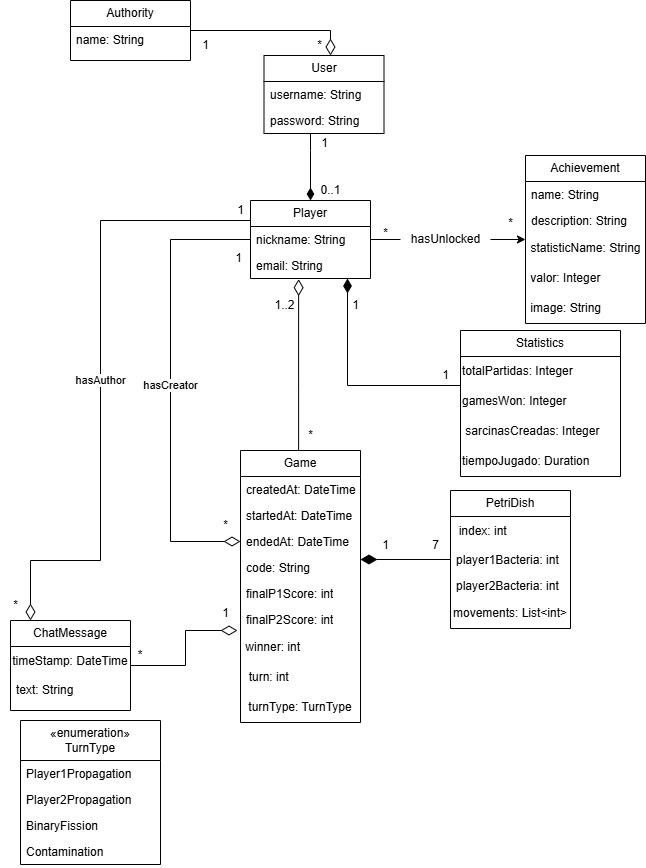

# Documento de diseño del sistema
**Asignatura:** Diseño y Pruebas (Grado en Ingeniería del Software, Universidad de Sevilla)  
**Curso académico:** 2025/2026
**Grupo/Equipo:** L6-03     
**Nombre del proyecto:** Petris
**Repositorio:** https://github.com/gii-is-DP1/dp1-2025-2026-l6-3-25  
**Integrantes (máx. 6):** <!-- Nombre Apellidos (US-Id / correo @us.es) -->
- David Lozano Acosta
- Diego Vicente Cámara
- José Ismael Barroso Delgado
- Jose Antonio Aguadero García
- Lu Dao Guerricabeitia Garzón
- Pablo Pérez Sorni

## Introducción

Petris es un juego de mesa basado en controlar la expansión de unas bacterias que se van moviendo entre unos discos, llamados placas de Petri. El objetivo de la partida consiste en intentar tener el menor número de bacterias posibles situadas estratégicamente para no obtener puntos de contaminación y hacerse con la victoria. 

Por supuesto más allá del objetivo del propio juego, está pensado para el disfrute y entretenimiento de las personas. En parte esta visión es la misma que comparte nuestro grupo de proyecto, quienes pretendemos que este juego, considerado un poco de nicho, llegue a conocerse un poco más.

Es un juego pensado para 2 jugadores en el que cada uno tiene una serie de bacterias y sarcinas. Empiezan cada uno con una bacteria situada en un disco del color de cada jugador. A partir de aquí van sucediendo distintas cosas en función del tipo de turno en el que nos encontremos. Distinguimos entre:
- **Fase de porpagación**: en la que los jugadores están obligados a realizar unos movimientos con ciertas restricciones, llamados propagaciones. Antes de terminar el turno el jugador ha de poder hacer una propagación correcta.
- **Fase de fisión binaria**: en esta fase las bacterias de cada jugador aumentan en función de ciertos criterios. 
- **Fase de contaminación**: fase en la cuál ambos jugadores aumentan su barra de contaminación en función de las bacterias presentes en las placas de Petri.

La duración de una partida es variable, pero ninguna suele superar los 10 minutos de duración. Normalmente se termina porque uno de los dos jugadores no puede realizar una propagación correcta o su barra de contaminación llega al máximo. Sin embargo, si ambos son lo suficientemente capaces como para llegar al final de los 40 turnos (contando como turnos cada una de las fases del juego) el resultado se decide o bien por los puntos de contaminación, o bien por el número de sarcinas, o bien por el número de bacterias.

[Enlace al vídeo de explicación de las reglas del Petris](https://www.youtube.com/watch?v=leB1K3TMzsQ)

## Diagrama(s) UML:

### Diagrama de Dominio/Diseño



### Diagrama de Capas (incluyendo Controladores, Servicios y Repositorios)


## Descomposición del mockups del tablero de juego en componentes


  - App – Componente principal de la aplicación
    - $\color{orange}{\textsf{Chat – Barra lateral izquierda para ver la conversación con el rival.}}$
      - $\color{darkred}{\textsf{[Escriba un mensaje... ]. Sitio para escribir el mensaje que quieras enviar.}}$
    - $\color{cyan}{\textsf{Tablero – Área de juego donde serán mostradas la fichas.}}$
    - $\color{lightblue}{\textsf{Turno – Barra lateral derecha donde ver a quién le toca/tocará los próximos turnos.}}$
      - $\color{green}{\textsf{[ Número de turno ] – Marca en que turno vas, cuando llega a 4 es que es la última}}$
    - $\color{purple}{\textsf{Temporizador – Arriba hay un temporizador que marca el tiempo restante en el turno.}}$
    - $\color{yellow}{\textsf{TerminarTurno – Botón para finalizar turno.}}$
    - $\color{red}{\textsf{Barra de puntuación – Barras laterales con el nombre del jugador arriba donde marca cuanto nivel de contaminación tiene.}}$
    - $\color{pink}{\textsf{Abandonar partida – Botón para salir de la partida antes de que finalice.}}$

## Patrones de diseño y arquitectónicos aplicados
En esta sección de especificar el conjunto de patrones de diseño y arquitectónicos aplicados durante el proyecto. Para especificar la aplicación de cada patrón puede usar la siguiente plantilla:

### Patrón: Modelo Vista Controlador (MVC)
*Tipo*: Arquitectónico 

*Contexto de Aplicación*

Este patrón arquitectónico se ha usado para organizar y estructurar el backend. Para la capa de la lógica de negocios, primero se han creado clases Modelo para cada tabla que queremos en la base de datos, para más tarde crear los servicios, cuyas funciones se han adaptado a las necesidades que hemos establecido en el frontend. Para acceder a esas tablas hemos accedido a traves de los servicios, en la capa de recursos hemos elegido los repositorios. Finalmente para la capa de presentación tenemos los controladores para cada función establecida en los servicios, con su vista respectiva en el frontend

*Clases o paquetes creados*

Hemos creado para las tablas User, Player, Achievement, Statistics, Match y PetriDish su modelo asociado con los atributos correspondientes establecidos en el diagrama de clases. Para todos los modelos les hemos creado sus servicios, repositorios y controladores

*Ventajas alcanzadas al aplicar el patrón*

Es interesante usar este patrón porque nos permite tener un código mejor estructurado por función, separando las responsabilidades de cada componente.

## Decisiones de diseño

### Decisión 1: Creación de la tabla estadísticas.
#### Descripción del problema:

Como grupo nos gustaría poder guardar las estadísticas en una tabla del backend.

#### Alternativas de solución evaluadas:

*Alternativa 1.a*: Que cada fila de la tabla sea una estadística con las propiedades nombre y valor.

*Ventajas:*
•	Sería más dinámica a la hora de añadir estadísticas nuevas en un futuro.
*Inconvenientes:*
•	Haría la tabla menos eficiente debido a que tendríamos un gran número de filas, mayor incluso al de jugadores.

*Alternativa 1.b*: Que cada columna tenga una estadística a guardar.
*Ventajas:*
•	Se quedaría una tabla más reducida dado que sería unas fila igual al número de jugadores.
*Inconvenientes:*
•	Si queremos añadir una estadística nueva hay que editar la base de la tabla.

#### Justificación de la solución adoptada

Al revisar el problema nos dimos cuenta que al ser un trabajo que no se va a prolongar en el tiempo no va a hacer falta añadir más estadísticas haciendo que la mejor opción sea la 1.b.

### Decisión 2: Usuario
#### Descripción del problema:

A la hora de hacer la clase Usuario tener el problema de que los admin no pueden jugar partidas.

#### Alternativas de solución evaluadas:
*Alternativa 1.a*: Que se usara usuario para jugar la partida.

*Ventajas:*
•	No habría que crear una clase intermedia.
*Inconvenientes:*
•	Habría que revisar si el usuario es admin o player.

*Alternativa 1.b*: Crear una clase intermedia llamada player y solo estos pueden jugar.
*Ventajas:*
•	No habría que revisar el rol.
• Se podría poner un nombre que se viera que no fuera el de usuario para iniciar sesión.
*Inconvenientes:*
•	Sería crear una tabla que tenga una relación 0..1 con usuario.

#### Justificación de la solución adoptada

Hemos optado por la opción 1.b porque la hemos valorado que la revisión si era admin o no a la hora de crear partidas podría dar problemas sumado a que nos daría más orden interno.

### Decisión 3: Game
#### Descripción del problema:

Como actualizar los cambios que se hagan en cada turno.

#### Alternativas de solución evaluadas:
*Alternativa 1.a*: Que se cambie la tabla Game cuando se crea, se inicia y se finaliza.

*Ventajas:*
•	La tabla Game al ser importante solo se cambiaría 3 veces.
*Inconvenientes:*
•	Habría que crear otras tablas para guardar el tablero y el turno en el que va.

*Alternativa 1.b*: Modificar Game cada turno.
*Ventajas:*
•	No habría que crear otras tablas para guardar datos.
*Inconvenientes:*
•	Existe la posibilidad de que al guardar datos de problemas.

#### Justificación de la solución adoptada

Hemos optado por la alternativa 1.b devido a que al ver el inconveniente que nos vino a la cabeza a la hora de ver opciones para crearlo nos dimos cuenta que no era tan necesario buscar que game solo se modificara 3 veces.

### Decisión 4: Uso de una pantalla de carga en la pagina del perfil.
#### Descripción del problema:

Como poder mirar las estadisticas, logros y historial de manera que sea atractivo a la vista y no vaya pegando tirones hasta que cargue toda la pagina.

#### Alternativas de solución evaluadas:

*Alternativa 1.a*: Poner una pantalla de carga que espere a todas las llamadas al backend.

*Ventajas:*
•	Sería más limpio y es un patrón de diseño bastamente extendido y utilzado.
*Inconvenientes:*
•	Haría que los jugadores no pudieran mirar los datos directamente.

*Alternativa 1.b*: Que todo vaya cargando de manera asíncrona cargando esperando al backend para cargar de una en una.

*Ventajas:*
•	Haría que los jugadores pudieran mirar los datos directamente.
*Inconvenientes:*
•	Da la sensacion de un producto inacabado y poco eficiente al ver como no todo está cargado cuando se entra a la página.

#### Justificación de la solución adoptada

Al revisar el problema nos decidimos por la primera alternativa ya que nos ayuda a entregar un producto con una apariencia más limpia y tambíen exime la necesidad de que todas las llamadas al backend sean instantaneas.

## Refactorizaciones aplicadas

Si ha hecho refactorizaciones en su código, puede documentarlas usando el siguiente formato:

### Refactorización X: 
En esta refactorización añadimos un mapa de parámtros a la partida para ayudar a personalizar la información precalculada de la que partimos en cada fase del juego.
#### Estado inicial del código
```Java 
class Animal
{
}
``` 
_Puedes añadir información sobre el lenguaje concreto en el que está escrito el código para habilitar el coloreado de sintaxis tal y como se especifica en [este tutorial](https://docs.github.com/es/get-started/writing-on-github/working-with-advanced-formatting/creating-and-highlighting-code-blocks)_

#### Estado del código refactorizado

```
código fuente en java, jsx o javascript
```
#### Problema que nos hizo realizar la refactorización
_Ej: Era difícil añadir información para implementar la lógica de negocio en cada una de las fases del juego (en nuestro caso varía bastante)_
#### Ventajas que presenta la nueva versión del código respecto de la versión original
_Ej: Ahora podemos añadir arbitrariamente los datos que nos hagan falta al contexto de la partida para que sea más sencillo llevar a cabo los turnos y jugadas_
