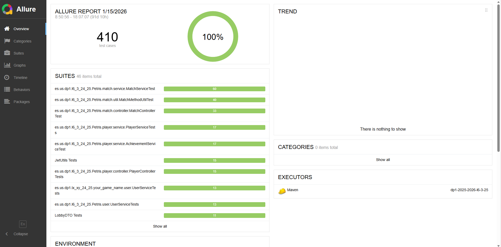

# Plan de Pruebas
**Asignatura:** Diseño y Pruebas 1 (Grado en Ingeniería del Software, Universidad de Sevilla)   
**Curso académico:** 2025/2026  
**Grupo/Equipo:** L6-03     
**Nombre del proyecto:** Petris  
**Repositorio:** https://github.com/gii-is-DP1/dp1-2025-2026-l6-3-25  
**Integrantes (máx. 6):** 
- David Lozano Acosta
- Diego Vicente Cámara
- José Ismael Barroso Delgado
- Jose Antonio Aguadero García
- Lu Dao Guerricabeitia Garzón
- Pablo Pérez Sorni

## 1. Introducción

Este documento describe el plan de pruebas para el proyecto **Petris** desarrollado en el marco de la asignatura **Diseño y Pruebas 1** por el grupo **L6-03**. El objetivo del plan de pruebas es garantizar que el software desarrollado cumple con los requisitos especificados en las historias de usuario y que se han realizado las pruebas necesarias para validar su funcionamiento.

## 2. Alcance

El alcance de este plan de pruebas incluye:

- Pruebas unitarias.
  - Pruebas unitarias de backend incluyendo pruebas servicios o repositorios
  - Pruebas unitarias parametrizadas de backend. Usan diferente casos de prueba para evitar repetir código.
  - Pruebas unitarias de frontend: pruebas de las funciones javascript creadas en frontend.
  - Pruebas unitarias de interfaz de usuario. Usan la interfaz de usuario de nuestros componentes frontend.
  - Pruebas unitarias parametrizadas de backend. Usan diferente casos de prueba para evitar repetir código.
- Pruebas de integración.  En nuestro caso principalmente son pruebas de controladores que también se ejecutarán mediante JUnit.

## 3. Estrategia de Pruebas

### 3.1 Tipos de Pruebas

#### 3.1.1 Pruebas Unitarias
Las pruebas unitarias se realizarán para verificar el correcto funcionamiento de los componentes individuales del software. Se utilizarán herramientas de automatización de pruebas como **JUnit** en backend y jest en frontend.

#### 3.1.2 Pruebas de Integración
Las pruebas de integración se enfocarán en evaluar la interacción entre los distintos módulos o componentes del sistema, nosotros las realizaremos a nivel de API, probando nuestros controladores Spring.

## 4. Herramientas y Entorno de Pruebas

### 4.1 Herramientas
- **Maven**: Gestión de dependencias y ejecución de las pruebas.
- **JUnit**: Framework de pruebas unitarias.
- **Jacoco**: Generación de informes de cobertura de código. Si se ejecuta el comando de maven install, se copiará el informe de cobertura a la subcarpeta del repositorio /docs/deliverables/D3/coverage (puede visualizarse pulsando en el fichero index.html de dicho directorio).
- **Allure**: Generación de informes de estado de las últimas ejecuciones de las pruebas. Permite agrupar las pruebas por módulo/épica y feature. Si se ejecuta el comando de maven install, se copiará el informe de estado a la subcarpeta del repositorio /docs/deliverables/D3/status (puede visualizarse pulsando en el fichero index.html de dicho directorio).
- **Jest**: Framework para pruebas unitarias en javascript.
- **React-test**: Librería para la creación de pruebas unitarias de componentes React.

#### Allure — generación y visualización

- **Rutas de resultados:** `target/allure-results` (generadas por Maven al ejecutar las pruebas).
- **Comandos útiles:**
  - `mvn allure:report` — generar reporte Allure (si está configurado el plugin en `pom.xml`).
  - `allure serve target/allure-results` — inicia un servidor temporal y abre la UI interactiva.
  - `allure generate target/allure-results -o target/site/allure-report && allure open target/site/allure-report` — generar HTML y abrirlo en el navegador.
- **Notas prácticas:**
  - Tras ejecutar `mvn install` en este proyecto, los resultados de las pruebas suelen quedar en `target/allure-results`.
  - Para entregar el informe en la asignatura, copia o genera el HTML y sitúalo en `/docs/deliverables/D3/status` (el fichero `index.html` ahí permite visualizar el estado agregado).
  - En CI/CD: añadir pasos que ejecuten `mvn test` y luego `mvn allure:report` o `allure generate`, y publicar `target/site/allure-report` como artefacto o página.

### 4.2 Entorno de Pruebas
Las pruebas se ejecutarán en el entorno de desarrollo y, eventualmente, en el entorno de pruebas del servidor de integración continua.

## 5. Planificación de Pruebas
### 5.1 Estado y trazadibilidad de Pruebas por Módulo y Épica

El informe de estado de las pruebas (con trazabilidad de éstas hacia los módulos y las épicas/historias de usaurio) se encuentra [aquí](
https://gii-is-dp1.github.io/group-project-seed/deliverables/D3/status/#behaviors).

### 5.2 Cobertura de Pruebas

El informe de cobertura de pruebas se puede consultar [aquí](
https://gii-is-dp1.github.io/group-project-seed/deliverables/D3/coverage/).

*Nota importante para el alumno*: A la hora de entregar el proyecto, debes modificar la url para que esté asociada al respositorio concreto de tu proyecto. Date cuenta de que ahora mismo apunta al repositorio _gii-is-DP1/group-project-seed_.

| Historia de Usuario | Prueba | Descripción | Estado | Tipo |
|---|---|---|---|---|
| **HU-01: Unirse a una partida (jugador)** | [UTB-01:testAddPlayer_Success](https://github.com/gii-is-DP1/dp1-2025-2026-l6-3-25/blob/main/src/test/java/es/us/dp1/l6_3_24_25/Petris/lobby/servicio/SalaServiceTest.java) | Verifica que se puede añadir un jugador a una sala existente. | Implementada | Unitaria en backend a nivel de Servicio |
| **HU-01: Unirse a una partida (jugador)** | [UTB-01:testAddPlayer_NonExistentLobby](https://github.com/gii-is-DP1/dp1-2025-2026-l6-3-25/blob/main/src/test/java/es/us/dp1/l6_3_24_25/Petris/lobby/servicio/SalaServiceTest.java) | Verifica que no se puede añadir un jugador a una sala inexistente. | Implementada | Unitaria en backend a nivel de Servicio (Caso negativo) |
| **HU-01: Unirse a una partida (jugador)** | [UTW-01:joinLobby_returnsLobbyAndSendsMessage](https://github.com/gii-is-DP1/dp1-2025-2026-l6-3-25/blob/main/src/test/java/es/us/dp1/l6_3_24_25/Petris/lobby/controlador/SalaControllerTest.java) | Verifica el endpoint **POST /api/salas/{codigo}/unirse** para unirse a una sala y enviar notificación (status 200 OK). | Implementada | Integración en backend (Controller/MockMvc) |
| **HU-01: Unirse a una partida (jugador)** | [UTW-01:joinLobby_notFound](https://github.com/gii-is-DP1/dp1-2025-2026-l6-3-25/blob/main/src/test/java/es/us/dp1/l6_3_24_25/Petris/lobby/controlador/SalaControllerTest.java) | Verifica el manejo del endpoint **POST /api/salas/{codigo}/unirse** cuando la sala no existe (status 404 Not Found). | Implementada | Integración en backend (Controller/MockMvc) |
| **HU-01: Unirse a una partida (jugador)** | [UTW-01:testGetMatchByCodePositive](https://github.com/gii-is-DP1/dp1-2025-2026-l6-3-25/blob/main/src/test/java/es/us/dp1/l6_3_24_25/Petris/match/controller/MatchControllerTest.java) | Verifica el endpoint **GET /v1/matches/code/{code}** para obtener una partida por su código. | Implementada | Integración en backend (Controller/MockMvc) |
| **HU-01: Unirse a una partida (jugador)** | [UTW-01:testJoinMatchPositive](https://github.com/gii-is-DP1/dp1-2025-2026-l6-3-25/blob/main/src/test/java/es/us/dp1/l6_3_24_25/Petris/match/controller/MatchControllerTest.java) | Verifica el endpoint **PUT /v1/matches/{id}** para unirse a una partida con código válido. | Implementada | Integración en backend (Controller/MockMvc) |
| **HU-01: Unirse a una partida (jugador)** | [UTW-01:testJoinMatchNegative](https://github.com/gii-is-DP1/dp1-2025-2026-l6-3-25/blob/main/src/test/java/es/us/dp1/l6_3_24_25/Petris/match/controller/MatchControllerTest.java) | Verifica el manejo de errores en endpoint **PUT /v1/matches/{id}** al unirse a una partida. | Implementada | Integración en backend (Controller/MockMvc) |
| **HU-01: Unirse a una partida (jugador)** | [UTW-01:watchLobby_publishesCurrentSnapshot](https://github.com/gii-is-DP1/dp1-2025-2026-l6-3-25/blob/main/src/test/java/es/us/dp1/l6_3_24_25/Petris/match/controller/WebSocketMatchControllerTests.java) | Verifica que al suscribirse a una sala se recibe el estado actual de la misma via WebSocket. | Implementada | Integración en backend (Controller/WebSocket) |
| **HU-01: Unirse a una partida (jugador)** | [UTB-01:testJoinMatchPositive](https://github.com/gii-is-DP1/dp1-2025-2026-l6-3-25/blob/main/src/test/java/es/us/dp1/l6_3_24_25/Petris/match/service/MatchServiceTest.java) | Verifica que un jugador se une correctamente a una partida privada por código. | Implementada | Unitaria en backend a nivel de Servicio |
| **HU-01: Unirse a una partida (jugador)** | [UTB-01:publishLobbySnapshot](https://github.com/gii-is-DP1/dp1-2025-2026-l6-3-25/blob/main/src/test/java/es/us/dp1/l6_3_24_25/Petris/match/service/WebSocketMatchServiceTest.java) | Verifica el envío del snapshot del lobby via WebSocket. | Implementada | Unitaria en backend a nivel de Servicio (WebSocket) |
| **HU-01: Unirse a una partida (jugador)** | [UTB-01:shouldUpdateIsCurrentlyInMatchFlag](https://github.com/gii-is-DP1/dp1-2025-2026-l6-3-25/blob/main/src/test/java/es/us/dp1/l6_3_24_25/Petris/player/service/PlayerServiceTests.java) | Verifica el cambio de estado 'en partida' del jugador. | Implementada | Unitaria en backend a nivel de Servicio |
| **HU-01: Unirse a una partida (jugador)** | [UTB-01:testJoinMatchPositive2](https://github.com/gii-is-DP1/dp1-2025-2026-l6-3-25/blob/main/src/test/java/es/us/dp1/l6_3_24_25/Petris/match/service/MatchServiceTest.java) | Verifica la lógica para unirse a una partida **pública**. | Implementada | Unitaria en backend a nivel de Servicio |
| **HU-01: Unirse a una partida (jugador)** | [UTB-01:testJoinMatchNegative5](https://github.com/gii-is-DP1/dp1-2025-2026-l6-3-25/blob/main/src/test/java/es/us/dp1/l6_3_24_25/Petris/match/service/MatchServiceTest.java) | Verifica que no se permite unirse si la partida está **llena**. | Implementada | Unitaria en backend a nivel de Servicio |
| **HU-02: Avanzar de turno (jugador)** | [UTW-02:testNextTurnPositive](https://github.com/gii-is-DP1/dp1-2025-2026-l6-3-25/blob/main/src/test/java/es/us/dp1/l6_3_24_25/Petris/match/controller/MatchControllerTest.java) | Verifica pasar turno correctamente cuando corresponde al jugador. | Implementada | Integración en backend (Controller/MockMvc) |
| **HU-02: Avanzar de turno (jugador)** | [UTW-02:testNextTurnPositive](https://github.com/gii-is-DP1/dp1-2025-2026-l6-3-25/blob/main/src/test/java/es/us/dp1/l6_3_24_25/Petris/match/controller/MatchControllerTest.java) | Verifica el endpoint de avance de turno cuando es el turno del jugador (status 200 OK). | Implementada | Integración en backend (Controller/MockMvc) |
| **HU-02: Avanzar de turno (jugador)** | [UTB-02:testNextTurnPositive](https://github.com/gii-is-DP1/dp1-2025-2026-l6-3-25/blob/main/src/test/java/es/us/dp1/l6_3_24_25/Petris/match/service/MatchServiceTest.java) | Verifica el cálculo correcto del siguiente turno y tipo de turno. | Implementada | Unitaria en backend a nivel de Servicio |
| **HU-04: Validación de movimientos (jugador)** | [UTW-04:testCheckErrorsPositive](https://github.com/gii-is-DP1/dp1-2025-2026-l6-3-25/blob/main/src/test/java/es/us/dp1/l6_3_24_25/Petris/match/controller/MatchControllerTest.java) | Verifica la solicitud de validación de estado del tablero (checkErrors). | Implementada | Integración en backend (Controller/MockMvc) |
| **HU-04: Validación de movimientos (jugador)** | [UTW-04:testCheckErrorsPositive](https://github.com/gii-is-DP1/dp1-2025-2026-l6-3-25/blob/main/src/test/java/es/us/dp1/l6_3_24_25/Petris/match/controller/MatchControllerTest.java) | Verifica la obtención de errores de propagación. | Implementada | Integración en backend (Controller/MockMvc) |
| **HU-04: Validación de movimientos (jugador)** | [UTB-04:testPropagationPositive](https://github.com/gii-is-DP1/dp1-2025-2026-l6-3-25/blob/main/src/test/java/es/us/dp1/l6_3_24_25/Petris/match/util/MatchMethodUtilTest.java) | Verifica que una propagación válida actualiza el tablero correctamente. | Implementada | Unitaria en backend (Utilidad Lógica) |
| **HU-04: Validación de movimientos (jugador)** | [UTB-04:testPropagationNegative](https://github.com/gii-is-DP1/dp1-2025-2026-l6-3-25/blob/main/src/test/java/es/us/dp1/l6_3_24_25/Petris/match/util/MatchMethodUtilTest.java) | Verifica que se lanzan excepciones ante movimientos ilegales (bacterias ajenas, distancias incorrectas). | Implementada | Unitaria en backend (Utilidad Lógica) |
| **HU-04: Validación de movimientos (jugador)** | [UTB-04:testCheckErrorsPositive](https://github.com/gii-is-DP1/dp1-2025-2026-l6-3-25/blob/main/src/test/java/es/us/dp1/l6_3_24_25/Petris/match/service/MatchServiceTest.java) | Verifica la invocación de la lógica de validación de movimientos (`MatchMethodUtil`). | Implementada | Unitaria en backend a nivel de Servicio |
| **HU-05: Control de turnos (jugador)** | [UTW-05:testGetMatchByIdPositive](https://github.com/gii-is-DP1/dp1-2025-2026-l6-3-25/blob/main/src/test/java/es/us/dp1/l6_3_24_25/Petris/match/controller/MatchControllerTest.java) | Verifica el endpoint **GET /v1/matches/{id}** para obtener el estado actual de la partida. | Implementada | Integración en backend (Controller/MockMvc) |
| **HU-05: Control de turnos (jugador)** | [UTW-05:watchMatch_publishesMatchSnapshot](https://github.com/gii-is-DP1/dp1-2025-2026-l6-3-25/blob/main/src/test/java/es/us/dp1/l6_3_24_25/Petris/match/controller/WebSocketMatchControllerTests.java) | Verifica que al suscribirse a una partida en curso se recibe el estado completo del tablero y juego via WebSocket. | Implementada | Integración en backend (Controller/WebSocket) |
| **HU-05: Control de turnos (jugador)** | [UTB-05:testToMatchDTO_Success](https://github.com/gii-is-DP1/dp1-2025-2026-l6-3-25/blob/main/src/test/java/es/us/dp1/l6_3_24_25/Petris/match/dto/MatchDTOTest.java) | Verifica la conversión completa de una partida a MatchDTO incluyendo estado del juego. | Implementada | Unitaria (DTO) |
| **HU-05: Control de turnos (jugador)** | [UTB-05:testToMatchDTO_BoardConversion](https://github.com/gii-is-DP1/dp1-2025-2026-l6-3-25/blob/main/src/test/java/es/us/dp1/l6_3_24_25/Petris/match/dto/MatchDTOTest.java) | Verifica que el estado del tablero (bacterias) se convierte correctamente al DTO. | Implementada | Unitaria (DTO) |
| **HU-05: Control de turnos (jugador)** | [UTB-05:publishMatchSnapshot](https://github.com/gii-is-DP1/dp1-2025-2026-l6-3-25/blob/main/src/test/java/es/us/dp1/l6_3_24_25/Petris/match/service/WebSocketMatchServiceTest.java) | Verifica el envío del estado de la partida via WebSocket. | Implementada | Unitaria en backend a nivel de Servicio (WebSocket) |
| **HU-07: Control de fase de fisión binaria (jugador)** | [UTB-07:testBinaryFissionPositive](https://github.com/gii-is-DP1/dp1-2025-2026-l6-3-25/blob/main/src/test/java/es/us/dp1/l6_3_24_25/Petris/match/util/MatchMethodUtilTest.java) | Verifica la lógica de incremento de bacterias en fase de fisión. | Implementada | Unitaria en backend (Utilidad Lógica) |
| **HU-08: Control de fase de contaminación (jugador)** | [UTB-08:testContaminationPositive](https://github.com/gii-is-DP1/dp1-2025-2026-l6-3-25/blob/main/src/test/java/es/us/dp1/l6_3_24_25/Petris/match/util/MatchMethodUtilTest.java) | Verifica el cálculo de puntos de contaminación. | Implementada | Unitaria en backend (Utilidad Lógica) |
| **HU-10: Abandonar partida (jugador)** | [UTW-10:testLeaveMatchPositive](https://github.com/gii-is-DP1/dp1-2025-2026-l6-3-25/blob/main/src/test/java/es/us/dp1/l6_3_24_25/Petris/match/controller/MatchControllerTest.java) | Verifica que un jugador puede abandonar la sala/partida. | Implementada | Integración en backend (Controller/MockMvc) |
| **HU-10: Abandonar partida (jugador)** | [UTW-10:testConcedeMatchPositive](https://github.com/gii-is-DP1/dp1-2025-2026-l6-3-25/blob/main/src/test/java/es/us/dp1/l6_3_24_25/Petris/match/controller/MatchControllerTest.java) | Verifica que un jugador puede rendirse durante la partida. | Implementada | Integración en backend (Controller/MockMvc) |
| **HU-10: Abandonar partida (jugador)** | [UTW-10:testLeaveMatchPositive](https://github.com/gii-is-DP1/dp1-2025-2026-l6-3-25/blob/main/src/test/java/es/us/dp1/l6_3_24_25/Petris/match/controller/MatchControllerTest.java) | Verifica el endpoint **PUT /v1/matches/{id}/leave** para abandonar una partida. | Implementada | Integración en backend (Controller/MockMvc) |
| **HU-10: Abandonar partida (jugador)** | [UTW-10:testConcedeMatchPositive](https://github.com/gii-is-DP1/dp1-2025-2026-l6-3-25/blob/main/src/test/java/es/us/dp1/l6_3_24_25/Petris/match/controller/MatchControllerTest.java) | Verifica funcionalidad de conceder partida (rendirse). | Implementada | Integración en backend (Controller/MockMvc) |
| **HU-10: Abandonar partida (jugador)** | [UTB-10:testLeaveMatchPositive](https://github.com/gii-is-DP1/dp1-2025-2026-l6-3-25/blob/main/src/test/java/es/us/dp1/l6_3_24_25/Petris/match/service/MatchServiceTest.java) | Verifica la lógica de abandono de partida y reasignación de creador. | Implementada | Unitaria en backend a nivel de Servicio |
| **HU-10: Abandonar partida (jugador)** | [UTB-10:testLeaveMatchPositive3](https://github.com/gii-is-DP1/dp1-2025-2026-l6-3-25/blob/main/src/test/java/es/us/dp1/l6_3_24_25/Petris/match/service/MatchServiceTest.java) | Verifica que si el creador abandona una sala sin oponente, la partida se **elimina**. | Implementada | Unitaria en backend a nivel de Servicio |
| **HU-10: Abandonar partida (jugador)** | [UTB-10:testConcedeMatchPositiveWithEnumSource](https://github.com/gii-is-DP1/dp1-2025-2026-l6-3-25/blob/main/src/test/java/es/us/dp1/l6_3_24_25/Petris/match/service/MatchServiceTest.java) | Verifica la lógica de **rendición** en turnos de propagación (parametrizada). | Implementada | Unitaria en backend a nivel de Servicio, parametrizada |
| **HU-11: Listado de partidas en curso (administrador)** | [UTW-11:testDeleteMatchPositive](https://github.com/gii-is-DP1/dp1-2025-2026-l6-3-25/blob/main/src/test/java/es/us/dp1/l6_3_24_25/Petris/match/controller/MatchControllerTest.java) | Verifica que un administrador puede eliminar una partida. | Implementada | Integración en backend (Controller/MockMvc) |
| **HU-11: Listado de partidas en curso (administrador)** | [UTW-11:watchLobbyList_publishesLobbyCollection](https://github.com/gii-is-DP1/dp1-2025-2026-l6-3-25/blob/main/src/test/java/es/us/dp1/l6_3_24_25/Petris/match/controller/WebSocketMatchControllerTests.java) | Verifica que al suscribirse a la lista de salas se recibe la colección actualizada via WebSocket. | Implementada | Integración en backend (Controller/WebSocket) |
| **HU-11: Listado de partidas en curso (administrador)** | [UTB-11:testGetAllLobbies_Success](https://github.com/gii-is-DP1/dp1-2025-2026-l6-3-25/blob/main/src/test/java/es/us/dp1/l6_3_24_25/Petris/lobby/servicio/SalaServiceTest.java) | Verifica que se pueden obtener todas las salas creadas. | Implementada | Unitaria en backend a nivel de Servicio |
| **HU-11: Listado de partidas en curso (administrador)** | [UTB-11:testGetAllLobbies_Empty](https://github.com/gii-is-DP1/dp1-2025-2026-l6-3-25/blob/main/src/test/java/es/us/dp1/l6_3_24_25/Petris/lobby/servicio/SalaServiceTest.java) | Verifica el comportamiento al listar salas cuando no hay ninguna creada. | Implementada | Unitaria en backend a nivel de Servicio |
| **HU-11: Listado de partidas en curso (administrador)** | [UTB-11:testToLobbyDTO_Success](https://github.com/gii-is-DP1/dp1-2025-2026-l6-3-25/blob/main/src/test/java/es/us/dp1/l6_3_24_25/Petris/match/dto/LobbyDTOTest.java) | Verifica la conversión correcta de una entidad Match a LobbyDTO para listados. | Implementada | Unitaria (DTO) |
| **HU-11: Listado de partidas en curso (administrador)** | [UTB-11:testGetAllMatches](https://github.com/gii-is-DP1/dp1-2025-2026-l6-3-25/blob/main/src/test/java/es/us/dp1/l6_3_24_25/Petris/match/service/MatchServiceTest.java) | Verifica que se pueden obtener todas las partidas almacenadas. | Implementada | Unitaria en backend a nivel de Servicio |
| **HU-11: Listado de partidas en curso (administrador)** | [UTB-11:publishLobbyList](https://github.com/gii-is-DP1/dp1-2025-2026-l6-3-25/blob/main/src/test/java/es/us/dp1/l6_3_24_25/Petris/match/service/WebSocketMatchServiceTest.java) | Verifica el envío de la lista de lobbies via WebSocket. | Implementada | Unitaria en backend a nivel de Servicio (WebSocket) |
| **HU-12: Ver nombre del oponente (jugador)** | [UTB-12:testToPlayerSummary_Success](https://github.com/gii-is-DP1/dp1-2025-2026-l6-3-25/blob/main/src/test/java/es/us/dp1/l6_3_24_25/Petris/match/dto/PlayerSummaryDTOTest.java) | Verifica que la información resumida del jugador (nombre, usuario) se convierte correctamente. | Implementada | Unitaria (DTO) |
| **HU-13: Crear partida privada (jugador)** | [UTW-13:testCreateMatchPositive](https://github.com/gii-is-DP1/dp1-2025-2026-l6-3-25/blob/main/src/test/java/es/us/dp1/l6_3_24_25/Petris/match/controller/MatchControllerTest.java) | Verifica la creación de una nueva partida indicando si es privada. | Implementada | Integración en backend (Controller/MockMvc) |
| **HU-13: Crear partida privada (jugador)** | [UTW-13:testStartMatchPositive](https://github.com/gii-is-DP1/dp1-2025-2026-l6-3-25/blob/main/src/test/java/es/us/dp1/l6_3_24_25/Petris/match/controller/MatchControllerTest.java) | Verifica que el creador de la partida puede iniciarla. | Implementada | Integración en backend (Controller/MockMvc) |
| **HU-13: Crear partida privada (jugador)** | [UTB-13:testCreateLobby_Success](https://github.com/gii-is-DP1/dp1-2025-2026-l6-3-25/blob/main/src/test/java/es/us/dp1/l6_3_24_25/Petris/lobby/servicio/SalaServiceTest.java) | Verifica la creación exitosa de una nueva sala con código de unión. | Implementada | Unitaria en backend a nivel de Servicio |
| **HU-13: Crear partida privada (jugador)** | [UTB-13:testCreateLobby_DifferentCodes](https://github.com/gii-is-DP1/dp1-2025-2026-l6-3-25/blob/main/src/test/java/es/us/dp1/l6_3_24_25/Petris/lobby/servicio/SalaServiceTest.java) | Verifica que las salas creadas tienen códigos de unión únicos. | Implementada | Unitaria en backend a nivel de Servicio |
| **HU-13: Crear partida privada (jugador)** | [UTW-13:createLobby_returnsLobby](https://github.com/gii-is-DP1/dp1-2025-2026-l6-3-25/blob/main/src/test/java/es/us/dp1/l6_3_24_25/Petris/lobby/controlador/SalaControllerTest.java) | Verifica el endpoint **POST /api/salas** con datos válidos (status 200 OK). | Implementada | Integración en backend (Controller/MockMvc) |
| **HU-13: Crear partida privada (jugador)** | [UTW-13:testCreateMatchPositive](https://github.com/gii-is-DP1/dp1-2025-2026-l6-3-25/blob/main/src/test/java/es/us/dp1/l6_3_24_25/Petris/match/controller/MatchControllerTest.java) | Verifica el endpoint **POST /v1/matches** para crear una nueva partida privada. | Implementada | Integración en backend (Controller/MockMvc) |
| **HU-13: Crear partida privada (jugador)** | [UTW-13:testStartMatchPositive](https://github.com/gii-is-DP1/dp1-2025-2026-l6-3-25/blob/main/src/test/java/es/us/dp1/l6_3_24_25/Petris/match/controller/MatchControllerTest.java) | Verifica que el creador puede iniciar la partida. | Implementada | Integración en backend (Controller/MockMvc) |
| **HU-13: Crear partida privada (jugador)** | [UTB-13:testToLobbyDTO_PrivacyFlag](https://github.com/gii-is-DP1/dp1-2025-2026-l6-3-25/blob/main/src/test/java/es/us/dp1/l6_3_24_25/Petris/match/dto/LobbyDTOTest.java) | Verifica que el flag de privacidad se establece correctamente en el DTO según la existencia de código. | Implementada | Unitaria (DTO) |
| **HU-13: Crear partida privada (jugador)** | [UTB-13:testCreateMatchPositive](https://github.com/gii-is-DP1/dp1-2025-2026-l6-3-25/blob/main/src/test/java/es/us/dp1/l6_3_24_25/Petris/match/service/MatchServiceTest.java) | Verifica que un jugador puede crear una nueva partida (privada o pública) si no está en otra. | Implementada | Unitaria en backend a nivel de Servicio |
| **HU-13: Crear partida privada (jugador)** | [UTB-13:testCreateMatchPositive](https://github.com/gii-is-DP1/dp1-2025-2026-l6-3-25/blob/main/src/test/java/es/us/dp1/l6_3_24_25/Petris/match/service/MatchServiceTest.java) | Verifica que se crea una partida y se asigna el creador correctamente. | Implementada | Unitaria en backend a nivel de Servicio |
| **HU-14: Ver ganador al finalizar (jugador)** | [UTW-14:testNextTurnPositive2](https://github.com/gii-is-DP1/dp1-2025-2026-l6-3-25/blob/main/src/test/java/es/us/dp1/l6_3_24_25/Petris/match/controller/MatchControllerTest.java) | Verifica que avanzar turno puede desencadenar el fin de la partida. | Implementada | Integración en backend (Controller/MockMvc) |
| **HU-14: Ver ganador al finalizar (jugador)** | [UTB-14:testGetWinnerPositive](https://github.com/gii-is-DP1/dp1-2025-2026-l6-3-25/blob/main/src/test/java/es/us/dp1/l6_3_24_25/Petris/match/util/MatchMethodUtilTest.java) | Verifica la lógica para determinar el ganador al terminar la partida. | Implementada | Unitaria en backend (Utilidad Lógica) |
| **HU-14: Ver ganador al finalizar (jugador)** | [UTB-14:testNextTurnPositive2](https://github.com/gii-is-DP1/dp1-2025-2026-l6-3-25/blob/main/src/test/java/es/us/dp1/l6_3_24_25/Petris/match/service/MatchServiceTest.java) | Verifica que al finalizar los turnos se cierra la partida y se calcula ganador. | Implementada | Unitaria en backend a nivel de Servicio |
| **HU-17: Registrar usuario** | [UTB-17:TestRegister](https://github.com//gii-is-DP1/dp1-2025-2026-l6-3-25/blob/main/src/test/java/es/us/dp1/l6_3_24_25/Petris/auth/AuthServiceTests.java) | Verifica que un nuevo usuario puede registrarse en el sistema. | Implementada |Unitaria en backend a nivel de Servicio, prueba social incluyendo a la BD y los repositorios. |
| **HU-17: Registro de usuario (usuario)** | [UTB17-shouldSave](https://github.com/gii-is-DP1/dp1-2025-2026-l6-3-25/blob/main/src/test/java/es/us/dp1/l6_3_24_25/Petris/player/service/PlayerServiceTests.java) | Verifica que se **guarda** correctamente un nuevo jugador. | Implementada | Unitaria en backend a nivel de Servicio, transaccional |
| **HU-17: Registro de usuario (usuario)** | [UTW17 - testCreatePlayer](https://github.com/gii-is-DP1/dp1-2025-2026-l6-3-25/blob/main/src/test/java/es/us/dp1/l6_3_24_25/Petris/player/controller/AchievementControllerTest.java) | Verifica el endpoint **POST /players** con datos válidos (status 201 Created). | Implementada | Integración en backend (Controller/MockMvc) |
| **HU-17: Registro de usuario (usuario)** | [UTB17-shouldSave](https://github.com/gii-is-DP1/dp1-2025-2026-l6-3-25/blob/main/src/test/java/es/us/dp1/l6_3_24_25/Petris/player/service/PlayerServiceTests.java) | Verifica que se crea y guarda correctamente un nuevo perfil de jugador. | Implementada | Unitaria en backend a nivel de Servicio |
| **HU-18: Iniciar sesión** | [UTB-18:TestLogin](https://github.com/gii-is-DP1/dp1-2025-2026-l6-3-25/blob/main/src/test/java/es/us/dp1/l6_3_24_25/Petris/auth/AuthControllerTests.java) | Verifica que un usuario puede iniciar sesión con credenciales válidas. | Implementada | Unitaria en backend de controlador aislaada |
| **HU-18: Iniciar sesión (jugador)** | [UTB18-shouldGetPlayerByUser](https://github.com/gii-is-DP1/dp1-2025-2026-l6-3-25/blob/main/src/test/java/es/us/dp1/l6_3_24_25/Petris/player/service/PlayerServiceTests.java) | Verifica la recuperación del perfil de jugador asociado a un usuario autenticado. | Implementada | Unitaria en backend a nivel de Servicio |
| **HU-18: Iniciar sesión (jugador)** | [UTB18-shouldNotGetPlayerWithIncorrectUser](https://github.com/gii-is-DP1/dp1-2025-2026-l6-3-25/blob/main/src/test/java/es/us/dp1/l6_3_24_25/Petris/player/service/PlayerServiceTests.java) | Verifica que se maneja el error si el usuario no tiene perfil de jugador asociado. | Implementada | Unitaria en backend a nivel de Servicio |
| **HU-20: Editar perfil (jugador)** | [UTW20 - testUpdatePlayer](https://github.com/gii-is-DP1/dp1-2025-2026-l6-3-25/blob/main/src/test/java/es/us/dp1/l6_3_24_25/Petris/player/controller/AchievementControllerTest.java) | Verifica el endpoint **PUT /players/{id}** con datos válidos (status 200 OK). | Implementada | Integración en backend (Controller/MockMvc) |
| **HU-20: Editar perfil (jugador)** | [UTW20 - testUpdatePlayerWithImage](https://github.com/gii-is-DP1/dp1-2025-2026-l6-3-25/blob/main/src/test/java/es/us/dp1/l6_3_24_25/Petris/player/controller/AchievementControllerTest.java) | Verifica el endpoint **PUT /players/{id}** con datos válidos (status 200 OK). | Implementada | Integración en backend (Controller/MockMvc) |
| **HU-20: Editar perfil (jugador)** | [UTW20 - testUpdatePlayer_NotFound](https://github.com/gii-is-DP1/dp1-2025-2026-l6-3-25/blob/main/src/test/java/es/us/dp1/l6_3_24_25/Petris/player/controller/AchievementControllerTest.java) | Verifica el manejo del endpoint **PUT /players/{id}** cuando el ID es incorrecto (status 404 Not Found). | Implementada | Integración en backend (Controller/MockMvc) |
| **HU-23: Listado de usuarios (administrador)** | [UTB23-shouldGetAllPlayers](https://github.com/gii-is-DP1/dp1-2025-2026-l6-3-25/blob/main/src/test/java/es/us/dp1/l6_3_24_25/Petris/player/service/PlayerServiceTests.java) | Verifica la obtención de **todos** los jugadores. | Implementada | Unitaria en backend a nivel de Servicio |
| **HU-23: Listado de usuarios (administrador)** | [UTW23-shouldGetAllPlayers](https://github.com/gii-is-DP1/dp1-2025-2026-l6-3-25/blob/main/src/test/java/es/us/dp1/l6_3_24_25/Petris/player/controller/PlayerControllerTests.java) | Verifica el endpoint **GET /players** para obtener la lista completa (status 200 OK). | Implementada | Integración en backend (Controller/MockMvc) |
| **HU-25: Eliminar usuario (administrador)** | [UTB-25:shouldDelete](https://github.com/gii-is-DP1/dp1-2025-2026-l6-3-25/blob/main/src/test/java/es/us/dp1/l6_3_24_25/Petris/player/service/AchievementServiceTest.java) | Verifica que se **elimina** un jugador existente correctamente. | Implementada | Unitaria en backend a nivel de Servicio |
| **HU-25: Eliminar usuario (administrador)** | [UTW-25:testDeletePlayer](https://github.com/gii-is-DP1/dp1-2025-2026-l6-3-25/blob/main/src/test/java/es/us/dp1/l6_3_24_25/Petris/player/controller/AchievementControllerTest.java) | Verifica el endpoint **DELETE /players/{id}** para un ID válido (status 204 No Content). | Implementada | Integración en backend (Controller/MockMvc) |
| **HU-25: Eliminar usuario (administrador)** | [UTB-25:shouldDelete](https://github.com/gii-is-DP1/dp1-2025-2026-l6-3-25/blob/main/src/test/java/es/us/dp1/l6_3_24_25/Petris/player/service/PlayerServiceTests.java) | Verifica la eliminación completa de un perfil de jugador. | Implementada | Unitaria en backend a nivel de Servicio |
| **HU-26: Ver estadísticas personales (jugador)** | [UTW26-testGetPlayerStatsById](https://github.com/gii-is-DP1/dp1-2025-2026-l6-3-25/blob/main/src/test/java/es/us/dp1/l6_3_24_25/Petris/player/controller/PlayerControllerTests.java) | Verifica el endpoint **GET /players/{id}/statistics** para un ID existente (status 200 OK). | Implementada | Integración en backend (Controller/MockMvc) |
| **HU-26: Ver estadísticas personales (jugador)** | [UTW26-testGetPlayerSpecificStatById](https://github.com/gii-is-DP1/dp1-2025-2026-l6-3-25/blob/main/src/test/java/es/us/dp1/l6_3_24_25/Petris/player/controller/PlayerControllerTests.java) | Verifica el endpoint **GET /players/{id}/statistics/{statId}** para unos IDs existente (status 200 OK). | Implementada | Integración en backend (Controller/MockMvc) |
| **HU-26: Ver estadísticas personales (jugador)** | [UTW26-testGetPlayerSpecificStatById_NotFound](https://github.com/gii-is-DP1/dp1-2025-2026-l6-3-25/blob/main/src/test/java/es/us/dp1/l6_3_24_25/Petris/player/controller/PlayerControllerTests.java) | Verifica que se lance `ResourceNotFoundException` al buscar un **ID de estadística inexistente**. | Integración en backend (Controller/MockMvc) |
| **HU-26: Ver estadísticas personales (jugador)** | [UTW26 - testUpdatePlayerStat](https://github.com/gii-is-DP1/dp1-2025-2026-l6-3-25/blob/main/src/test/java/es/us/dp1/l6_3_24_25/Petris/player/controller/AchievementControllerTest.java) | Verifica el endpoint **PUT /players/{id}/statistics/{statId}** con datos válidos (status 200 OK). | Implementada | Integración en backend (Controller/MockMvc) |
| **HU-26: Ver estadísticas personales (jugador)** | [UTW26 - testUpdatePlayerStat_NotFound](https://github.com/gii-is-DP1/dp1-2025-2026-l6-3-25/blob/main/src/test/java/es/us/dp1/l6_3_24_25/Petris/player/controller/AchievementControllerTest.java) | Verifica el manejo del endpoint **PUT /players/{id}/statistics/{statId}** cuando el ID de la estadística es incorrecto (status 404 Not Found). | Implementada | Integración en backend (Controller/MockMvc) |
| **HU-26: Ver estadísticas personales (jugador)** | [UTB-26:getAllStatistics](https://github.com/gii-is-DP1/dp1-2025-2026-l6-3-25/blob/main/src/test/java/es/us/dp1/l6_3_24_25/Petris/player/service/StatisticsServiceTest.java) | Verifica la obtención de **todas** las estadísticas registradas. | Implementada | Unitaria en backend a nivel de Servicio |
| **HU-26: Ver estadísticas personales (jugador)** | [UTB26-getAchievementById_ExistingId](https://github.com/gii-is-DP1/dp1-2025-2026-l6-3-25/blob/main/src/test/java/es/us/dp1/l6_3_24_25/Petris/player/service/StatisticsServiceTest.java) | Verifica la obtención de una estadística por **ID válido**. | Implementada | Unitaria en backend a nivel de Servicio |
| **HU-26: Ver estadísticas personales (jugador)** | [UTB26-getAchievementById_WrongId](https://github.com/gii-is-DP1/dp1-2025-2026-l6-3-25/blob/main/src/test/java/es/us/dp1/l6_3_24_25/Petris/player/service/StatisticsServiceTest.java) | Verifica que se lance `ResourceNotFoundException` al buscar un **ID inexistente**. | Implementada | Unitaria en backend a nivel de Servicio |
| **HU-26: Ver estadísticas personales (jugador)** | [UTB26-saveStatistics](https://github.com/gii-is-DP1/dp1-2025-2026-l6-3-25/blob/main/src/test/java/es/us/dp1/l6_3_24_25/Petris/player/service/StatisticsServiceTest.java) | Verifica que se **guardan** correctamente las estadísticas. | Implementada | Unitaria en backend a nivel de Servicio, transaccional |
| **HU-26: Ver estadísticas personales (jugador)** | [UTB-26:getAchievementById_ExistingId](https://github.com/gii-is-DP1/dp1-2025-2026-l6-3-25/blob/main/src/test/java/es/us/dp1/l6_3_24_25/Petris/player/service/StatisticsServiceTest.java) | Verifica la obtención de una estadística por **ID válido**. | Implementada | Unitaria en backend a nivel de Servicio |
| **HU-26: Ver estadísticas personales (jugador)** | [UTB-26:getAchievementById_WrongId](https://github.com/gii-is-DP1/dp1-2025-2026-l6-3-25/blob/main/src/test/java/es/us/dp1/l6_3_24_25/Petris/player/service/StatisticsServiceTest.java) | Verifica que se lance `ResourceNotFoundException` al buscar un **ID inexistente**. | Implementada | Unitaria en backend a nivel de Servicio |
| **HU-26: Ver estadísticas personales (jugador)** | [UTB-26:saveStatistics](https://github.com/gii-is-DP1/dp1-2025-2026-l6-3-25/blob/main/src/test/java/es/us/dp1/l6_3_24_25/Petris/player/service/StatisticsServiceTest.java) | Verifica el **guardado** correcto de un objeto de estadísticas. | Implementada | Unitaria en backend a nivel de Servicio, transaccional |
| **HU-26: Ver estadísticas personales (jugador)** | [UTB-26:shouldUpdateStatsForFinishedMatch](https://github.com/gii-is-DP1/dp1-2025-2026-l6-3-25/blob/main/src/test/java/es/us/dp1/l6_3_24_25/Petris/player/batchProcessing/MatchStatsBatchIntegrationTests.java) | Verifica la actualización automática de estadísticas al finalizar una partida. | Implementada | Integración en backend (Batch/SpringBootTest) |
| **HU-26: Ver estadísticas personales (jugador)** | [UTB-26:shouldUpdateStatsWhenMatchForceEnded](https://github.com/gii-is-DP1/dp1-2025-2026-l6-3-25/blob/main/src/test/java/es/us/dp1/l6_3_24_25/Petris/player/batchProcessing/MatchStatsBatchIntegrationTests.java) | Verifica que las estadísticas se persisten incluso cuando se fuerza el fin de la partida. | Implementada | Integración en backend (Batch/SpringBootTest) |
| **HU-26: Ver estadísticas personales (jugador)** | [UTB-26:triggerForMatch](https://github.com/gii-is-DP1/dp1-2025-2026-l6-3-25/blob/main/src/test/java/es/us/dp1/l6_3_24_25/Petris/player/batchProcessing/MatchStatsBatchOrchestratorTest.java) | Verifica que el orquestador prepara y lanza el job de Batch correctamente. | Implementada | Unitaria en backend (Batch Orchestrator) |
| **HU-26: Ver estadísticas personales (jugador)** | [UTB-26:write_appliesDeltas](https://github.com/gii-is-DP1/dp1-2025-2026-l6-3-25/blob/main/src/test/java/es/us/dp1/l6_3_24_25/Petris/player/batchProcessing/PlayerStatsWriterTest.java) | Verifica que se aplican los cambios a las estadísticas y se otorgan logros. | Implementada | Unitaria en backend (Batch Writer) |
| **HU-26: Ver estadísticas personales (jugador)** | [UTB-26:process_validatesData](https://github.com/gii-is-DP1/dp1-2025-2026-l6-3-25/blob/main/src/test/java/es/us/dp1/l6_3_24_25/Petris/player/batchProcessing/StatProcessorTest.java) | Verifica el filtrado y transformación de datos estadísticos. | Implementada | Unitaria en backend (Batch Processor) |
| **HU-26: Ver estadísticas personales (jugador)** | [UTW-26:getStatisticsById](https://github.com/gii-is-DP1/dp1-2025-2026-l6-3-25/blob/main/src/test/java/es/us/dp1/l6_3_24_25/Petris/player/controller/StatisticsControllerTest.java) | Verifica la obtención de una entidad de estadísticas por su ID. | Implementada | Integración en backend (Controller/MockMvc) |
| **HU-26: Ver estadísticas personales (jugador)** | [UTB-26:getScore_computesLogic](https://github.com/gii-is-DP1/dp1-2025-2026-l6-3-25/blob/main/src/test/java/es/us/dp1/l6_3_24_25/Petris/player/model/StatisticsTest.java) | Verifica el cálculo algorítmico de la puntuación (Score) basado en victorias y partidas. | Implementada | Unitaria en backend (Modelo) |
| **HU-26: Ver estadísticas personales (jugador)** | [UTB-26:saveStatistics](https://github.com/gii-is-DP1/dp1-2025-2026-l6-3-25/blob/main/src/test/java/es/us/dp1/l6_3_24_25/Petris/player/service/StatisticsServiceTest.java) | Verifica la persistencia correcta de los datos estadísticos. | Implementada | Unitaria en backend a nivel de Servicio |
| **HU-26: Ver estadísticas personales (jugador)** | [UTB-26:getStatisticsById](https://github.com/gii-is-DP1/dp1-2025-2026-l6-3-25/blob/main/src/test/java/es/us/dp1/l6_3_24_25/Petris/player/service/StatisticsServiceTest.java) | Verifica la recuperación de estadísticas por su ID. | Implementada | Unitaria en backend a nivel de Servicio |
| **HU-27: Ver logros (jugador)** | [UTB-27:testGetAllAchievements](https://github.com/gii-is-DP1/dp1-2025-2026-l6-3-25/blob/main/src/test/java/es/us/dp1/l6_3_24_25/Petris/player/service/AchievementServiceTest.java) | Verifica la obtención de **todos** los logros existentes. | Implementada | Unitaria en backend a nivel de Servicio |
| **HU-27: Ver logros (jugador)** | [UTB-27:testGetAchievementByCorrectId](https://github.com/gii-is-DP1/dp1-2025-2026-l6-3-25/blob/main/src/test/java/es/us/dp1/l6_3_24_25/Petris/player/service/AchievementServiceTest.java) | Verifica la obtención de un logro por **ID válido**. | Implementada | Unitaria en backend a nivel de Servicio |
| **HU-27: Ver logros (jugador)** | [UTB-27:testGetAchievementByWrongId](https://github.com/gii-is-DP1/dp1-2025-2026-l6-3-25/blob/main/src/test/java/es/us/dp1/l6_3_24_25/Petris/player/service/AchievementServiceTest.java) | Verifica que se lance `ResourceNotFoundException` al buscar un **ID inexistente**. | Implementada | Unitaria en backend a nivel de Servicio (Caso negativo) |
| **HU-27: Ver logros (jugador)** | [UTB-27:testGetAchievementByName](https://github.com/gii-is-DP1/dp1-2025-2026-l6-3-25/blob/main/src/test/java/es/us/dp1/l6_3_24_25/Petris/player/service/AchievementServiceTest.java) | Verifica la obtención de un logro por **nombre válido**. | Implementada | Unitaria en backend a nivel de Servicio |
| **HU-27: Ver logros (jugador)** | [UTB-27:testGetAchievementWrongByName](https://github.com/gii-is-DP1/dp1-2025-2026-l6-3-25/blob/main/src/test/java/es/us/dp1/l6_3_24_25/Petris/player/service/AchievementServiceTest.java) | Verifica que se lance `ResourceNotFoundException` al buscar un **nombre inexistente**. | Implementada | Unitaria en backend a nivel de Servicio (Caso negativo) |
| **HU-27: Ver logros (jugador)** | [UTW-27:getAllAchievements](https://github.com/gii-is-DP1/dp1-2025-2026-l6-3-25/blob/main/src/test/java/es/us/dp1/l6_3_24_25/Petris/player/controller/AchievementControllerTest.java) | Verifica el endpoint **GET /achievements** para obtener la lista completa (status 200 OK). | Implementada | Integración en backend (Controller/MockMvc) |
| **HU-27: Ver logros (jugador)** | [UTW-27:getAchievementById\_ExistingId](https://github.com/gii-is-DP1/dp1-2025-2026-l6-3-25/blob/main/src/test/java/es/us/dp1/l6_3_24_25/Petris/player/controller/AchievementControllerTest.java) | Verifica el endpoint **GET /achievements/{id}** para un ID existente (status 200 OK). | Implementada | Integración en backend (Controller/MockMvc) |
| **HU-27: Ver logros (jugador)** | [UTW-27:getAchievementById\_NotExistingId](https://github.com/gii-is-DP1/dp1-2025-2026-l6-3-25/blob/main/src/test/java/es/us/dp1/l6_3_24_25/Petris/player/controller/AchievementControllerTest.java) | Verifica el manejo del endpoint **GET /achievements/{id}** para un ID inexistente (status 404 Not Found). | Implementada | Integración en backend (Controller/MockMvc) |
| **HU-27: Ver logros (jugador)** | [UTW27-testGetPlayerAchievementById](https://github.com/gii-is-DP1/dp1-2025-2026-l6-3-25/blob/main/src/test/java/es/us/dp1/l6_3_24_25/Petris/player/controller/PlayerControllerTests.java) | Verifica el endpoint **GET /players/{id}/achievements** para un ID existente (status 200 OK). | Implementada | Integración en backend (Controller/MockMvc) |
| **HU-27: Ver logros (jugador)** | [UTW27-testGetPlayerAchievementById_NoAchievements](https://github.com/gii-is-DP1/dp1-2025-2026-l6-3-25/blob/main/src/test/java/es/us/dp1/l6_3_24_25/Petris/player/controller/PlayerControllerTests.java) | Verifica que se devuelva una lista vacía al buscar un jugador **sin logros**. | Integración en backend (Controller/MockMvc) |
| **HU-27: Ver logros (jugador)** | [UTW-27:testGetPlayerAchievementById](https://github.com/gii-is-DP1/dp1-2025-2026-l6-3-25/blob/main/src/test/java/es/us/dp1/l6_3_24_25/Petris/player/controller/PlayerControllerTests.java) | Verifica la recuperación de los logros conseguidos por un jugador específico. | Implementada | Integración en backend (Controller/MockMvc) |
| **HU-27: Ver logros (jugador)** | [UTW-27:testGetPlayerAchievementById_NoAchievements](https://github.com/gii-is-DP1/dp1-2025-2026-l6-3-25/blob/main/src/test/java/es/us/dp1/l6_3_24_25/Petris/player/controller/PlayerControllerTests.java) | Verifica que se devuelve una lista vacía cuando el jugador no tiene logros. | Implementada | Integración en backend (Controller/MockMvc) |
| **HU-28: Ver perfil de otro jugador (jugador)** | [UTB28-shouldGetPlayerById](https://github.com/gii-is-DP1/dp1-2025-2026-l6-3-25/blob/main/src/test/java/es/us/dp1/l6_3_24_25/Petris/player/service/PlayerServiceTests.java) | Verifica la obtención de un jugador por **ID válido**. | Implementada | Unitaria en backend a nivel de Servicio |
| **HU-28: Ver perfil de otro jugador (jugador)** | [UTW28-testGetPlayerById](https://github.com/gii-is-DP1/dp1-2025-2026-l6-3-25/blob/main/src/test/java/es/us/dp1/l6_3_24_25/Petris/player/controller/PlayerControllerTests.java) | Verifica el endpoint **GET /players/{id}** para un ID existente (status 200 OK). | Implementada | Integración en backend (Controller/MockMvc) |
| **HU-28: Ver perfil de otro jugador (jugador)** | [UTW28-testGetPlayerById_NotFound](https://github.com/gii-is-DP1/dp1-2025-2026-l6-3-25/blob/main/src/test/java/es/us/dp1/l6_3_24_25/Petris/player/controller/PlayerControllerTests.java) | Verifica el manejo del endpoint **GET /players/{id}** para un ID inexistente (status 404 Not Found). | Implementada | Integración en backend (Controller/MockMvc) |
| **HU-28: Ver perfil de otro jugador (jugador)** | [UTB28-shouldNotGetPlayerByIncorrectId](https://github.com/gii-is-DP1/dp1-2025-2026-l6-3-25/blob/main/src/test/java/es/us/dp1/l6_3_24_25/Petris/player/service/PlayerServiceTests.java) | Verifica que se lance `ResourceNotFoundException` al buscar un **ID inexistente**. | Implementada | Unitaria en backend a nivel de Servicio |
| **HU-28: Ver perfil de otro jugador (jugador)** | [UTB28-shouldGetPlayerByNickname](https://github.com/gii-is-DP1/dp1-2025-2026-l6-3-25/blob/main/src/test/java/es/us/dp1/l6_3_24_25/Petris/player/service/PlayerServiceTests.java) | Verifica la obtención de un jugador por **nickname válido**. | Implementada | Unitaria en backend a nivel de Servicio |
| **HU-28: Ver perfil de otro jugador (jugador)** | [UTB28-shouldNotGetPlayerByIncorrectNickname](https://github.com/gii-is-DP1/dp1-2025-2026-l6-3-25/blob/main/src/test/java/es/us/dp1/l6_3_24_25/Petris/player/service/PlayerServiceTests.java) | Verifica que se lance `ResourceNotFoundException` al buscar un **nickname inexistente**. | Implementada | Unitaria en backend a nivel de Servicio |
| **HU-28: Ver perfil de otro jugador (jugador)** | [UTW28-testGetPlayerByNickname](https://github.com/gii-is-DP1/dp1-2025-2026-l6-3-25/blob/main/src/test/java/es/us/dp1/l6_3_24_25/Petris/player/controller/PlayerControllerTests.java) | Verifica el endpoint **GET /players/nickname/{nickname}** para un nickname existente (status 200 OK). | Implementada | Integración en backend (Controller/MockMvc) |
| **HU-28: Ver perfil de otro jugador (jugador)** | [UTW28-testGetPlayerByNickname_NotFound](https://github.com/gii-is-DP1/dp1-2025-2026-l6-3-25/blob/main/src/test/java/es/us/dp1/l6_3_24_25/Petris/player/controller/PlayerControllerTests.java) | Verifica el manejo del endpoint **GET /players/nickname/{nickname}** para un nickname inexistente (status 404 Not Found). | Implementada | Integración en backend (Controller/MockMvc) |
| **HU-28: Ver perfil de otro jugador (jugador)** | [UTB28-shouldGetPlayerByUsername](https://github.com/gii-is-DP1/dp1-2025-2026-l6-3-25/blob/main/src/test/java/es/us/dp1/l6_3_24_25/Petris/player/service/PlayerServiceTests.java) | Verifica la obtención de un jugador por **username válido**. | Implementada | Unitaria en backend a nivel de Servicio |
| **HU-28: Ver perfil de otro jugador (jugador)** | [UTB28-shouldNotGetPlayerByIncorrectUsername](https://github.com/gii-is-DP1/dp1-2025-2026-l6-3-25/blob/main/src/test/java/es/us/dp1/l6_3_24_25/Petris/player/service/PlayerServiceTests.java) | Verifica que se lance `ResourceNotFoundException` al buscar un **username inexistente**. | Implementada | Unitaria en backend a nivel de Servicio |
| **HU-28: Ver perfil de otro jugador (jugador)** | [UTW28-testGetPlayerByUsername](https://github.com/gii-is-DP1/dp1-2025-2026-l6-3-25/blob/main/src/test/java/es/us/dp1/l6_3_24_25/Petris/player/controller/PlayerControllerTests.java) | Verifica el endpoint **GET /players/user/{user}** para un username existente (status 200 OK). | Implementada | Integración en backend (Controller/MockMvc) |
| **HU-28: Ver perfil de otro jugador (jugador)** | [UTW28-testGetPlayerByUsername_NotFound](https://github.com/gii-is-DP1/dp1-2025-2026-l6-3-25/blob/main/src/test/java/es/us/dp1/l6_3_24_25/Petris/player/controller/PlayerControllerTests.java) | Verifica el manejo del endpoint **GET /players/user/{user}** para un username inexistente (status 404 Not Found). | Implementada | Integración en backend (Controller/MockMvc) |
| **HU-28: Ver perfil de otro jugador (jugador)** | [UTB28-shouldGetPlayerByUser](https://github.com/gii-is-DP1/dp1-2025-2026-l6-3-25/blob/main/src/test/java/es/us/dp1/l6_3_24_25/Petris/player/service/PlayerServiceTests.java) | Verifica la obtención de un jugador por **user válido**. | Implementada | Unitaria en backend a nivel de Servicio |
| **HU-28: Ver perfil de otro jugador (jugador)** | [UTB28-shouldNotGetPlayerWithIncorrectUser](https://github.com/gii-is-DP1/dp1-2025-2026-l6-3-25/blob/main/src/test/java/es/us/dp1/l6_3_24_25/Petris/player/service/PlayerServiceTests.java) | Verifica que se lance `ResourceNotFoundException` al buscar un **user inexistente**. | Implementada | Unitaria en backend a nivel de Servicio |
| **HU-28: Ver perfil de otro jugador (jugador)** | [UTB28-shouldGetPlayerByUsername](https://github.com/gii-is-DP1/dp1-2025-2026-l6-3-25/blob/main/src/test/java/es/us/dp1/l6_3_24_25/Petris/player/service/PlayerServiceTests.java) | Verifica la obtención de un jugador por **nombre de usuario válido**. | Implementada | Unitaria en backend a nivel de Servicio |
| **HU-28: Ver perfil de otro jugador (jugador)** | [UTB28-shouldNotGetPlayerByIncorrectUsername](https://github.com/gii-is-DP1/dp1-2025-2026-l6-3-25/blob/main/src/test/java/es/us/dp1/l6_3_24_25/Petris/player/service/PlayerServiceTests.java) | Verifica que se lance `ResourceNotFoundException` al buscar un **nombre de usuario inexistente**. | Implementada | Unitaria en backend a nivel de Servicio |
| **HU-29: Ver ranking de jugadores (jugador)** | [UTB29-testGetGlobalRanking](https://github.com/gii-is-DP1/dp1-2025-2026-l6-3-25/blob/main/src/test/java/es/us/dp1/l6_3_24_25/Petris/player/service/RankingServiceTest.java) | Verifica la obtención del ranking global ordenado por puntuación descendente. | Implementada | Unitaria en backend a nivel de Servicio |
| **HU-29: Ver ranking de jugadores (jugador)** | [UTW-29:getGlobalRanking](https://github.com/gii-is-DP1/dp1-2025-2026-l6-3-25/blob/main/src/test/java/es/us/dp1/l6_3_24_25/Petris/player/controller/RankingControllerTest.java) | Verifica el endpoint que devuelve la clasificación global de jugadores ordenados. | Implementada | Integración en backend (Controller/MockMvc) |
| **HU-29: Ver ranking de jugadores (jugador)** | [UTB-29:testGetGlobalRanking](https://github.com/gii-is-DP1/dp1-2025-2026-l6-3-25/blob/main/src/test/java/es/us/dp1/l6_3_24_25/Petris/player/service/RankingServiceTest.java) | Verifica que el servicio devuelve la lista de jugadores ordenada por puntuación descendente. | Implementada | Unitaria en backend a nivel de Servicio |
| **HU-30: Ver estadísticas globales (jugador)** | [UTB30-testGetGlobalStatistics](https://github.com/gii-is-DP1/dp1-2025-2026-l6-3-25/blob/main/src/test/java/es/us/dp1/l6_3_24_25/Petris/player/service/StatisticsServiceTest.java) | Verifica la obtención correcta de todos los acumulados globales del juego. | Implementada | Unitaria en backend a nivel de Servicio |
| **HU-30: Ver estadísticas globales (jugador)** | [UTB-30:testGetGlobalStatistics](https://github.com/gii-is-DP1/dp1-2025-2026-l6-3-25/blob/main/src/test/java/es/us/dp1/l6_3_24_25/Petris/player/service/StatisticsServiceTest.java) | Verifica el cálculo correcto de las **estadísticas globales** (totales). | Implementada | Unitaria en backend a nivel de Servicio |
| **HU-30: Ver estadísticas globales (jugador)** | [UTB-30:testGetBoxPlotStatsForGoodField](https://github.com/gii-is-DP1/dp1-2025-2026-l6-3-25/blob/main/src/test/java/es/us/dp1/l6_3_24_25/Petris/player/service/StatisticsServiceTest.java) | Verifica la generación de datos para **diagramas de caja (BoxPlot)** para campos válidos. | Implementada | Unitaria en backend a nivel de Servicio, parametrizada |
| **HU-30: Ver estadísticas globales (jugador)** | [UTB-30:testGetBoxPlotStatsForInvalidField](https://github.com/gii-is-DP1/dp1-2025-2026-l6-3-25/blob/main/src/test/java/es/us/dp1/l6_3_24_25/Petris/player/service/StatisticsServiceTest.java) | Verifica el manejo de error al solicitar estadísticas de BoxPlot para un **campo inválido**. | Implementada | Unitaria en backend a nivel de Servicio |
| **HU-30: Ver estadísticas globales (jugador)** | [UTW-30:getGlobalStatisticsArray](https://github.com/gii-is-DP1/dp1-2025-2026-l6-3-25/blob/main/src/test/java/es/us/dp1/l6_3_24_25/Petris/player/controller/StatisticsControllerTest.java) | Verifica la obtención de las estadísticas globales acumuladas del sistema. | Implementada | Integración en backend (Controller/MockMvc) |
| **HU-30: Ver estadísticas globales (jugador)** | [UTW-30:getStatisticsDistribution](https://github.com/gii-is-DP1/dp1-2025-2026-l6-3-25/blob/main/src/test/java/es/us/dp1/l6_3_24_25/Petris/player/controller/StatisticsControllerTest.java) | Verifica la obtención de datos de distribución (BoxPlot) para análisis estadístico. | Implementada | Integración en backend (Controller/MockMvc) |
| **HU-30: Ver estadísticas globales (jugador)** | [UTB-30:testGetGlobalStatistics](https://github.com/gii-is-DP1/dp1-2025-2026-l6-3-25/blob/main/src/test/java/es/us/dp1/l6_3_24_25/Petris/player/service/StatisticsServiceTest.java) | Verifica la agregación correcta de estadísticas globales (tiempo total, partidas, etc.). | Implementada | Unitaria en backend a nivel de Servicio |
| **HU-30: Ver estadísticas globales (jugador)** | [UTB-30:testGetBoxPlotStatsForGoodField](https://github.com/gii-is-DP1/dp1-2025-2026-l6-3-25/blob/main/src/test/java/es/us/dp1/l6_3_24_25/Petris/player/service/StatisticsServiceTest.java) | Verifica la generación de datos para diagramas de caja (BoxPlot) de un campo estadístico. | Implementada | Unitaria en backend a nivel de Servicio |
| **HU-31: Comparar estadísticas (jugador)** | [UTB31-testGetBoxPlotStatsForGoodField](https://github.com/gii-is-DP1/dp1-2025-2026-l6-3-25/blob/main/src/test/java/es/us/dp1/l6_3_24_25/Petris/player/service/StatisticsServiceTest.java) | Verifica la obtención de estadísticas Box Plot para campos válidos. | Implementada | Unitaria en backend a nivel de Servicio, parametrizada |
| **HU-31: Comparar estadísticas (jugador)** | [UTB31-testGetBoxPlotStatsForInvalidField](https://github.com/gii-is-DP1/dp1-2025-2026-l6-3-25/blob/main/src/test/java/es/us/dp1/l6_3_24_25/Petris/player/service/StatisticsServiceTest.java) | Verifica que se lance `IllegalArgumentException` al pedir Box Plot de campo inválido. | Implementada | Unitaria en backend a nivel de Servicio |
| **HU-32: Definir nuevos logros (administrador)** | [UTB-32:testSaveAchievement](https://github.com/gii-is-DP1/dp1-2025-2026-l6-3-25/blob/main/src/test/java/es/us/dp1/l6_3_24_25/Petris/player/service/AchievementServiceTest.java) | Verifica que se **guarda** correctamente un nuevo logro. | Implementada | Unitaria en backend a nivel de Servicio, transaccional |
| **HU-32: Definir nuevos logros (administrador)** | [UTW-32:saveAchievement\_ValidDataSubmitted](https://github.com/gii-is-DP1/dp1-2025-2026-l6-3-25/blob/main/src/test/java/es/us/dp1/l6_3_24_25/Petris/player/controller/AchievementControllerTest.java) | Verifica el endpoint **POST /achievements** con datos válidos (status 201 Created). | Implementada | Integración en backend (Controller/MockMvc) |
| **HU-32: Definir nuevos logros (administrador)** | [UTW-32:getAllAchievements_ReturnAchievementList](https://github.com/gii-is-DP1/dp1-2025-2026-l6-3-25/blob/main/src/test/java/es/us/dp1/l6_3_24_25/Petris/player/controller/AchievementControllerTest.java) | Verifica que el administrador puede listar todos los logros del sistema. | Implementada | Integración en backend (Controller/MockMvc) |
| **HU-32: Definir nuevos logros (administrador)** | [UTW-32:getAchievementById_ExistingId](https://github.com/gii-is-DP1/dp1-2025-2026-l6-3-25/blob/main/src/test/java/es/us/dp1/l6_3_24_25/Petris/player/controller/AchievementControllerTest.java) | Verifica la obtención de los detalles de un logro por su ID. | Implementada | Integración en backend (Controller/MockMvc) |
| **HU-32: Definir nuevos logros (administrador)** | [UTW-32:createAchievementWithImage](https://github.com/gii-is-DP1/dp1-2025-2026-l6-3-25/blob/main/src/test/java/es/us/dp1/l6_3_24_25/Petris/player/controller/AchievementControllerTest.java) | Verifica que al crear un logro con imagen se asigna a los jugadores que ya cumplen los requisitos. | Implementada | Integración en backend (Controller/MockMvc) |
| **HU-32: Definir nuevos logros (administrador)** | [UTB-32:testCreateAchievementWithImage](https://github.com/gii-is-DP1/dp1-2025-2026-l6-3-25/blob/main/src/test/java/es/us/dp1/l6_3_24_25/Petris/player/service/AchievementServiceTest.java) | Verifica la lógica de subida de ficheros asociada a la creación de logros. | Implementada | Unitaria en backend a nivel de Servicio |
| **HU-32: Definir nuevos logros (administrador)** | [UTW-32:getAllAchievements_ReturnAchievementList](https://github.com/gii-is-DP1/dp1-2025-2026-l6-3-25/blob/main/src/test/java/es/us/dp1/l6_3_24_25/Petris/player/controller/AchievementControllerTest.java) | Verifica que el administrador puede listar todos los logros del sistema. | Implementada | Integración en backend (Controller/MockMvc) |
| **HU-32: Definir nuevos logros (administrador)** | [UTW-32:getAchievementById_ExistingId_returnStatus200](https://github.com/gii-is-DP1/dp1-2025-2026-l6-3-25/blob/main/src/test/java/es/us/dp1/l6_3_24_25/Petris/player/controller/AchievementControllerTest.java) | Verifica la obtención de los detalles de un logro existente por su ID. | Implementada | Integración en backend (Controller/MockMvc) |
| **HU-32: Definir nuevos logros (administrador)** | [UTW-32:getAchievementById_NotExistingId_returnStatus404](https://github.com/gii-is-DP1/dp1-2025-2026-l6-3-25/blob/main/src/test/java/es/us/dp1/l6_3_24_25/Petris/player/controller/AchievementControllerTest.java) | Verifica que se devuelve 404 al buscar un logro con ID inexistente. | Implementada | Integración en backend (Controller/MockMvc) |
| **HU-32: Definir nuevos logros (administrador)** | [UTW-32:saveAchievement_ValidDataSubmitted_returnStatus201](https://github.com/gii-is-DP1/dp1-2025-2026-l6-3-25/blob/main/src/test/java/es/us/dp1/l6_3_24_25/Petris/player/controller/AchievementControllerTest.java) | Verifica la creación de un nuevo logro con datos válidos. | Implementada | Integración en backend (Controller/MockMvc) |
| **HU-32: Definir nuevos logros (administrador)** | [UTW-32:createAchievementWithImage_AssignsToEligiblePlayers](https://github.com/gii-is-DP1/dp1-2025-2026-l6-3-25/blob/main/src/test/java/es/us/dp1/l6_3_24_25/Petris/player/controller/AchievementControllerTest.java) | Verifica que al crear un logro con imagen se vincula automáticamente a los jugadores elegibles. | Implementada | Integración en backend (Controller/MockMvc) |
| **HU-32: Definir nuevos logros (administrador)** | [UTB-32:testSaveAchievement](https://github.com/gii-is-DP1/dp1-2025-2026-l6-3-25/blob/main/src/test/java/es/us/dp1/l6_3_24_25/Petris/player/service/AchievementServiceTest.java) | Verifica la persistencia de un nuevo logro con todos sus campos. | Implementada | Unitaria en backend a nivel de Servicio |
| **HU-32: Definir nuevos logros (administrador)** | [UTB-32:testCreateAchievementWithImageIoFailure](https://github.com/gii-is-DP1/dp1-2025-2026-l6-3-25/blob/main/src/test/java/es/us/dp1/l6_3_24_25/Petris/player/service/AchievementServiceTest.java) | Verifica que los errores de E/S al subir imágenes se manejan correctamente. | Implementada | Unitaria en backend a nivel de Servicio |
| **HU-33: Editar logros (administrador)** | [UTW-33:updateAchievement_ValidDataSubmitted_ReturnStatus200](https://github.com/gii-is-DP1/dp1-2025-2026-l6-3-25/blob/main/src/test/java/es/us/dp1/l6_3_24_25/Petris/player/controller/AchievementControllerTest.java) | Verifica la actualización correcta de los datos de un logro. | Implementada | Integración en backend (Controller/MockMvc) |
| **HU-33: Editar logros (administrador)** | [UTW-33:updateAchievement_WrongId_ReturnStatus404](https://github.com/gii-is-DP1/dp1-2025-2026-l6-3-25/blob/main/src/test/java/es/us/dp1/l6_3_24_25/Petris/player/controller/AchievementControllerTest.java) | Verifica que se devuelve 404 al intentar actualizar un logro inexistente. | Implementada | Integración en backend (Controller/MockMvc) |
| **HU-33: Editar logros (administrador)** | [UTB-33:testUpdateAchievementWithImageDeletesOld](https://github.com/gii-is-DP1/dp1-2025-2026-l6-3-25/blob/main/src/test/java/es/us/dp1/l6_3_24_25/Petris/player/service/AchievementServiceTest.java) | Verifica que al actualizar la imagen de un logro, el fichero antiguo se elimina del disco. | Implementada | Unitaria en backend a nivel de Servicio |
| **HU-33: Editar logros (administrador)** | [UTB-33:testUpdateAchievementWithoutImageKeepsExisting](https://github.com/gii-is-DP1/dp1-2025-2026-l6-3-25/blob/main/src/test/java/es/us/dp1/l6_3_24_25/Petris/player/service/AchievementServiceTest.java) | Verifica que actualizar un logro sin subir nueva imagen preserva la anterior. | Implementada | Unitaria en backend a nivel de Servicio |
| **HU-33: Editar logros (administrador)** | [UTW-33:updateAchievement\_ValidDataSubmitted](https://github.com/gii-is-DP1/dp1-2025-2026-l6-3-25/blob/main/src/test/java/es/us/dp1/l6_3_24_25/Petris/player/controller/AchievementControllerTest.java) | Verifica el endpoint **PUT /achievements/{id}** con datos válidos (status 200 OK). | Implementada | Integración en backend (Controller/MockMvc) |
| **HU-33: Editar logros (administrador)** | [UTW-32:updateAchievement\_WrongId](https://github.com/gii-is-DP1/dp1-2025-2026-l6-3-25/blob/main/src/test/java/es/us/dp1/l6_3_24_25/Petris/player/controller/AchievementControllerTest.java) | Verifica el manejo del endpoint **PUT /achievements/{id}** cuando el ID es incorrecto (status 404 Not Found). | Implementada | Integración en backend (Controller/MockMvc) |
| **HU-34: Eliminar logros (administrador)** | 
[UTW-34:deleteAchievement_ValidId_ReturnNoContent](https://github.com/gii-is-DP1/dp1-2025-2026-l6-3-25/blob/main/src/test/java/es/us/dp1/l6_3_24_25/Petris/player/controller/AchievementControllerTest.java) | Verifica la eliminación correcta de un logro existente. | Implementada | Integración en backend (Controller/MockMvc) |
| **HU-34: Eliminar logros (administrador)** | [UTW-34:deleteAchievement_WrongId_ReturnStatus404](https://github.com/gii-is-DP1/dp1-2025-2026-l6-3-25/blob/main/src/test/java/es/us/dp1/l6_3_24_25/Petris/player/controller/AchievementControllerTest.java) | Verifica que se devuelve 404 al intentar eliminar un logro inexistente. | Implementada | Integración en backend (Controller/MockMvc) |
| **HU-34: Eliminar logros (administrador)** | [UTB-32:testDeleteAchievement](https://github.com/gii-is-DP1/dp1-2025-2026-l6-3-25/blob/main/src/test/java/es/us/dp1/l6_3_24_25/Petris/player/service/AchievementServiceTest.java) | Verifica la eliminación física de un logro en base de datos. | Implementada | Unitaria en backend a nivel de Servicio |
| **HU-34: Eliminar logros (administrador)** | [UTB-34:testDeleteAchievementRemovesFromPlayers](https://github.com/gii-is-DP1/dp1-2025-2026-l6-3-25/blob/main/src/test/java/es/us/dp1/l6_3_24_25/Petris/player/service/AchievementServiceTest.java) | Verifica que al borrar un logro, se desvincula de los jugadores que lo poseían. | Implementada | Unitaria en backend a nivel de Servicio |
| **HU-34: Eliminar logros (administrador)** | [UTB-34:testDeleteAchievementThrowsWhenNotFound](https://github.com/gii-is-DP1/dp1-2025-2026-l6-3-25/blob/main/src/test/java/es/us/dp1/l6_3_24_25/Petris/player/service/AchievementServiceTest.java) | Verifica que intentar eliminar un logro inexistente lanza excepción. | Implementada | Unitaria en backend a nivel de Servicio |
| **HU-34: Eliminar logros (administrador)** | [UTB-34:testDeleteAchievement](https://github.com/gii-is-DP1/dp1-2025-2026-l6-3-25/blob/main/src/test/java/es/us/dp1/l6_3_24_25/Petris/player/service/AchievementServiceTest.java) | Verifica que se **elimina** un logro existente correctamente. | Implementada | Unitaria en backend a nivel de Servicio, transaccional |
| **HU-34: Eliminar logros (administrador)** | [UTB-32:testDeleteAchievementNotFound](https://github.com/gii-is-DP1/dp1-2025-2026-l6-3-25/blob/main/src/test/java/es/us/dp1/l6_3_24_25/Petris/player/service/AchievementServiceTest.java) | Verifica el manejo de errores al intentar **eliminar** un logro inexistente. | Implementada | Unitaria en backend a nivel de Servicio (Caso negativo) |
| **HU-34: Eliminar logros (administrador)** | [UTW-34:deleteAchievement\_ValidId](https://github.com/gii-is-DP1/dp1-2025-2026-l6-3-25/blob/main/src/test/java/es/us/dp1/l6_3_24_25/Petris/player/controller/AchievementControllerTest.java) | Verifica el endpoint **DELETE /achievements/{id}** para un ID válido (status 204 No Content). | Implementada | Integración en backend (Controller/MockMvc) |
| **HU-34: Eliminar logros (administrador)** | [UTW-34:deleteAchievement\_WrongId](https://github.com/gii-is-DP1/dp1-2025-2026-l6-3-25/blob/main/src/test/java/es/us/dp1/l6_3_24_25/Petris/player/controller/AchievementControllerTest.java) | Verifica el manejo del endpoint **DELETE /achievements/{id}** cuando el ID es incorrecto (status 404 Not Found). | Implementada | Integración en backend (Controller/MockMvc) |
| **HU-35: Añadir amigo (jugador)** | [UTW-35:shouldCreateFriendRequest](https://github.com/gii-is-DP1/dp1-2025-2026-l6-3-25/blob/main/src/test/java/es/us/dp1/l6_3_24_25/Petris/friend/FriendControllerTests.java) | Verifica el endpoint **POST /players/friends** para enviar una solicitud de amistad (status 201 Created). | Implementada | Integración en backend (Controller) |
| **HU-35: Añadir amigo (jugador)** | [UTW-35:shouldAcceptFriendRequest](https://github.com/gii-is-DP1/dp1-2025-2026-l6-3-25/blob/main/src/test/java/es/us/dp1/l6_3_24_25/Petris/friend/FriendControllerTests.java) | Verifica el endpoint **PUT /players/friends/{id}** para aceptar una solicitud existente (status 200 OK). | Implementada | Integración en backend (Controller) |
| **HU-35: Añadir amigo (jugador)** | [UTW-35:shouldReturn404WhenAcceptingNonExistentFriend](https://github.com/gii-is-DP1/dp1-2025-2026-l6-3-25/blob/main/src/test/java/es/us/dp1/l6_3_24_25/Petris/friend/FriendControllerTests.java) | Verifica el endpoint **PUT /players/friends/{id}** cuando la solicitud no existe (status 404 Not Found). | Implementada | Integración en backend (Controller) |
| **HU-35: Añadir amigo (jugador)** | [UTB-35:shouldCreateFriendship](https://github.com/gii-is-DP1/dp1-2025-2026-l6-3-25/blob/main/src/test/java/es/us/dp1/l6_3_24_25/Petris/friend/FriendServiceTest.java) | Verifica la creación de una nueva solicitud de amistad con estado `PENDING`. | Implementada | Lógica de Negocio (Service) |
| **HU-35: Añadir amigo (jugador)** | [UTB-35:shouldSaveFriendship](https://github.com/gii-is-DP1/dp1-2025-2026-l6-3-25/blob/main/src/test/java/es/us/dp1/l6_3_24_25/Petris/friend/FriendServiceTest.java) | Verifica la actualización del estado de la amistad (de PENDING a ACCEPTED) en la base de datos. | Implementada | Lógica de Negocio (Service) |
| **HU-37: Eliminar amigo (jugador)** | [UTW-37:FriendController: shouldDeleteFriend](https://github.com/gii-is-DP1/dp1-2025-2026-l6-3-25/blob/main/src/test/java/es/us/dp1/l6_3_24_25/Petris/friend/FriendControllerTests.java) | Verifica el endpoint **DELETE /friends/{id}** para eliminar una amistad (status 204 No Content). | Implementada | Integración en backend (Controller) |
| **HU-37: Eliminar amigo (jugador)** | [UTB-37:shouldDeleteFriendship](https://github.com/gii-is-DP1/dp1-2025-2026-l6-3-25/blob/main/src/test/java/es/us/dp1/l6_3_24_25/Petris/friend/FriendServiceTest.java) | Verifica que el servicio elimina correctamente una amistad de la base de datos. | Implementada | Lógica de Negocio (Service) |
| **HU-40: Ver lista de amigos (jugador)** | [UTW-40:shouldGetFriendById](https://github.com/gii-is-DP1/dp1-2025-2026-l6-3-25/blob/main/src/test/java/es/us/dp1/l6_3_24_25/Petris/friend/FriendControllerTests.java) | Verifica el endpoint **GET /players/friends/{id}** recuperando una amistad por ID (status 200 OK). | Implementada | Integración en backend (Controller) |
| **HU-40: Ver lista de amigos (jugador)** | [UTW-40:shouldGetFriendsByUsername](https://github.com/gii-is-DP1/dp1-2025-2026-l6-3-25/blob/main/src/test/java/es/us/dp1/l6_3_24_25/Petris/friend/FriendControllerTests.java) | Verifica el endpoint **GET /players/{username}/friends** recuperando la lista de amigos aceptados (status 200 OK). | Implementada | Integración en backend (Controller) |
| **HU-40: Ver lista de amigos (jugador)** | [UTW-40:shouldGetRequests](https://github.com/gii-is-DP1/dp1-2025-2026-l6-3-25/blob/main/src/test/java/es/us/dp1/l6_3_24_25/Petris/friend/FriendControllerTests.java) | Verifica el endpoint **GET /players/{username}/requests** recuperando solicitudes recibidas (status 200 OK). | Implementada | Integración en backend (Controller) |
| **HU-40: Ver lista de amigos (jugador)** | [UTW-40:shouldGetRequester](https://github.com/gii-is-DP1/dp1-2025-2026-l6-3-25/blob/main/src/test/java/es/us/dp1/l6_3_24_25/Petris/friend/FriendControllerTests.java) | Verifica el endpoint **GET /players/{username}/requester** recuperando solicitudes enviadas (status 200 OK). | Implementada | Integración en backend (Controller) |
| **HU-40: Ver lista de amigos (jugador)** | [UTB-40:shouldGetFriendsByUsername](https://github.com/gii-is-DP1/dp1-2025-2026-l6-3-25/blob/main/src/test/java/es/us/dp1/l6_3_24_25/Petris/friend/FriendServiceTest.java) | Verifica que el servicio recupera correctamente la lista de amigos dado un nombre de usuario. | Implementada | Lógica de Negocio (Service) |
| **HU-40: Ver lista de amigos (jugador)** | [UTB-40:shouldGetFriendsById](https://github.com/gii-is-DP1/dp1-2025-2026-l6-3-25/blob/main/src/test/java/es/us/dp1/l6_3_24_25/Petris/friend/FriendServiceTest.java) | Verifica que el servicio recupera una entidad `Friend` específica por su ID. | Implementada | Lógica de Negocio (Service) |
| **HU-40: Ver lista de amigos (jugador)** | [UTB-40:shouldReturnExistingFriendshipIfDuplicate](https://github.com/gii-is-DP1/dp1-2025-2026-l6-3-25/blob/main/src/test/java/es/us/dp1/l6_3_24_25/Petris/friend/FriendServiceTest.java) | Comprueba la lógica de idempotencia: si se intenta crear una amistad ya existente, devuelve la original. | Implementada | Lógica de Negocio (Service) |
| **HU-40: Ver lista de amigos (jugador)** | [UTB-40:shouldVerifyFriendship](https://github.com/gii-is-DP1/dp1-2025-2026-l6-3-25/blob/main/src/test/java/es/us/dp1/l6_3_24_25/Petris/friend/FriendServiceTest.java) | Prueba el método booleano auxiliar que valida si dos jugadores son amigos aceptados. | Implementada | Lógica de Negocio (Service) |

## 6. Criterios de Aceptación

- Todas las pruebas unitarias deben pasar con éxito antes de la entrega final del proyecto.
- La cobertura de código debe ser al menos del 70%.
- No debe haber fallos críticos en las pruebas de integración y en la funcionalidad.

## 7. Conclusión

Este plan de pruebas establece la estructura y los criterios para asegurar la calidad del software desarrollado. Es responsabilidad del equipo de desarrollo y pruebas seguir este plan para garantizar la entrega de un producto funcional y libre de errores.
